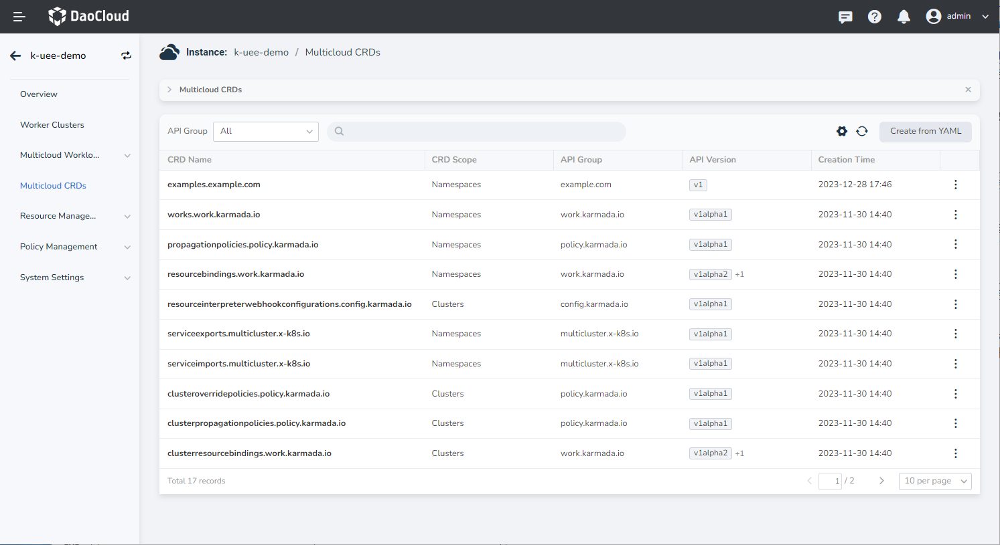
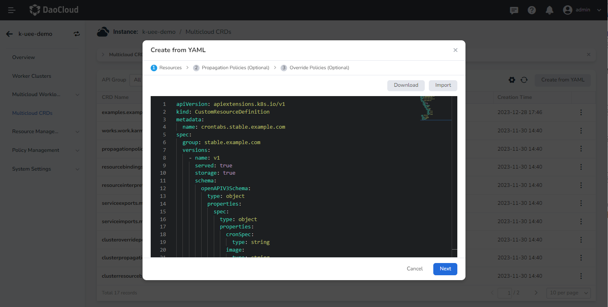
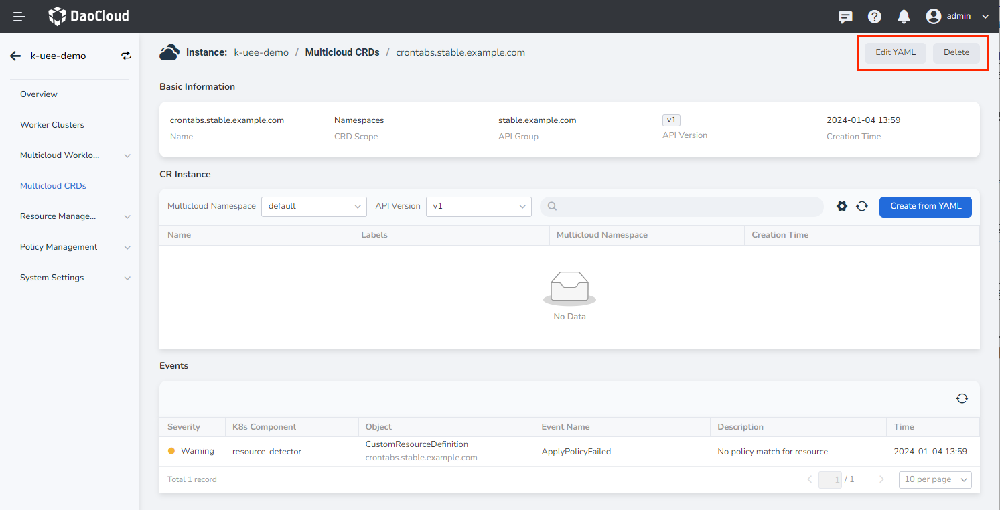
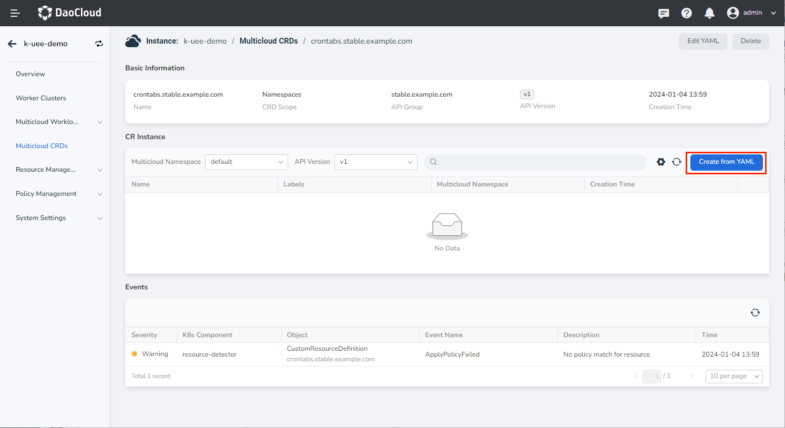
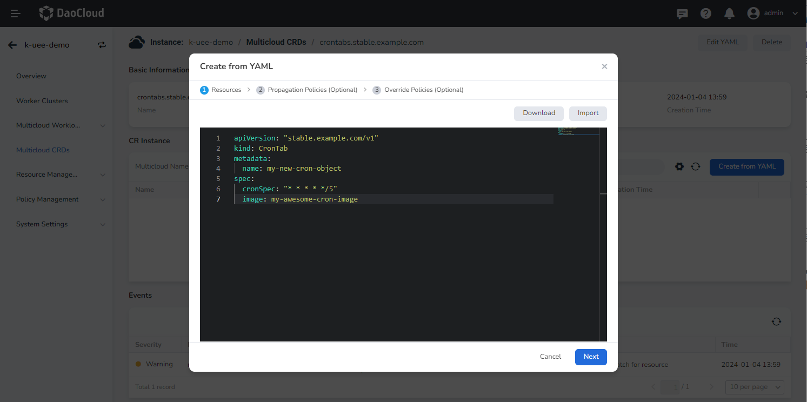

# Manage Multicloud CRDs

You can follow the steps below to create a custom resource definition (CRD) for multicloud.

1. Click __Multicloud CRDs__ in the left navigation bar to access the custom resource page. Then, click the __Create from YAML__ button located in the upper right corner.

    

2. Navigate to the __Create from YAML__ page, input the YAML statement, and click __OK__. You also have the option to download and import features.

    

3. After creating the custom resource named `crontabs.stable.example.com`, you can return to the custom resource list page to view it.

    

4. You can click the name to access the custom resource details page, where the YAML information can be edited to update the custom resource.

    

**CRD Example:**

```yaml
apiVersion: apiextensions.k8s.io/v1
kind: CustomResourceDefinition
metadata:
  name: crontabs.stable.example.com
spec:
  group: stable.example.com
  versions:
    - name: v1
      served: true
      storage: true
      schema:
        openAPIV3Schema:
          type: object
          properties:
            spec:
              type: object
              properties:
                cronSpec:
                  type: string
                image:
                  type: string
                replicas:
                  type: integer
  scope: Namespaced
  names:
    plural: crontabs
    singular: crontab
    kind: CronTab
    shortNames:
    - ct
```

## Create CR instance via YAML

1. Access the custom resource details and click the __Create from YAML__ button located on the right side of the CR instance.

    

2. Navigate to the __Create from YAML__ page and begin by filling in the YAML information of the CR. This page also supports download and import features. Note that the propagation policy and override policy are optional.

    

3. After creating the CR instance named __my-new-cron-obiext__, return to the CR instance list page where you can view it.

    

**CR Example:**

```yaml
apiVersion: "stable.example.com/v1"
kind: CronTab
metadata:
  name: my-new-cron-object
spec:
  cronSpec: "* * * * */5"
  image: my-awesome-cron-image
```
