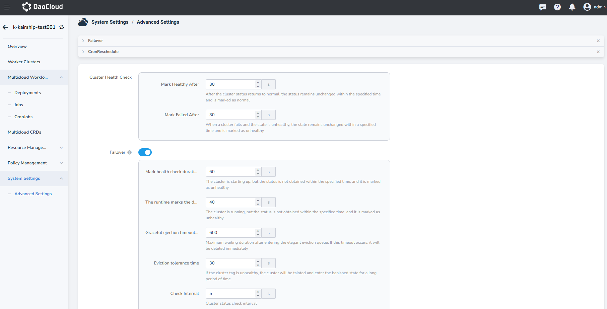
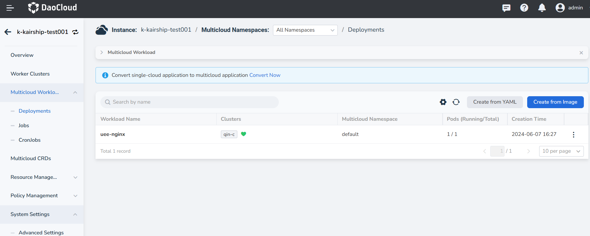
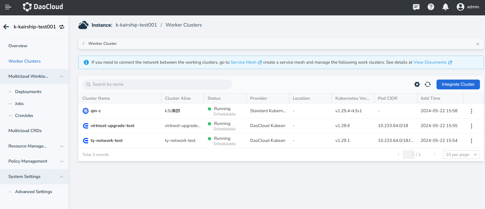

# Introduction to failover

When a cluster fails, the pod replicas in the cluster will be automatically migrated to
other available clusters to ensure service stability.

**Prerequisites**

The scheduling policy of multicloud workloads can only choose aggregation mode or dynamic weight mode,
and the failover feature can only take effect at this time.

## Enabling failover

1. Enter the Multicloud Management module, click __System Settings__ -> __Advanced Settings__ ,
   failover can realize copy scheduling between multiple clusters, it is disabled by default,
   please enable it if necessary.

    

2. The following parameters are for the cluster, click to enable failover and save.

    | Parameter | Description | Field Name | Default Value |
    | --------- | ----------- | --------------- | ------------- |
    | ClusterMonitorPeriod | Interval for checking cluster status | Check Interval | 60s |
    | ClusterMonitorGracePeriod | If the cluster health status is not obtained within this configured time during runtime, the cluster will be marked as unhealthy | The runtime marks the duration of an unhealthy check | 40s |
    | ClusterStartupGracePeriod | If the cluster health status is not obtained within this configured time at startup, the cluster will be marked as unhealthy | Mark health check duration at startup | 600s |
    | FailoverEvictionTimeout | After a cluster is marked as unhealthy, it will be tainted and enter eviction state if this duration is exceeded (cluster will be tainted with eviction) | Eviction tolerance time | 30s |
    | ClusterTaintEvictionRetryFrequency | Maximum waiting duration after entering the graceful eviction queue, after which immediate deletion will occur | Graceful eviction timeout duration | 5s |

## Verifying failover

1. Create a multicloud deployment, choose to deploy on multiple clusters,
   and select the Aggregated/DynamicWeight mode for the scheduling policy.

    

2. If a cluster is unhealthy at this time and has not recovered within the specified time range,
   the cluster will be stained and enter the eviction state (this document will manually stain a cluster).

    

3. At this time, the Pods with no deployment will be migrated according to the resources of
   the remaining clusters. Eventually there will be no Pods in an unhealthy (tainted) cluster.

    <!--screenshot-->