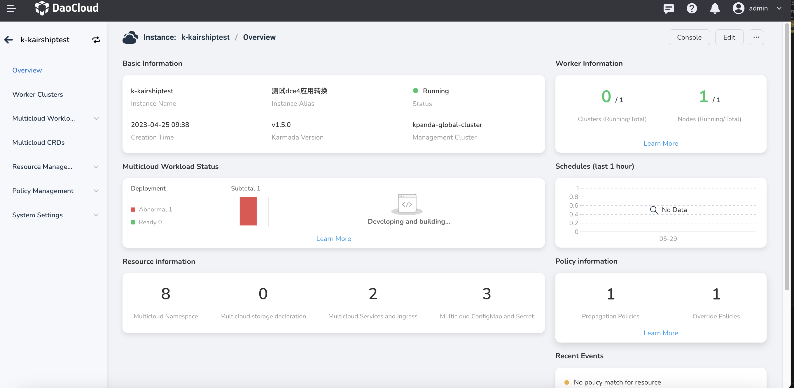

---
hide:
  - toc
---

# View Multicloud Instance

In the multicloud instance list, click the name of an instance to enter the overview page.

- Instance Search

    You can use the search function at the top of the instance list to quickly retrieve the instance you need.

    Support fuzzy match of cluster names.

- Instance Information

    The overview page displays the basic information of the current instance, such as multicloud workload status, resource information, and working cluster information.

    To be specific, you can view:

    - Instance name and alias
    - Creation time of the instance
    - Karmada version of the current instance
    - Instance status
    - Overall CPU usage of the instance, which is the combined calculation of all working clusters added into this instance
    - Overall memory usage of the instance
    - Number of healthy cluster versus total number of clusters
