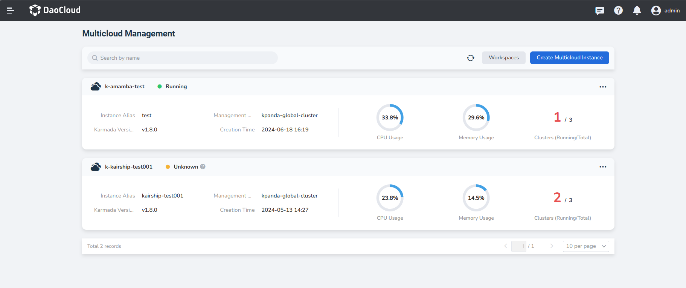
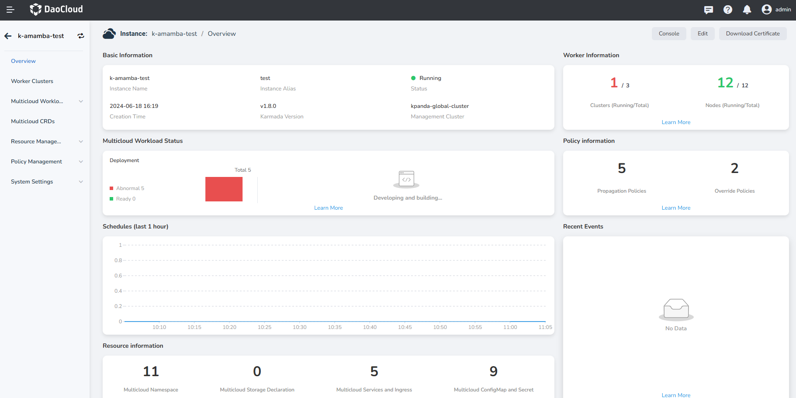

---
hide:
  - toc
MTPE: ModetaNiu
DATE: 2024-08-01
---

# View Multicloud Instance

1. In the page of Multicloud Management, click the name of the instance that you want to review.

    You can search instances by name in the search box above. Fuzzy match supported.
    
    

2. Check instance statistics.

    The Overview page displays basic information, multicloud workload status, resource information, 
    worker information, schedules, policy information and recent events. The page specifically includes:

    - Instance name/alias
    - Creation time
    - Karmada version
    - Status of the instance
    - Overall CPU usage **based on the total resources of all worker clusters added into the instance**
    - Overall memory usage
    - Number of clusters/nodes running in the current instance **detail page is provided**
    - Number of propagation policies and override policies **detail page is provided**

        