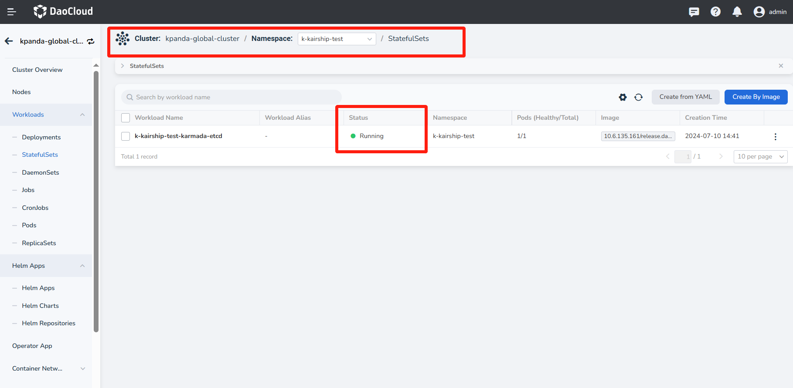
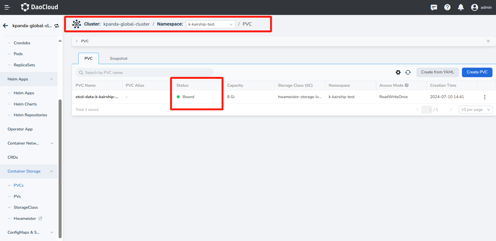
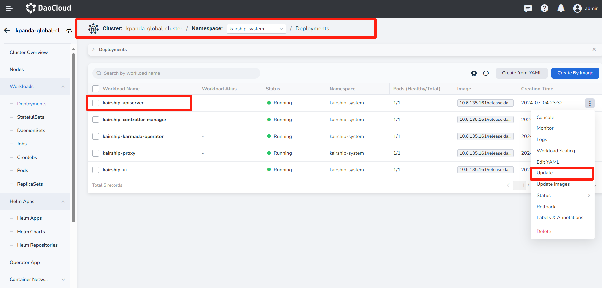
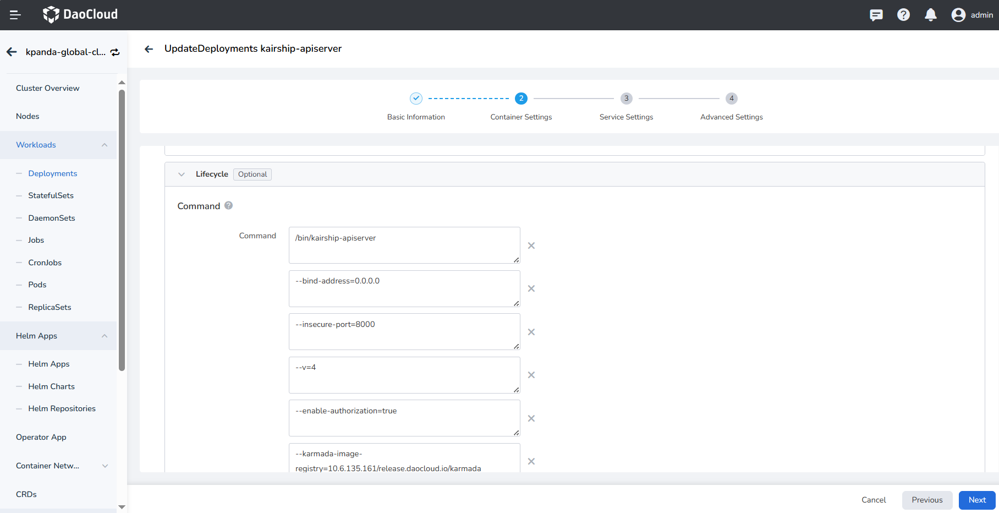

# Create Multicloud Instance

To use the fantastic features provided by Multicloud Management module, you must create a multicloud instance 
at the first step. 
Then, you can manage resources under this instance.

!!! note

    - DCE 5.0 Multicloud Management is developed based on the open source project [Karmada](https://karmada.io/), 
      so a Karmada instance will be automatically created when you create a multicloud instance.

    - The newly-created multicloud instance is deployed in the global management cluster by default, in the form 
      of a virtual cluster, which is transparent to users.
    
    - To distinguish from real clusters, all virtual clusters have a __k-__ prefix in their names.

To create an multicloud instance, follow the steps below: 

1. Enter the instance list, click __Create Multicloud Instance__ in the upper right corner.

    

2. Fill in information and click "OK".

    - Management Cluster: available clusters come from those integrated or created in DCE 5.0 [Container Management](../../kpanda/intro/index.md) module. If no target cluster is found, go to Container Management module to [integrate](../../kpanda/user-guide/clusters/integrate-cluster.md) or [create](../../kpanda/user-guide/clusters/create-cluster.md) a cluster.
    - Delete Instance: if checked，the Karmada instance will also be deleted when you delete the multicloud management instance. If not checked, the Karmada instance will remain and you can use it in terminal, but not in DCE 5.0 Multicloud Management anymore. It is recommended to delete it simultaneously.

    

3. When selecting the management cluster for installing the multicloud instance, it is recommended to use a cluster 
   that is functioning normally and has a storage class (SC) installed, ensuring sufficient storage volume space. 
   Otherwise, the installation may fail. If failure occurs, follow these steps to troubleshoot:

    - In the management cluster's StatefulSets page, confirm the running status of __etcd__.

        

    - Check whether the PVC is in a __Bound__ state.

        

    - Select the __kairship-apiserver__ deployment under the __kairship-system__ namespace and update it.

        

    - After entering the update page, modify the container configuration lifecycle startup command according to the actual situation of the management cluster.
    
        

    - If there is no PVC in the management cluster and hostPath is used instead, the installation can still succeed, but high availability cannot be achieved.