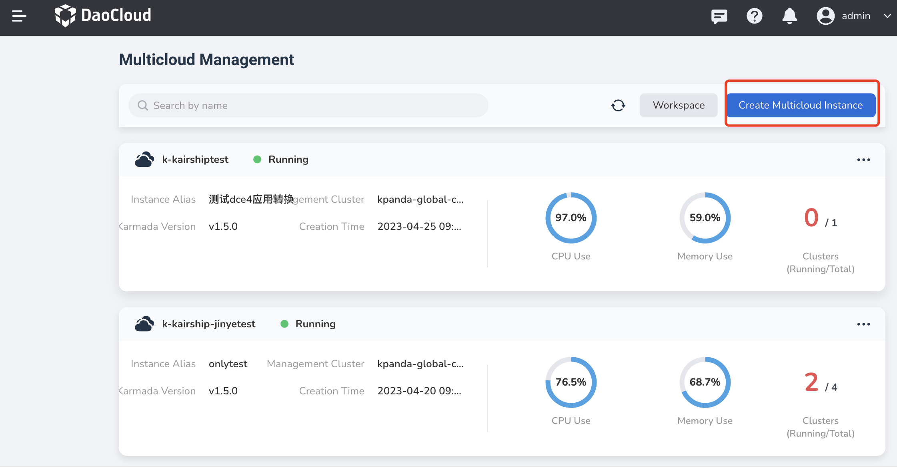
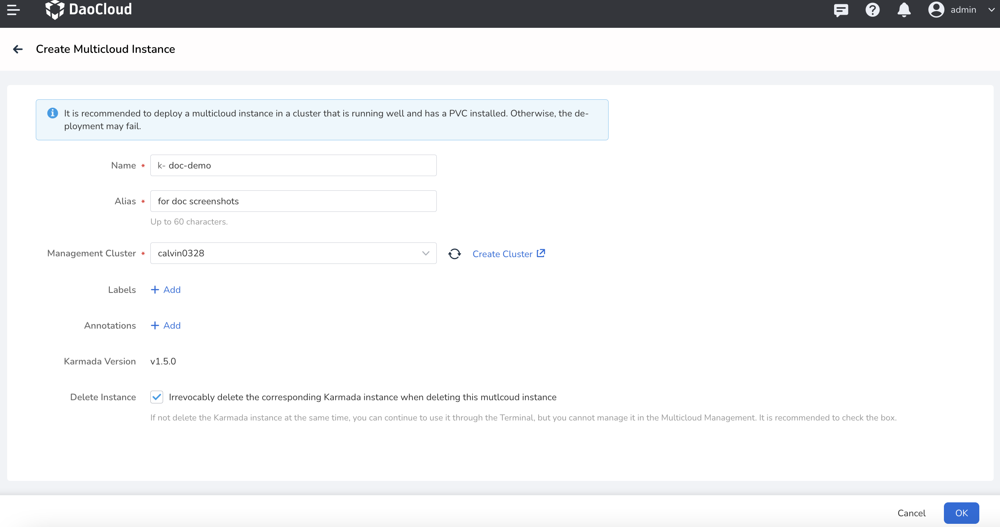

---
hide:
  - toc
---

# Create Multicloud Instance

To use fantasitc features provided by Multicloud Management module, you must create a multicloud instance first and then manage resources under this instance.

1. Click `Create Multicloud Instance` in the upper right corner.

    

2. Fill in information and click "OK".

    - Management Cluster: When choosing the control plane cluster, it is recommended to use a cluster that is running normally and has a PVC installed, otherwise the creation may fail due to no storage resources.
    - Delete Instance: If checked，the Karmada instance will also be deleted when you delete the multicloud management instance. If not checked, the Karmada instance will remain and you can use it in any other places.

    

!!! note

    - A virtual Kubernetes cluster will be automatically created in Container Management module when a multicloud instance is created. This is designed to manage resources across clusters as if in a single cluster. The virtual cluster will not be listed in Container Management module, but it does exist.
    
    - Because of the above reason, the name of each multicloud instance must start with "k-" to keep it separated from other real cluster.
