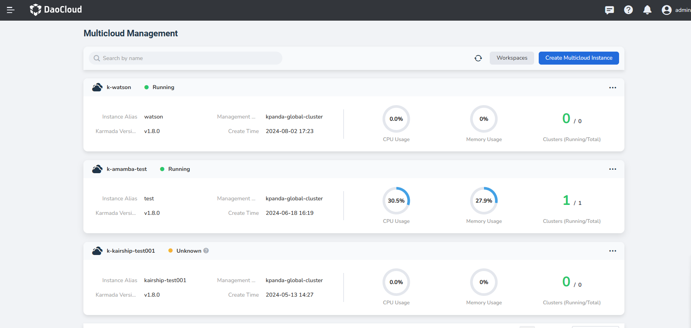
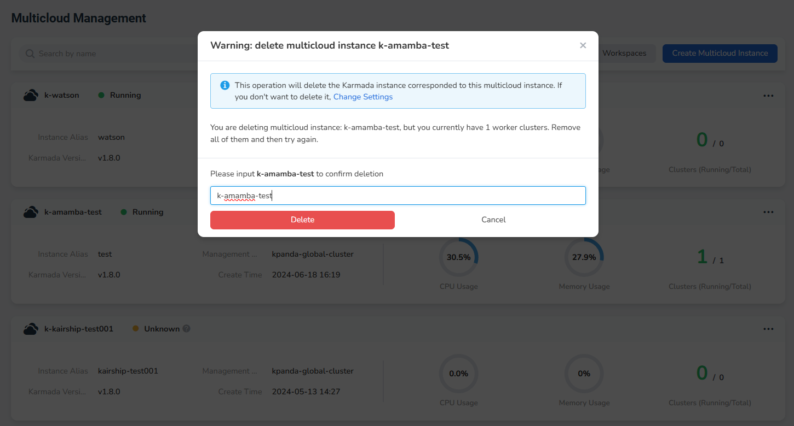

# Delete Multicloud Instance

If an instance is no longer used, you can delete it with the following steps.

!!! note

    To ensure data security and successful deletions, you must clear all resources (clusters, workloads, services, etc.) 
    under the instance before deleting it. After the instance is deleted, all relative resources will be delted. 
    Please proceed with caution. 

1. In the page of Multicloud Management, click __┇__ button on the right, and select __Delete__ from the pop-up menu.

    

2. Enter the instance name to avoid misoperation, and click the __Delete__ button.

    { width="600" }
