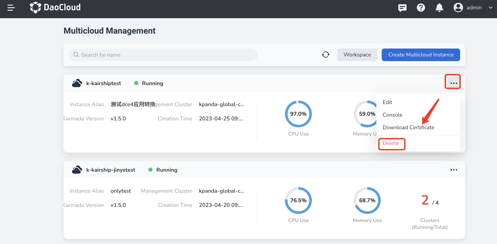
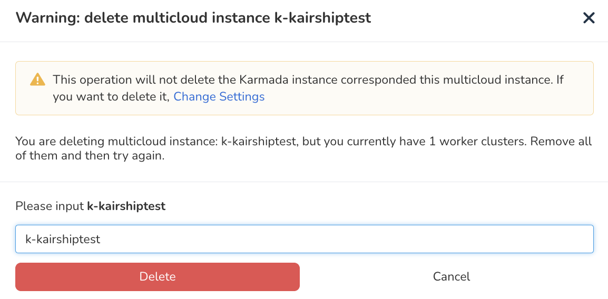

---
hide:
  - toc
---

# Delete Multicloud Instance

If an instance is no longer used, you can delete it with the following steps.

1. Find the instance that you want to delete, click the `...` button on the right, and select `Delete` from the pop-up menu.

    

2. Enter the instance name to avoid misoperation, and click the `Delete` button.

    

!!! note

    To ensure data security, you must clear all resources under the instance and then delete it. Otherwise, you will be remind of the resources that are still under the instance. You cannot delete it until these resources have been cleared.
