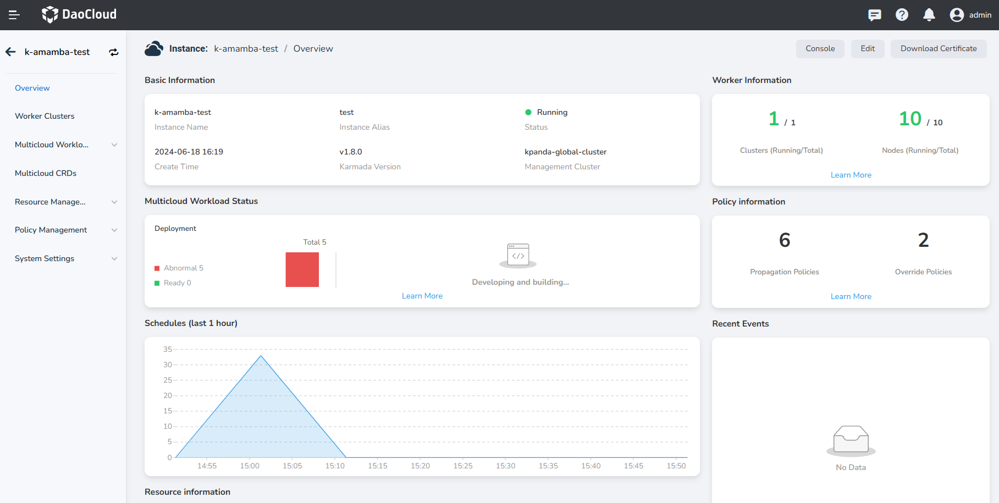
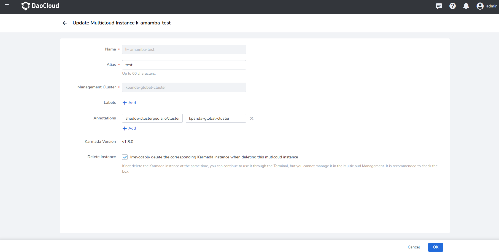

---
hide:
  - toc
---

# Multicloud Instance Details

In DCE 5.0 Multicloud Management, you can easily view the details of each multicloud instance.

1. In the multicloud instance list, click the name of a specific instance and enter overview page.

    

2. The instance overview page displays the Basic Information, Multicloud Workload Status, Schedules, 
   Resource information, Worker Information, Policy Information, and Recent Events.

    

3. Click the button in the upper right corner of the overview page or the action bar in the list: 
   it supports operations such as accessing the console, editing, and downloading certificate.

    - __Console__ : Supports one-click access to the console of the multicloud instance, allowing you to manage and 
      operate your instance directly via the command line.
    - __Edit__ : Supports updating the instance alias, label, annotation, and setting the behavior when the instance is deleted.
    - __Download Certificate__ : Supports customizing the validity period of the certificate. After downloading, 
      this certificate can be used to access Kubernetes. It is important to keep the certificate safe to avoid leakage.

    

    