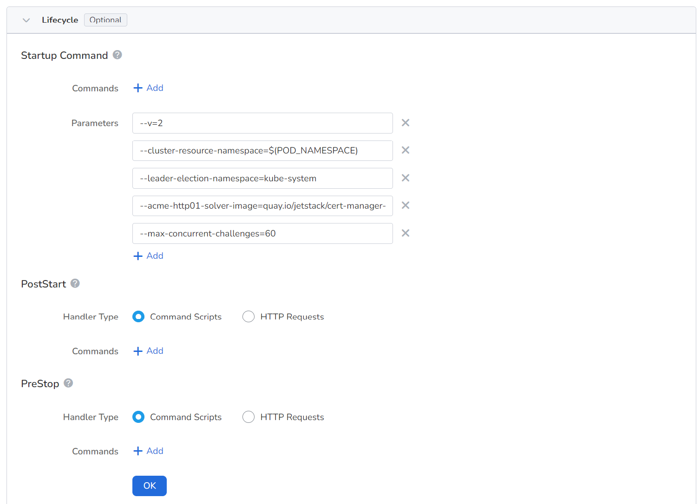

# Q&A

1. Can I specify my own Karmada version or get it upgraded? 

    Yes, The current default version is v1.8.0, and you can upgrade the version by yourself.

2. How to convert single-cluster applications to multicloud applications?

    Refer to [One-Click Conversion to Multicloud Workloads](../workload/promote.md).

3. Can I collect logs of applications deployed in different cluster?

    This is feature is still under development and will go public soon.

4. Can I check monitoring information of a multicloud workload in one picture?

    Yes. You can view it by clicking the name of the workload in the list of multicloud workloads.

5. Can workloads communicate across clusters?

    Yes. Refer to [Multicloud Network Interconnection](../../mspider/user-guide/multicluster/cluster-interconnect.md)

6. Can Service realize cross-cluster service discovery?

    Yes. Refer to [Multicloud Network Interconnection](../../mspider/user-guide/multicluster/cluster-interconnect.md)

7. Does Karmada have production level support?

    It is still in the TP stage, and the high availability issue of many internal components needs to be resolved (Karmada depends on etcd, etc.).

8. How to achieve failover?

    Due to Karmada's native support for fault tolerance, Karmada will intelligently reschedule to complete the fault tolerance when a member cluster experiences a failure. Refer to [Failover Introduction](../failover/failover.md)

9. How about the permission system?

    It uses the existing [permission system of DCE 5.0](../../ghippo/user-guide/access-control/role.md), and bound Karmada instances with workspaces.

10. How to query multicluster events?

    Multicloud Management integrates resources at the product level. You can view all Karmada-instance-level events.

11. How can Container Management module get the information multicloud instances?

    The Karmada control-plane is essentially a complete Kubernetes control plane without any nodes carrying workloads. Therefore, when creating multicloud management instances, a clever action is taken to add the instance itself as a hidden cluster to the container management (not displayed in the container management). This allows for leveraging the full capabilities of container management (collecting and accelerating the retrieval of resources from various Kubernetes clusters, CRDs, etc.). When querying the resources of a specific multicloud management instance (such as Deployment, PropagationPolicy, OverridePolicy, etc.) in the interface, retrieval can be directly done through container management, achieving read and write separation and speeding up response time.

12. How to customize registry URL of __karmada__ images?

    Kairship uses the open-source __karmada-operator__ for multi-instance LCM management. Operator provides rich customization capabilities. It supports customizing the repository address of the karmada resource image in the startup parameters. 
    
    Add __--chat-repo-url__ in the startup commands of containers to specify the image source.

    

13. How to connect with karmada clusters?

    Click __Console__ in the upper right corner of the instance overview page.

14. Can I delete only the multicloud instance without deleting the corresponding karmada instance?

    Yes, when creating a multicloud instance, you can choose whether to select the instance release feature. If selected, the corresponding Karmada instance will be deleted synchronously. If not deleted, you can continue to use it through the terminal, but you cannot manage the Karmada instance within the multicloud management, so it is recommended to delete it synchronously.

15. How can working clusters in a multicloud instance connect with each other?

    Refer to [Multicloud Network Interconnection](../../mspider/user-guide/multicluster/cluster-interconnect.md)