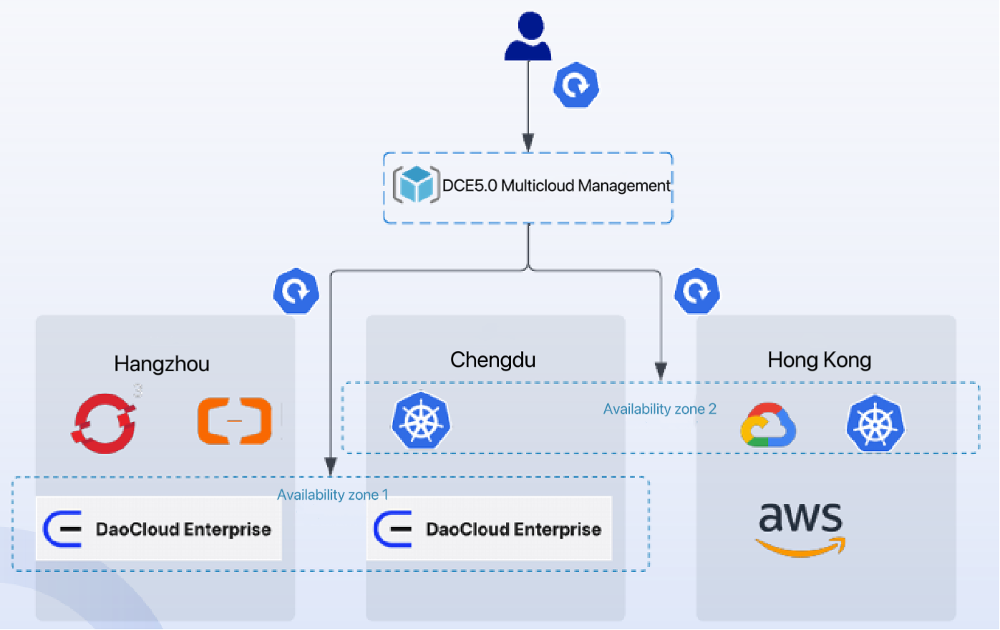

---
hide:
  - toc
MTPE: WANG0608GitHub
date: 2024-07-10
---

# What is Multicloud Management?

Cloud computing has been developing in China for nearly 15 years, and with the maturity of technology, enterprise are not satisfied with simply moving their applications to the cloud. Instead, more complex multicloud requirements have emerged. The development process of cloud computing from single cloud to multicloud is illustrated below:

At the early stage, enterprises simply migrated their applications to the cloud. However, now they want to select clouds and customize their own multicloud environment.

According to statistics, the current distribution of multicloud adoption by businesses choosing to the cloud are as follows:

| Cloud Solutions | Market Share |
| ------------------------ | ------------ |
| multiple public clouds + multiple private clouds | 43% |
| multiple public clouds + one private cloud | 29% |
| one public cloud + multiple private clouds | 12% |
| one public cloud + one private cloud | 9% |
| one public cloud or one private cloud | 7% |

As the table shows, multicloud has become the mainstream in the market. This also explains why DaoCloud crafted the Multicloud Management module in DCE 5.0.

MultiCloud Management is an application-centric platform for efficiently managing applications across multiple clouds.
It allows centralized management of multicloud and hybrid-cloud environments, providing cross-cloud deployment, release, and operational components. Scaling of applications based on cluster resources supports global load balancing, and it provides disaster recovery that fully addresses the disaster recovery problem for multicloud applications.

[Demo video: One-Click Conversion to Multicloud](../../videos/use-cases.md#_2)

## Basic Concepts

| Concept | Description |
| ------- | ----------- |
| **Resource Template** | The multicloud management software uses Kubernetes native APIs to define federated resource templates, enabling seamless integration with existing Kubernetes tooling. |
| **Deployment Policy** | The multicloud management software provides an independent `PropagationPolicy` API to define multi-cluster scheduling requirements. |
| | - Supports a **1:N policy mapping mechanism**, allowing users to avoid specifying scheduling constraints every time a federated application is created. |
| | - With the **default policy**, users can interact directly with the Kubernetes API. |
| **Differentiation Policy** | The multicloud management software provides an `OverridePolicy` API to automatically generate independent configurations for different clusters. |
| | - Automatically configures different image registry addresses based on the region of the member cluster. |
| | - Uses different storage classes according to cloud vendors of the clusters. |

## Product Advantages

Empowering developers to use **multicloud as if it were a single Kubernetes cluster**, multicloud management offers the following advantages:

* **Compatible with Kubernetes Native API**
  
    Upgrade from single-cluster to multi-cluster with zero modification.

* **Seamless Integration with the Kubernetes Toolchain Ecosystem**

    * Freedom from vendor lock-in: multicloud platform support, automatic allocation, and flexible migration.
    * No dependency on commercial vendor products.

* **Rich Multi-Cluster Scheduling**

    * Cluster affinity scheduling for high-availability multi-cluster deployments with fine granularity.
    * Supports multiple regions, availability zones, clusters, and vendors.

* **Open and Neutral**

    * Jointly initiated by organizations from internet, finance, manufacturing, telecommunications, and cloud industries.
    * Out-of-the-box built-in policy sets for multiple scenarios: dual-active across cities, two-city three-center DR, and cross-region disaster recovery.

* **Centralized Management**

    * No need to worry about cluster location.
    * Supports public cloud, private cloud, and edge clusters.

[Download DCE 5.0](../../download/index.md){ .md-button .md-button--primary }
[Install DCE 5.0](../../install/index.md){ .md-button .md-button--primary }
