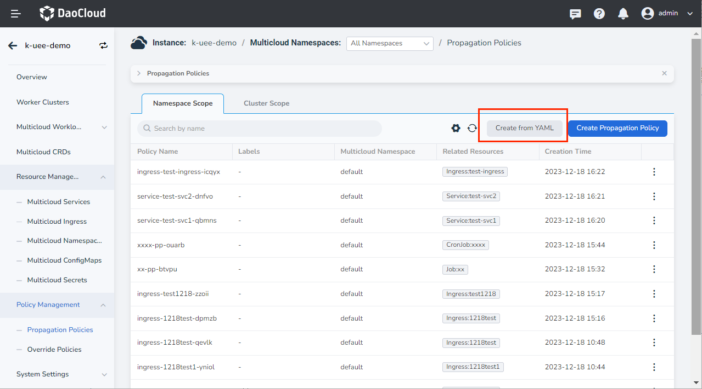
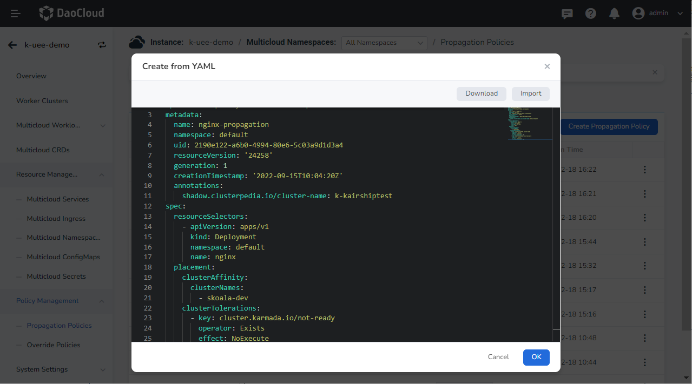
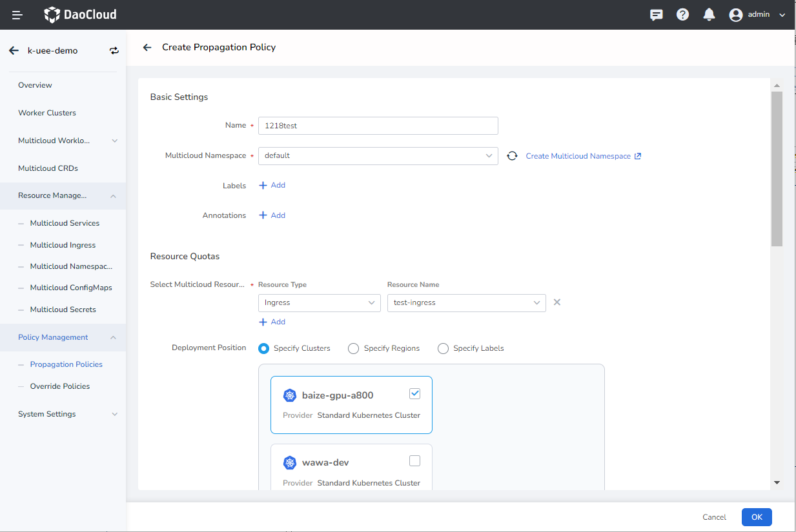
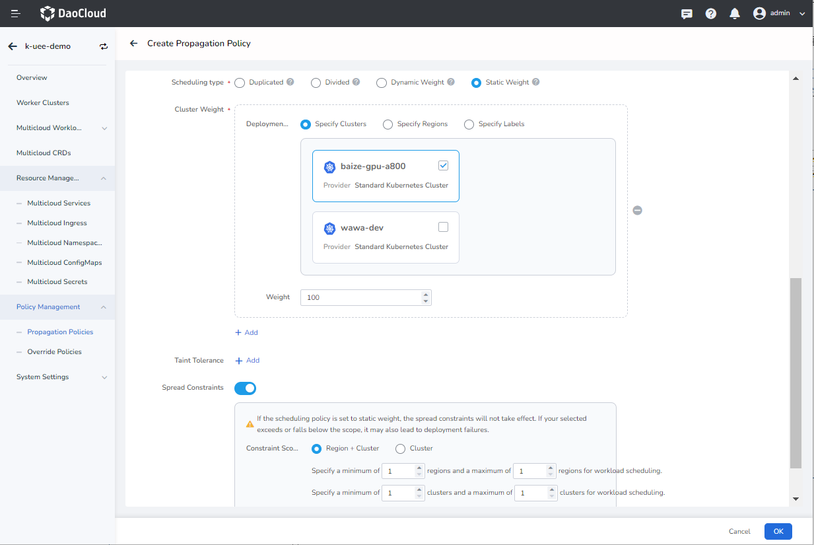
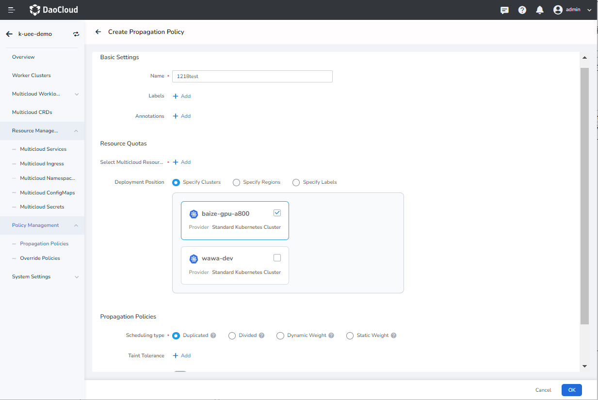

# Propagation Policies

Multicloud Management supports viewing the propagation policy list of the current instance and its associated multicloud resources on the interface, supports creating and editing propagation policy information in the form of YAML and forms, and only provides a delete button for idle propagation policies.

Propagation policies define how resources are distributed across multicloud and clusters. Propagation Policy is divided into Namespace Scope and Cluster Scope.

- Namespace Propagation Policy represents a policy that propagates a set of resources to one or more member clusters, and can only propagate resources in its own namespace.
- Cluster Propagation Policy represents a cluster-wide policy for propagating a set of resources to one or more member clusters, capable of propagating cluster-level resources and resources in any namespace other than the system-reserved namespace.

## Create from YAML

1. After entering a multicloud instance, in the left navigation bar, click __Policy Management__ -> __Propagation Policies__ -> __Namespace Scope__ , and click the __Create from YAML__ button in the upper right corner.

    

2. On the __Create from YAML__ page, after entering the correct YAML statement, click __OK__ .

    

3. Return to the propagation policy list, and the newly created one is the first one by default. Click __⋮__ on the right side of the list to edit YAML and perform delete operations.

## YAML example

Here is an example YAML for a propagation policy that you can use with a little modification.

```yaml title="YAML example"
kind: PropagationPolicy
apiVersion: policy.karmada.io/v1alpha1
metadata:
  name: nginx-propagation
  namespace: default
  uid: 2190e122-a6b0-4994-80e6-5c03a9d1d3a4
  resourceVersion: '24258'
  generation: 1
  creationTimestamp: '2022-09-15T10:04:20Z'
  annotations:
    shadow.clusterpedia.io/cluster-name:k-kairshiptest
spec:
  resourceSelectors:
    - apiVersion: apps/v1
      kind: Deployment
      namespace: default
      name: nginx
  placement:
    clusterAffinity:
      clusterNames:
        -skoala-dev
    clusterTolerations:
      - key: cluster.karmada.io/not-ready
        operator: Exists
        effect: NoExecute
        tolerationSeconds: 300
      - key: cluster.karmada.io/unreachable
        operator: Exists
        effect: NoExecute
        tolerationSeconds: 300
```

## Create Propagation Policy

1. Follow the steps below to create a propagation policy.

    - Basic Settings: fill in the name, select the multicloud namespace, and add label annotations
    - Resource Quotas: select multicloud resources and target deployment clusters
    - Propagation Policies: Scheduling type, taint tolerance, you can choose whether to enable spread constraints, support filling in priority (propagation policy can also be created at the same time when creating resources, when the propagation policy is also created on this page, you can choose according to the priority level to determine which propagation policy the resource uses)

    

    

2. The form creates a cluster scope propagation policy without selecting a namespace.

    

    !!! note

        If you want to delete a propagation policy, you need to remove the workload related to the policy first. After the deletion, all the information related to the policy will be deleted. Please operate with caution.
