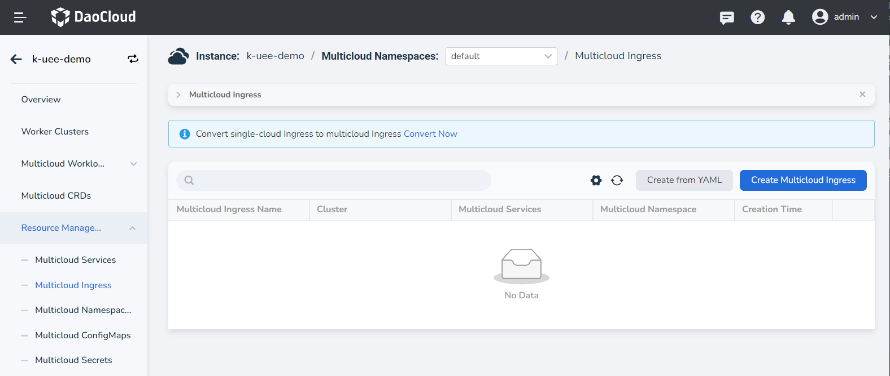
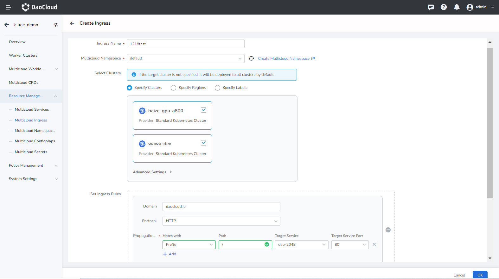
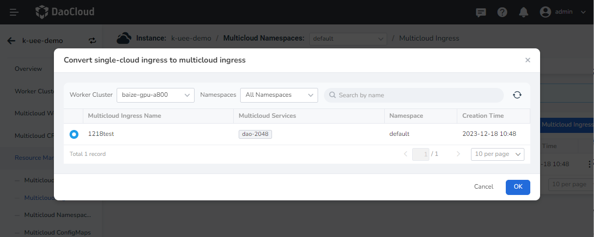
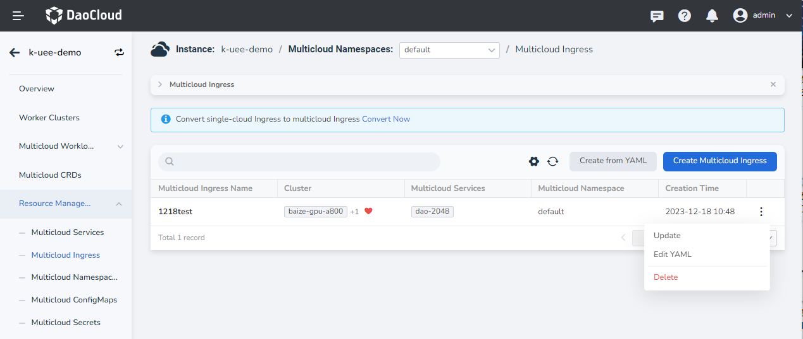

---
hide:
  - toc
---

# Multicloud Ingress

Multicloud Ingress is a unified abstraction of the standard Kubernetes Ingress multicloud. By creating an Ingress and associating it with several multicloud services, it can be distributed to multiple clusters at the same time.

Currently, two creation methods are provided: form creation and YAML creation. This article takes form creation as an example, and follows the steps below.

1. After entering a multicloud instance, in the left navigation bar, click __Resource Management__ -> __Multicloud Ingress__ , and click the __Create Multicloud Ingress__ button in the upper right corner.

    

2. On the __Create Multicloud Ingress__ page, after configuring the deployment location, setting ingress rules, Ingress Class, whether to enable session persistence, etc., click __OK__ . For details, please refer to [Create Ingress](../../kpanda/user-guide/network/create-ingress.md)

    

3. It supports one-click conversion of sub-cluster services to multicloud ingress. Click __Convert Now__ on the list page, select the ingress under the specified working cluster and namespace, and click OK to convert successfully.

    

4. Click __⋮__ on the right side of the list to update and delete the ingress.

    

    !!! note

        If an ingress is deleted, the service-related information will also disappear, so please proceed with caution.

## YAML example

Here is an example YAML for multicloud ingress that you can use with a little modification.

```yaml
kind: Ingress
apiVersion: networking.k8s.io/v1
metadata:
  name: ingress-test
  namespace: default
  uid: 49a45f23-2e5a-4a23-9f21-77418c1b9bbb
  resourceVersion: '1979660'
  generation: 1
  creationTimestamp: '2023-04-27T00:07:43Z'
  labels:
    propagationpolicy.karmada.io/name: ingress-ingress-test-ygddx
    propagationpolicy.karmada.io/namespace: default
  annotations:
    shadow.clusterpedia.io/cluster-name: k-kairship-jxy
spec:
  rules:
    - host: testing.daocloud.io
      http:
        paths:
          - path: /
            pathType: Prefix
            backend:
              service:
                name: test-service
                port:
                  number: 123
status:
  loadBalancer: {}
```
