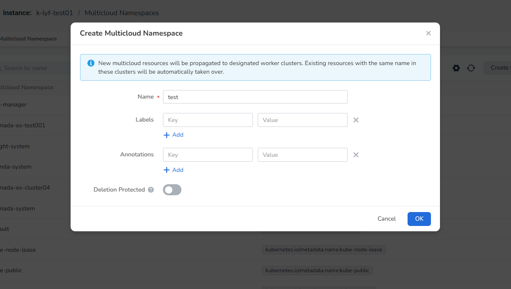

# Multicloud Namespace

A multicloud namespace can manage workloads across clouds and across clusters. Currently, wizard-based creation 
is provided.

This article takes wizard creation as an example. You can follow the steps below.

1. After entering a multicloud instance, in the left navigation bar, click __Resource Management__ -> __Multicloud Namespace__ , and click the __Create Namespace__ button in the upper right corner.

    

2. On the __Create Multicloud Namespace__ page, enter a name, add labels and annotations, and click __OK__ .

    

3. Return to the list of multicloud namespaces, and the newly created one will be the first one by default. Click __⋮__ on the right side of the list to edit the YAML, view events, update or delete the namespace.

    

    !!! note

        To delete a namespace, you need to remove all workloads under the namespace first. After the deletion, the workloads and services in the namespace will be affected, so please proceed with caution.