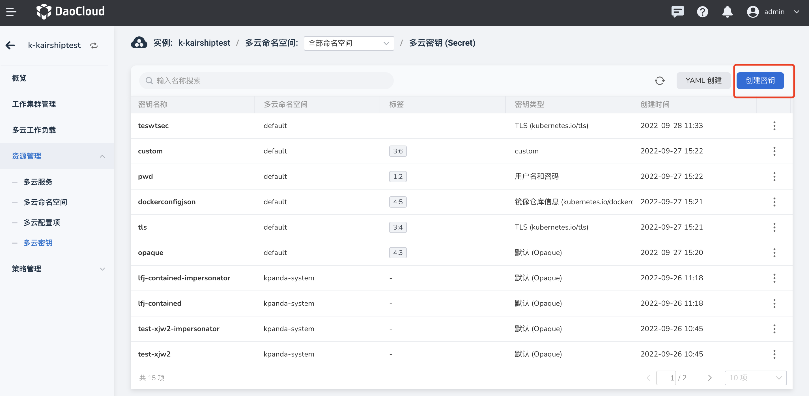
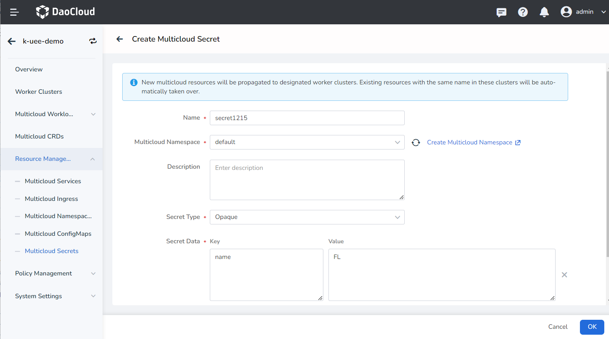
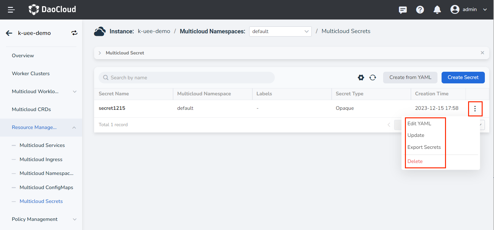

# Multicloud Secrets

A Secret is an object that contains a small amount of sensitive information such as a password, token, or key.
Such information may be placed in the Pod specification or in the image.
Using Secret means you don't need to include secret data in your application code.

Since Secrets can be created independently of the Pods that use them, there is less risk of exposing Secrets (and their data) during the workflow of creating, viewing, and editing Pods.
DCE and applications running in the cluster can also take additional precautions with Secrets, such as avoiding writing confidential data to non-volatile storage.

Secret is similar to ConfigMap but designed to hold secret data.

Two creation methods are currently provided: wizard creation and YAML creation. This article takes wizard creation as an example, and follows the steps below.

1. After entering a multicloud instance, in the left navigation bar, click __Resource Management__ -> __Multicloud Secrets__ , and click the __Create Secret__ button in the upper right corner.

    

2. On the __Create Secret__ page, enter the name, select the namespace and other information, and click __OK__ .

    

3. Back to the list of multicloud secrets, the newly created one is the first one by default. Click __⋮__ on the right side of the list to edit YAML, update, export and delete Secret.

    

    !!! note

        If you delete a Secret, its related information will also be deleted, please operate with caution.

## YAML example

Here is an example YAML for Multicloud Secret that you can use with some modification.

```yaml
kind: Secret
apiVersion: v1
metadata:
  name: dockerconfigjson
  namespace: default
  uid: 452c3465-e9a1-4869-8972-2f199ba2750a
  resourceVersion: '1679594'
  creationTimestamp: '2022-09-27T07:21:36Z'
  labels:
    '4': '5'
  annotations:
    kairship.io/describe: test
    shadow.clusterpedia.io/cluster-name:k-kairshiptest
data:
  .dockerconfigjson: >-
    eyJhdXRocyI6eyIxIjp7InVzZXJuYW1lIjoiMiIsInBhc3N3b3JkIjoiMyIsImF1dGgiOiJNam96In19fQ==
type: kubernetes.io/dockerconfigjson
```
