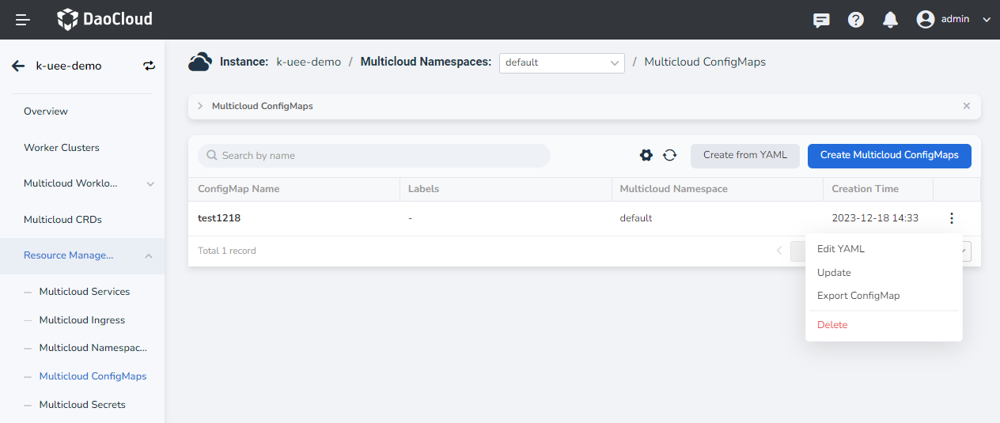
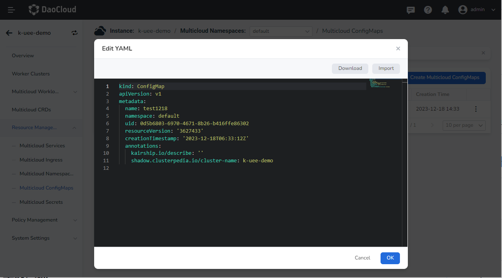
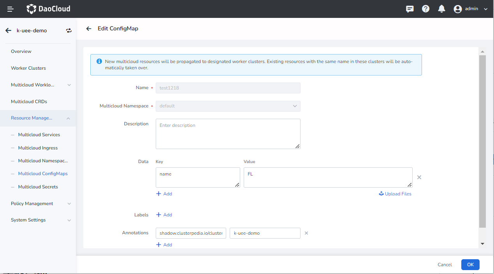

# Update Multicloud ConfigMaps

Currently, two update methods are provided: editing YAML and form update.

1. After entering a multicloud instance, in the left navigation bar, click `Resource Management` -> `Multicloud ConfigMaps`, click `⋮` to edit YAML or update configmaps.

    

2. In the `Edit YAML` pop-up window, modify the YAML information, click `OK` to update the configmaps.

    

3. Click `Update` to update the configmaps through the form, but the load name and multicloud namespace cannot be updated.

    

4. After completing the content that needs to be modified, click `OK`, and the update is successful.
