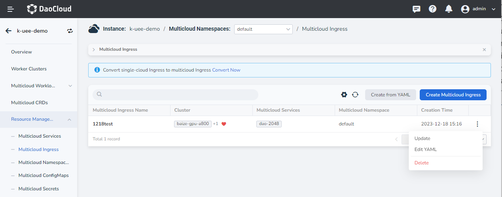
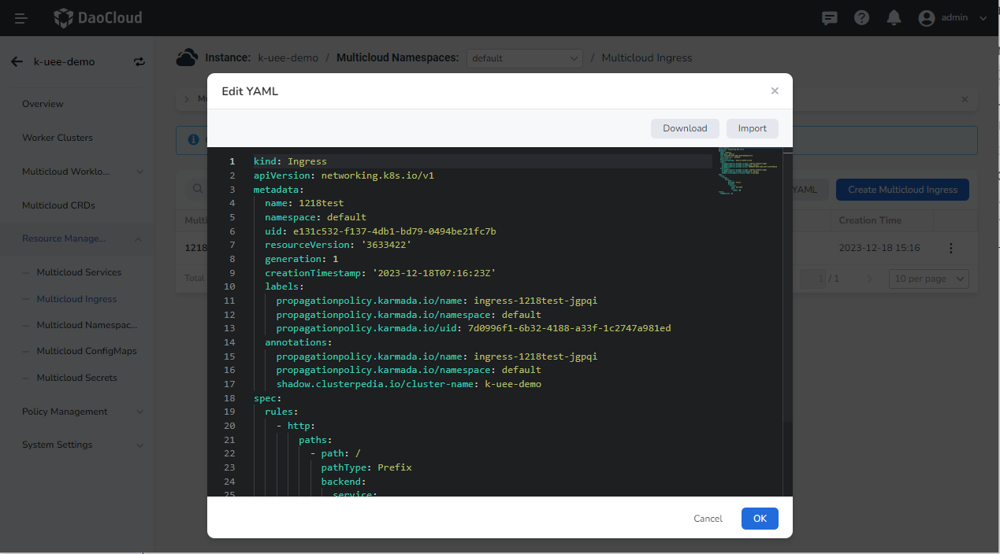
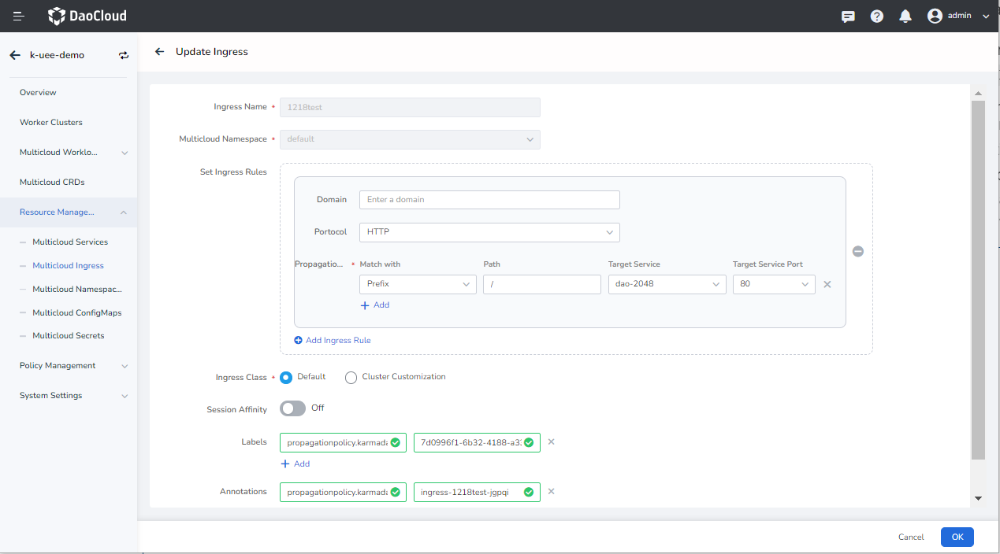

# Update Multicloud Ingress

Currently, two update methods are provided: editing YAML and form update.

1. After entering a multicloud instance, in the left navigation bar, click __Resource Management__ -> __Multicloud Ingress__ , click __⋮__ to update the ingress in the form.

    

2. In the __Edit YAML__ pop-up window, modify the YAML information, click __OK__ to update the ingress.

    

3. Click __Update__ to update the ingress through the form, but the name, multicloud namespace, and cluster of Ingress Class cannot be updated.

    

4. After completing the content that needs to be modified, click __OK__ , and the update is successful.
