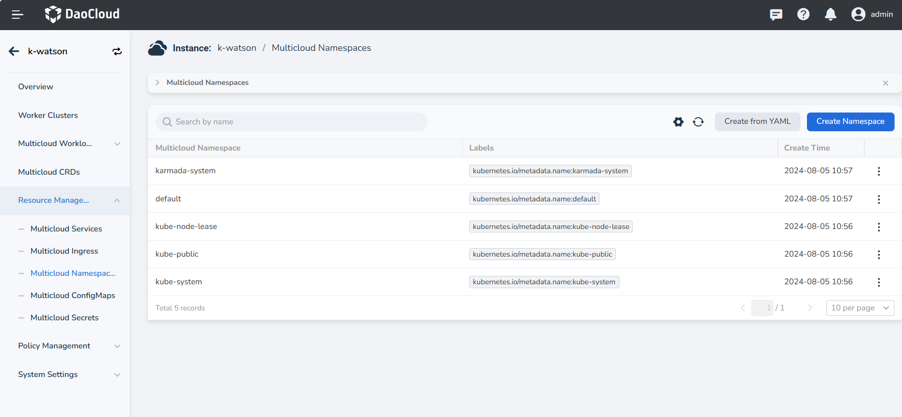
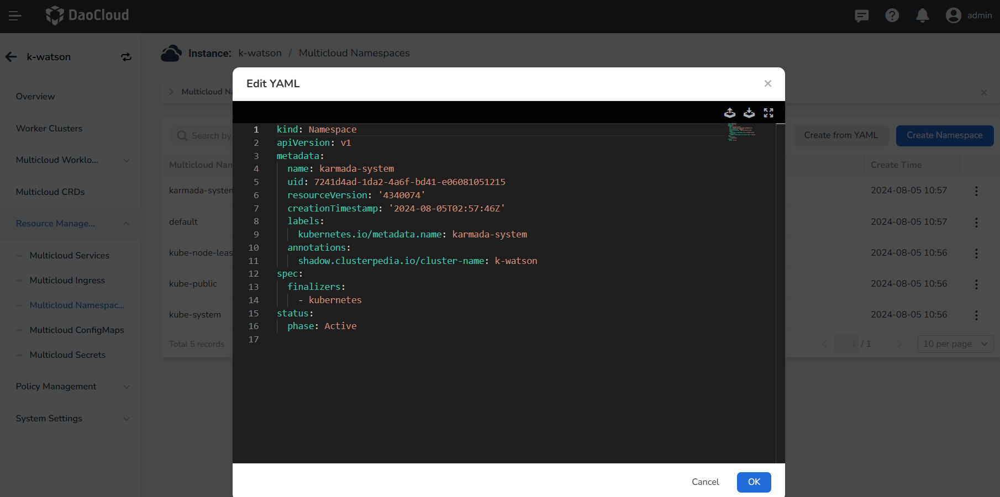
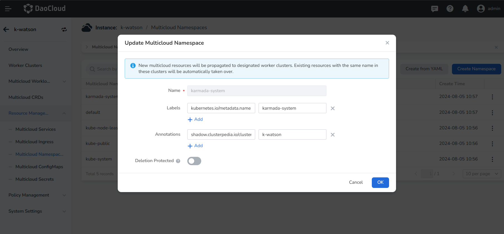

# Update Multicloud Namespace

You currently have two options for updating multicloud namespaces: edit YAML and update with form.

1. After entering a multicloud instance, click __Resource Management__ -> __Multicloud Namespace__ in the 
   left navigation bar. Click __┇__ to edit the YAML or update the namespace.

    

2. In the __Edit YAML__ pop-up window, modify the YAML information and click __OK__ to update the multicloud namespace.

    

3. Click __Update__ to update the multicloud namespace using a form. This supports updating labels, annotations, 
   and enabling deletion protection. The name of the multicloud namespace cannot be updated.

    

4. After completing the necessary modifications, click __OK__ to successfully update.