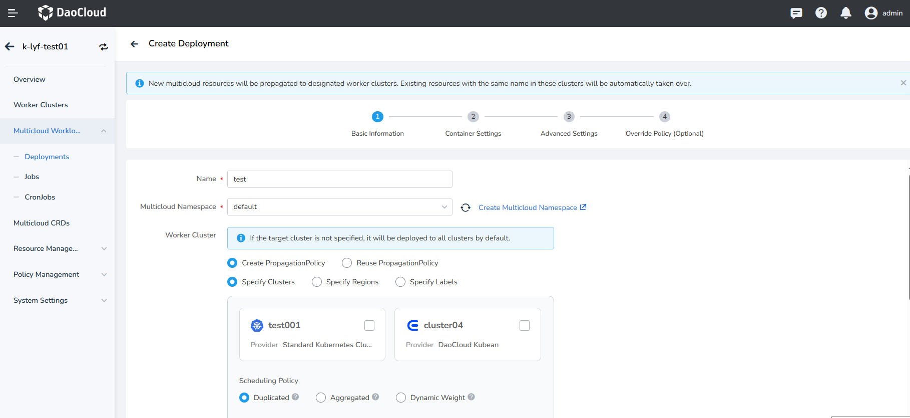
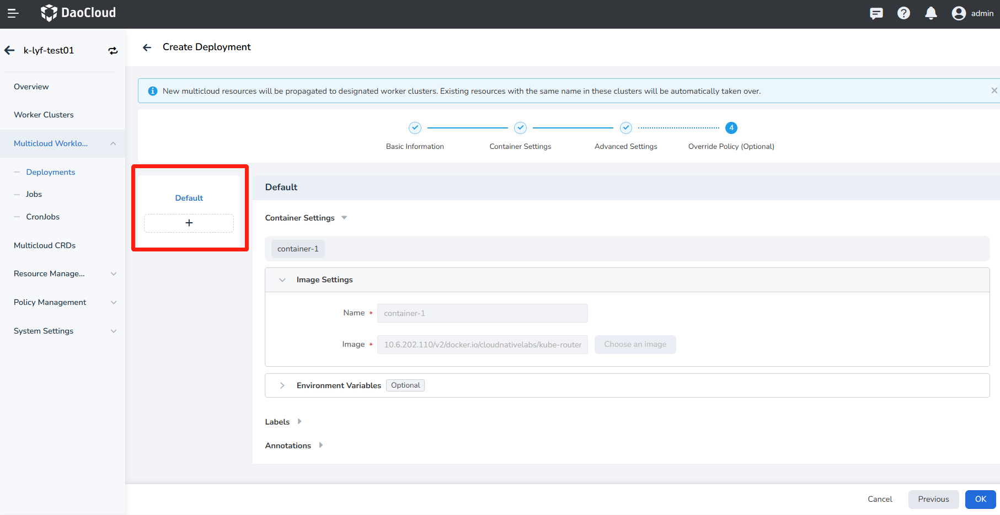
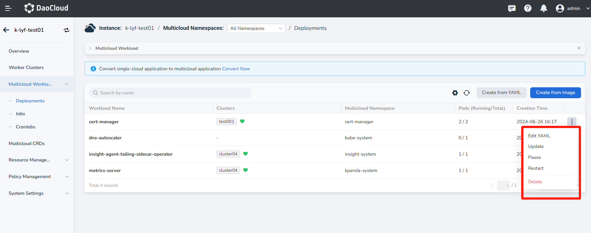

---
| Corrected scheduling categories to remove redundancy |
MTPE: ModetaNiu
DATE: 2024-07-12
---

# Create Multicloud Deployment from Image

After [added a worker cluster](../cluster.md#add-a-cluster) into a multicloud instance, you can create multicloud workloads or convert existing workloads into multicloud workloads.

- Supports distributing a workload across different regions and availability zones, as well as across different clusters, 
  including hybrid cloud clusters.
- Supports creating multicloud deployments, multicloud tasks, and multicloud cron jobs.
- Supports quick creation via images or YAML files.

## Prerequisites

- [Create a multicloud instance](../instance/add.md).
- [Add at least one worker cluster](../cluster.md#add-a-cluster) to the multicloud instance.
- If you want to deploy workloads to specific clusters based on region, availability zone, or labels, 
   you need to add region, availability zone, and label information to the clusters beforehand.

## Steps

Follow the steps below to create a multicloud deployment from image.

1. Click the name of the multicloud instance, then navigate to __Multicloud Workloads__ in the left navigation bar, and click __Create from Image__ in the top right corner.

    

1. Follow the wizard prompts to configure each parameter and then click __OK__.

    === "Basic Information"

        Deployment Cluster: If no cluster is specified, the deployment will default to all clusters.

        | Operation | Description | Default Value |
        | --- | ---- | ----- |
        | Specify Clusters | Check specific clusters to directly designate the deployment clusters for the multicloud workload | Select appropriate clusters |
        | Specify Regions  | Filter deployment clusters based on providers/regions/zones. You can check up to three filter conditions simultaneously | Select appropriate providers, regions, zones Providers: Standard Kubernetes Cluster, Red Hat OpenShift |
        | Specify Labels   | Select clusters to deploy the workload using labels | Operator — __In__: Nodes must include the selected label, and the label's value must **belong** to a specified set of values. Separate multiple values with a __;__  Operator — __Exists__: Nodes only need to include the label, regardless of its specific value |

        

        | Parameter | Options/Sub-Parameters | Description |
        |------|-------------|------|
        | Scheduling Policy | Duplicated | Deploy the number of replicas specified in the __Instance Count__ field in each selected cluster. __Total Replicas = Instance Count ✖️ Number of Deployment Clusters__ |
        | | Aggregated | Distribute the number of replicas specified in the __Instance Count__ field across as few clusters as possible. __Total Replicas = Instance Count__ |
        | | DynamicWeight | Dynamically schedule the workload to different deployment clusters based on the maximum real-time schedulable instances of all target clusters. __Total Replicas = Instance Count__ |
        | Advanced Propogation Strategy | Auto Propagation | This is a switch. When enabled, it automatically detects resources like ConfigMap and Secret that the multicloud workload configuration depends on and distributes these resources to each selected deployment cluster. |
        | | Clusters Excluded | Exclude a specific cluster from the filter results. The workload will not be deployed to the excluded cluster. If no target cluster is specified, the deployment will default to all clusters. |
        | | Cluster Taint Tolerance | After [adding taints to the cluster on the Worker Cluster Management page](../cluster.md#modify-cluster-taints), resources with these taints cannot be scheduled to the cluster. Enable taint toleration here to allow resources with the corresponding taints to be scheduled to the selected clusters. |
        | | Spread Constraints | This is a switch. When enabled, it allows control over how many regions/availability zones the workload is distributed across. For example, if both the maximum and minimum values are set to 1, all workloads will be deployed to clusters within the same region/availability zone. Supports configuring both region+cluster or just the cluster values. |
        | | Deletion Protected | This is a switch. When enabled, it provides a deletion protection mechanism to prevent catastrophic impacts caused by users accidentally deleting resources (such as Namespace or Cluster resources) on the Karmada control plane. |

    === "Container Settings"
    
        Refer to [Container Configuration](../../kpanda/user-guide/workloads/create-deployment.md#container-settings) 
        to fill in the container configuration information.

    === "Advanced Configuration"
    
        Refer to [Advanced Configuration](../../kpanda/user-guide/workloads/create-deployment.md#advanced-settings) 
        to fill in the advanced configuration.

    === "Override Policy"
    
        Refer to the following instructions to fill in the override polices, and finally, click __OK__.

        

        - Default: The general configuration filled in during the previous steps, which cannot be modified here.
        - To modify the default configuration, click __Previous__ at the bottom of the page to return to the respective configuration environment and re-enter the information.
        - Click the __➕__ sign below the default configuration and select a cluster to set override polices for the selected cluster.
        - Clusters without override polices will use the default configuration.
        - Currently, you can configure different container images, environment variables, labels, and annotations for different clusters.

        !!! note
    
            - If no override policy is needed, simply click __OK__ in the bottom right corner to complete the creation of the multicloud workload.
            - If override policy is needed, click __Next__ and continue to refer to the documentation below to fill in the configuration information.

1. You will be automatically redirected to the list of multicloud deployments. By clicking the **┇** button on the right side, you can edit YAML, update/pause/restart/delete the workload.

    

[Next step：create multicloud services](../resource/service.md){ .md-button .md-button--primary }
