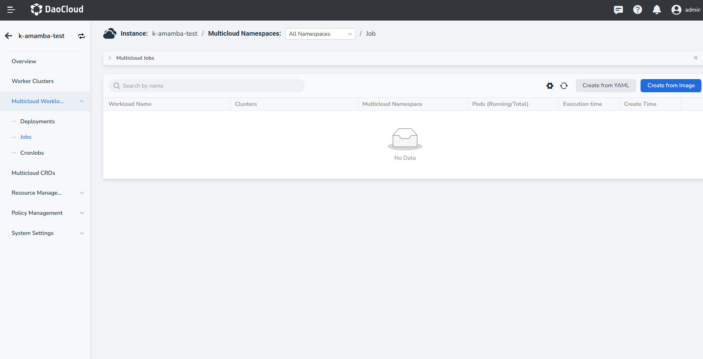
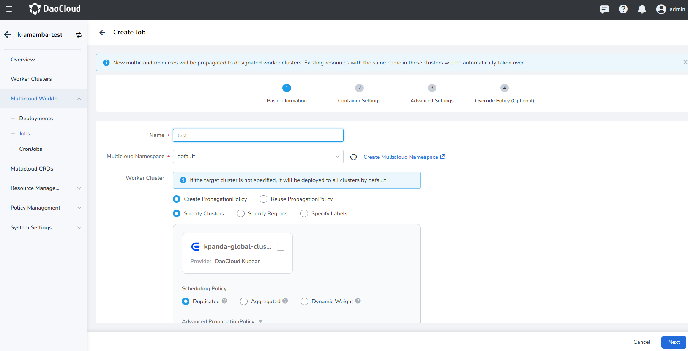
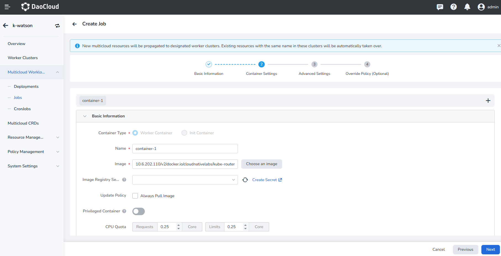
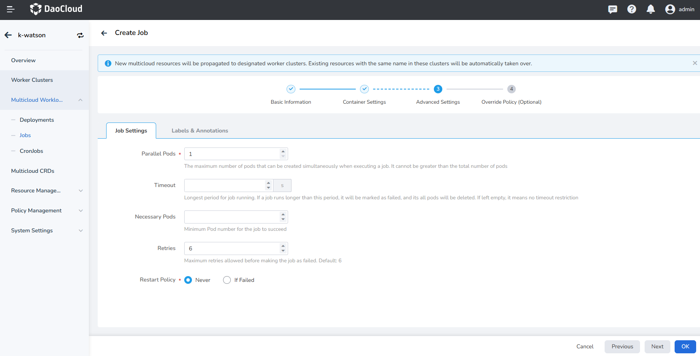
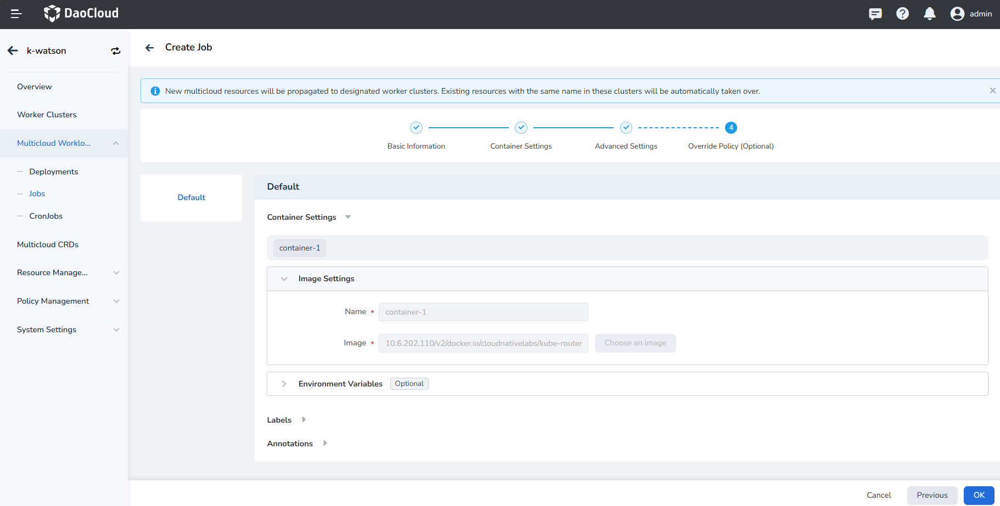
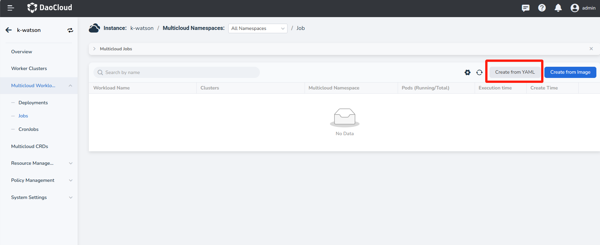
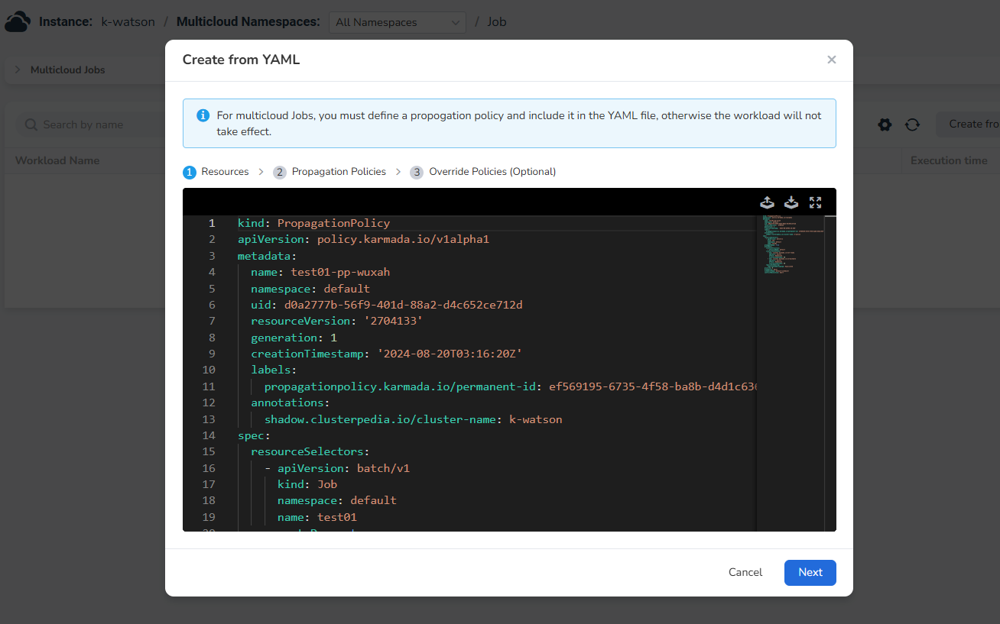

---
hide:
  - toc
MTPE: ModetaNiu
DATE: 2024-08-20
---

# Multicloud Job

Currently, there are two ways to create multicloud jobs: __Create from Image__ and __Create from YAML__ .

## Create from Image

1. In the left navigation bar, click __Multicloud Workload__ to enter the job page, and click the 
   __Create from Image__ button in the upper right corner.

    

1. On the __Create Job__ page, after configuring the basic information of the load, click __Next__ .

    

    - Name: No more than 63 characters, can only contain lowercase letters, numbers, and a separator ("-"), 
      and must start and end with a lowercase letter or number. The name of the same type of workload in the same 
      namespace cannot be repeated, and the name of the workload cannot be changed after the workload is created.
    - Multicloud Namespace: Select the namespace where the newly created job will be deployed. The `default` namespace 
      is used by default. If you cannot find the required namespace, you can create a new one according to the prompt 
      on the page.
    - Worker Cluster: Provides three options to determine which clusters the workload will be deployed on.
    - Replicas: Enter the number of Pod instances for the workload. By default, 1 Pod instance is created.
    - Scheduling Policy: Provides three methods to determine how to allocate workload instances.
    - Description: Enter the description information of the workload and customize the content. The number of characters should not exceed 512.

    There are three ways to deploy a cluster:

    - Specify Clusters: Specify a cluster by selecting the cluster name
    - Specified Regions: Specify the cluster by selecting the manufacturer, region, and availability zone
    - Specify Labels: specify clusters by adding metrics
    - You can also exclude clusters/set cluster taint tolerance/dynamic area selection in the Advanced PropagationPolicy, 
      and finally it will display which clusters are expected to be scheduled to at the bottom.

    Scheduling Policies are divided into three ways:

    - Duplicated: schedule the same number of instances in all selected clusters
    - Aggregated: schedule as few instances as possible in all selected clusters
    - Dynamic Weight: according to the real-time schedulable maximum number of instances of all selected clusters, 
      the total number of filled instances will be run in equal proportion

1. On the __Container Settings__ page, configure the basic information of the container where the workload resides, 
   and optionally configure information such as Lifecycle and Health Check, and then click __Next__ .

    

1. On the __Advanced Settings__ page, you can configure job settings, labels and annotations.

    

    Job settings need to include the following data:

    - Parallel Pods: The maximum number of Pods that can be created at the same time during job execution, 
      and it should not be greater than the total number of Pods. Default is 1.
    - Timeout: When this time is exceeded, the job will be marked as failed to execute, and all Pods under the job will be deleted. When it is empty, it means that no timeout is set.
    - Necessary Pods: Minimum Pod number for the job to succeed
    - Retries: Maximum retries allowed before making the job as failed. Default is 6.
    - Restart Policy: Whether to restart the Pod when the setting fails.

    If you do not need to configure override policy after the creation is complete, you can directly click __OK__ to 
    complete the creation of the multicloud job.

1. On the __Override Policy (Optional)__ page, after selecting the Container Settings, Labels and Annotations, click __OK__ .

    

    You can add the specified override settings in the list on the left. After you add an override setting, 
    you need to specify the specified cluster.
    The selectable range of the cluster is only the cluster selected at the beginning, and the selected cluster 
    will use the specified override policy; the unspecified cluster will still use the default settings.

!!! note

    - When creating a multicloud workload through image, if you need to use the advanced capabilities of specifying a 
      location and specifying a label to create, you need to ensure that the corresponding location or label 
      has been set for the worker cluster;
      Labels need to be added within a single cluster, and can be jumped to the corresponding cluster maintenance 
      from the worker cluster management list.
    - When configuring the number of replicas, you need to pay attention to the corresponding scheduling policy. 
      Only when it is repeated, will all the configured replicas be started in multiple clusters.

## Create from YAML

1. In the left navigation bar, click __Multicloud Workload__ to enter the job page, and click the 
   __Create from YAML__ button in the upper right corner.

    

1. Enter or upload YAML, click __OK__ .

    

### YAML Example

A YAML example is listed as follows. You can use the file with a little modification.

```yaml
kind: PropagationPolicy
apiVersion: policy.karmada.io/v1alpha1
metadata:
  name: test01-pp-wuxah
  namespace: default
  uid: d0a2777b-56f9-401d-88a2-d4c652ce712d
  resourceVersion: '2704133'
  generation: 1
  creationTimestamp: '2024-08-20T03:16:20Z'
  labels:
    propagationpolicy.karmada.io/permanent-id: ef569195-6735-4f58-ba8b-d4d1c6363d47
  annotations:
    shadow.clusterpedia.io/cluster-name: k-watson
spec:
  resourceSelectors:
    - apiVersion: batch/v1
      kind: Job
      namespace: default
      name: test01
  propagateDeps: true
  placement:
    clusterAffinities:
      - affinityName: default
    clusterTolerations:
      - key: cluster.karmada.io/not-ready
        operator: Exists
        effect: NoExecute
        tolerationSeconds: 30
      - key: cluster.karmada.io/unreachable
        operator: Exists
        effect: NoExecute
        tolerationSeconds: 30
    replicaScheduling:
      replicaSchedulingType: Duplicated
  priority: 0
  preemption: Never
  schedulerName: default-scheduler
  conflictResolution: Abort
```
