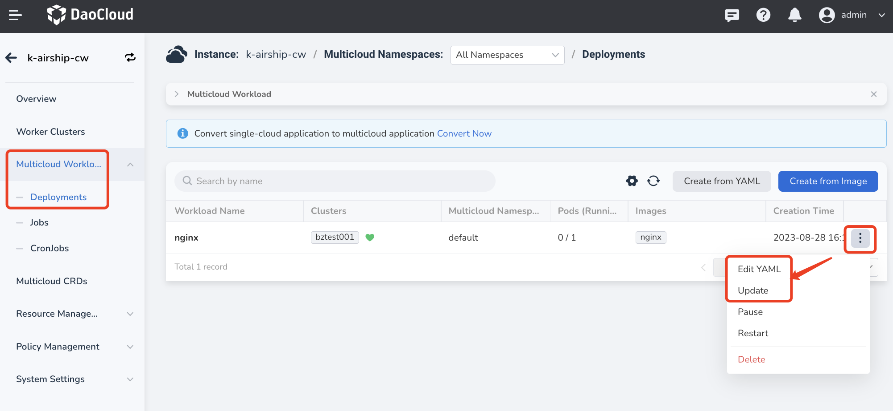

---
hide:
  - toc
---

# Update/Delete Multicloud Workloads

You can create a multi-cloud deployment either from an [image](deployment.md) or a [YAML file](yaml.md). Therefore, you can also update it with these two methods.

1. Click __Multicloud Workloads__ -> __Deployments__ in the left navigation menu. Then, click the __ⵈ__ icon on the far right of the corresponding workload to display more options.

    - Select __Edit YAML__ to update the deployment using YAML.
    - Select __Update__ to update the deployment using a form.
    - Select __Delete__ to directly delete the deployment.
    - Select __Pause__ to temporarily stop the deployment from running.
    - Select __Restart__ to restart the deployment.

        

2. After making the necessary changes, click __OK__ to complete the update.
