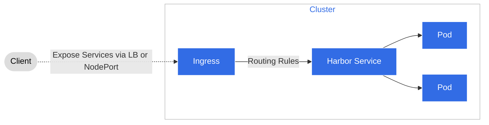
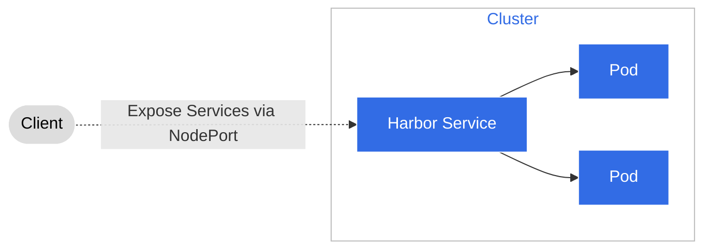

# What access type should I choose to managed Harbor?

When creating a managed Harbor, you need to choose an access type.
Currently, there are two supported types: Ingress and NodePort.

The table below explains the advantages and disadvantages of these two access types:

<table>
  <tr>
    <th></th>
    <th>Ingress</th>
    <th>NodePort</th>
  </tr>
  <tr>
    <td>Advantages</td>
    <td>
      <ol>
        <li>Easy management and usage with Ingress. Memorable domain names and easy service migration.</li>
        <li>Supports uploading HTTPS certificates, can pull images without configuring non-secure repositories.</li>
      </ol>
    </td>
    <td>
      <ol>
        <li>Doesn't depend on any components, can quickly start services for demos and trials.</li>
        <li>NodePort has higher performance, no additional routing processing.</li>
      </ol>
    </td>
  </tr>
  <tr>
    <td>Disadvantages</td>
    <td>
      <ol>
        <li>Requires DNS service for domain resolution in private network environments, depends on underlying network infrastructure.</li>
        <li>Ingress incurs certain performance overhead due to additional routing processing.</li>
      </ol>
    </td>
    <td>
      <ol>
        <li>Ingress has limited management, strongly binds IP to a specific host, and image addresses become non-migratable.</li>
        <li>Can only use self-signed certificates, need to configure non-secure repositories when pulling images.</li>
      </ol>
    </td>
  </tr>
</table>

!!! tip

    - In **production environments**, we recommend using the Ingress method because Ingress supports
      the use of HTTPS protocols. You can use self-signed certificates or purchase certificates to
      avoid the need for configuring non-secure repositories when pulling images.
    - In **testing environments**, we recommend using the NodePort method because it doesn't depend
      on any components and allows for quick service startup for demos and trials.

## Ingress

**Prerequisites:**

- The cluster must have an Ingress component installed, such as Nginx, Traefik, HAProxy, etc.
  For specific installation methods, please refer to the
  [Ingress](../../network/modules/ingress-nginx/index.md) documentation.
- The cluster must have a DNS service installed, such as CoreDNS, KubeDNS, Bind, etc.
  For specific installation methods, please refer to the
  [DNS](https://kubernetes.io/zh-cn/docs/concepts/services-networking/dns-pod-service/) documentation.
- The cluster must have a LoadBalancer component installed, such as MetalLB, F5, Nginx, etc.
  For specific installation methods, please refer to the
  [LoadBalancer](../../network/modules/metallb/index.md) documentation.

**Ingress Flow**

Ingress exposes HTTP and HTTPS routes from outside the cluster to services within the cluster.
Traffic routing is controlled by rules defined on Ingress resources.
The following diagram illustrates the flow of using Ingress in managed Harbor:



For **private cloud**, after deploying managed Harbor with Ingress, you need to add domain name
resolution to the DNS service. This maps the domain name to the IP address of the LoadBalancer,
allowing users to access Harbor using the domain name. Adding DNS domain name resolution requires
separate operations inside and outside the Kubernetes cluster, as described below:

### Adding DNS domain name resolution inside the Kubernetes cluster

In the Kubernetes cluster, you need to add DNS domain name resolution in the CoreDNS component.
Follow these steps:

1. Access the CoreDNS ConfigMap:

    ```bash
    kubectl -n kube-system edit configmap coredns
    ```

2. Edit the ConfigMap and add the `harbor.example.com` resolution to the LoadBalancer IP address:

    ```text
    hosts {
      10.1.1.1 harbor.example.com
      fallthrough
    }
    ```

    !!! note
   
        `harbor.example.com` is a user-defined domain name, and the LoadBalancer IP address is the Ingress IP address.

3. Save and exit. This will recreate the CoreDNS Pod:

    ```bash
    kubectl get pod -n kube-system coredns-5c98db65d4-2t2l2
    ```

### Adding DNS domain name resolution outside the Kubernetes cluster

Outside the cluster, you can deploy a separate CoreDNS component to handle DNS domain name resolution
and configure the domain name. Follow the same steps as described above.

**If the domain name is public, the above steps are not necessary as public domain names are already resolved.**

## NodePort

NodePort is a way to access services in a Kubernetes cluster.
It opens a port on each Node and forwards traffic to the port of the Service.
The following diagram illustrates the flow of using NodePort in Kubernetes:


