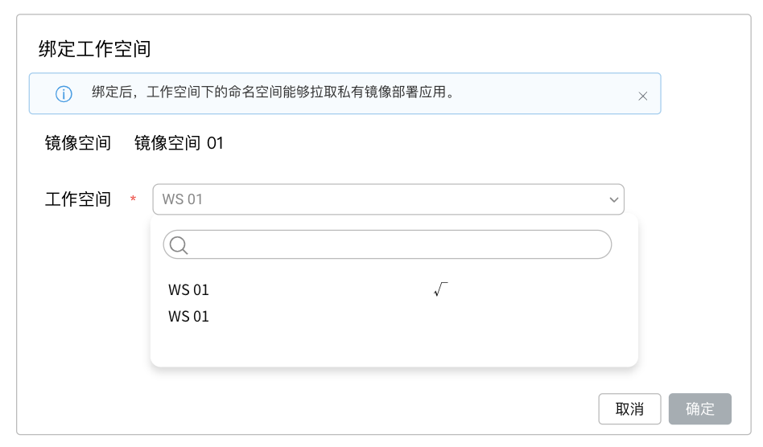

# mirror space binding workspace

There are two types of mirror spaces: public and private.
Images in the public image space are public images, and images in the private image space are private images.

For public images, when deploying applications in the container management module, users can click the `Select Image` button to select `Mirror Warehouse` - `Warehouse Integration` in all the images in the public image space to deploy applications without any configuration.

For a private image, the administrator must allocate the private image space to the workspace (tenant) before it can be used by members under the workspace to ensure the security of the private image.

Prerequisite: An external Harbor warehouse has been created or integrated, and one or more mirror spaces have been created.

## Binding steps

1. Log in to the web console as a user with the Admin role, and click `Mirror Warehouse` from the left navigation bar.

    

1. Click `Warehouse Integration` on the left navigation bar, click a warehouse name to enter the warehouse, and navigate to the mirrored `Warehouse Space` menu.

1. Click the `Bind Workspace` button on the right side of a mirror space entry, and select the workspace to be bound.

1. Click `OK` to finish binding the workspace.

    

## FAQ

1. When deploying an application in the Kubernetes namespace, the image in the image space cannot be selected through the "Select Image" button.

    - Check whether the Kubernetes namespace is bound to a workspace (binding is required).
    - Check whether the image space is bound to the workspace where the Kubernetes namespace is located (binding is required).
    - To check whether the status of the mirror space is private or public, switch to the following tab to find out.

    

2. What is the difference between assigning a mirror space to a workspace and associating a warehouse under a workspace?

    The platform administrator Admin can manage in a unified manner, and assign a mirror space to multiple workspaces in batches without having to associate them separately.

    Workspace Admin Workspace Admin can associate external mirror warehouses for members to use according to needs, without relying on platform administrators, which is more flexible to use.