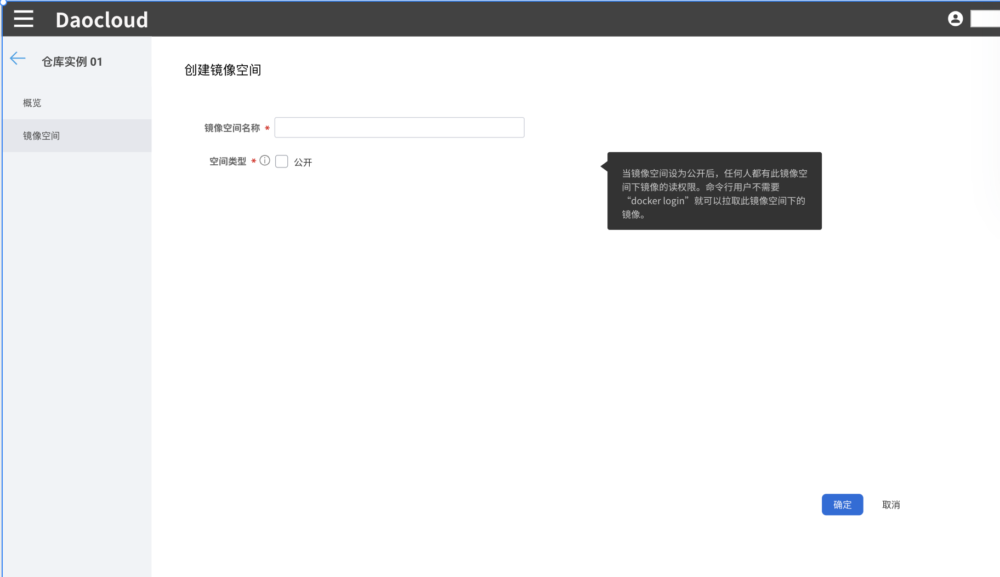

---
hide:
  - toc
---

# create mirror space

Harbor provides the image isolation function based on the image space (project). There are two types of mirror spaces: public and private:

- Public mirror warehouse: all users can access, usually store public mirrors, there is a library public mirror space by default.
- Private mirror warehouse: Only authorized users can access it, usually storing the mirror image of the mirror space itself.

Prerequisite: An external Harbor repository has been created or integrated.

1. Log in to the web console as a user with the Admin role, and click `Mirror Warehouse` from the left navigation bar.

    

1. Click `Managed Harbor` on the left navigation bar, click a warehouse name, and navigate to the `Mirror space` menu.

1. Click the `Create Mirror Space` button in the upper right corner, fill in the name of the mirror space, select the type and click `OK`.

    

!!! info

    If the status of the image space is public, the images in the space can be pulled and used by all Kubernetes namespaces on the platform;
    If the status of the image space is private, the image space can only be pulled and used by the Kubernetes namespace under the workspace (tenant) after the administrator Admin binds the image space to one or more workspaces (tenants).