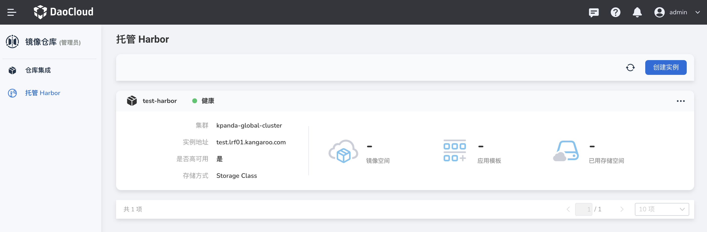
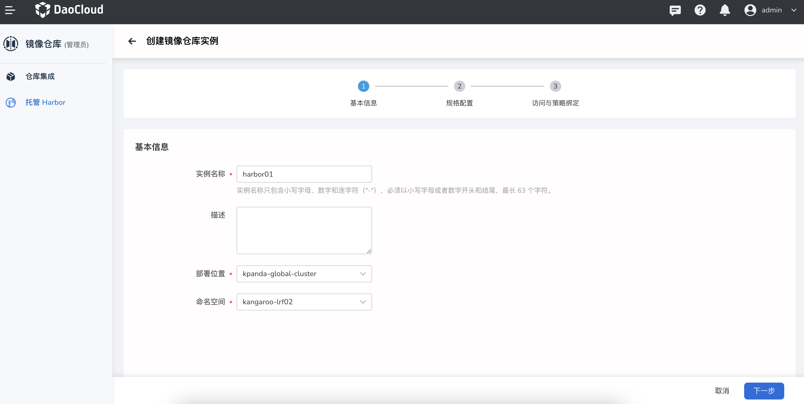
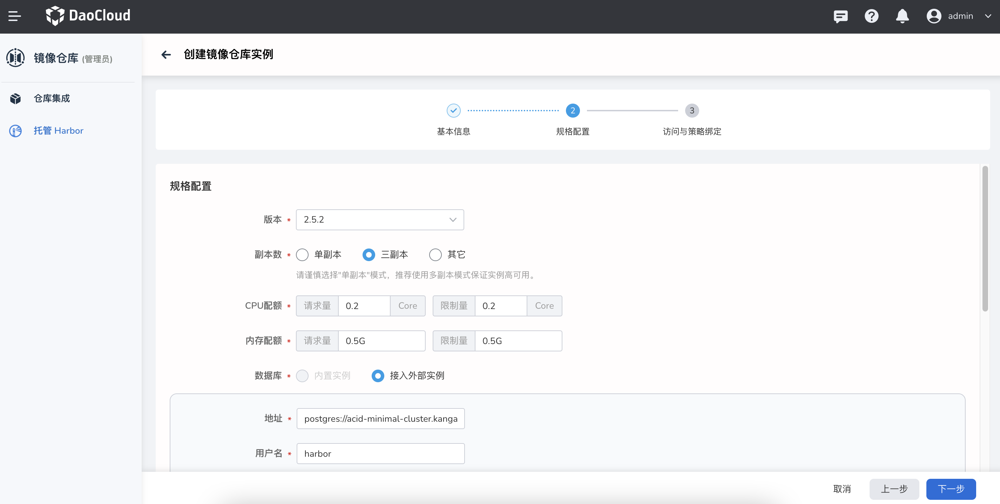
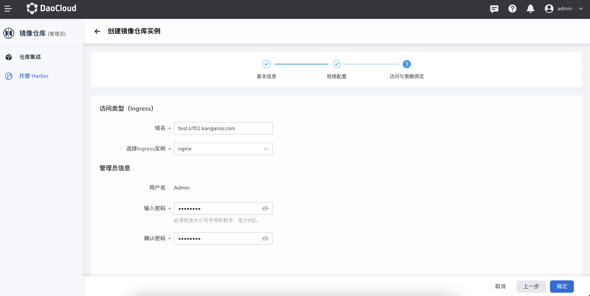
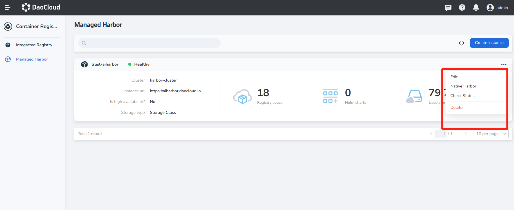
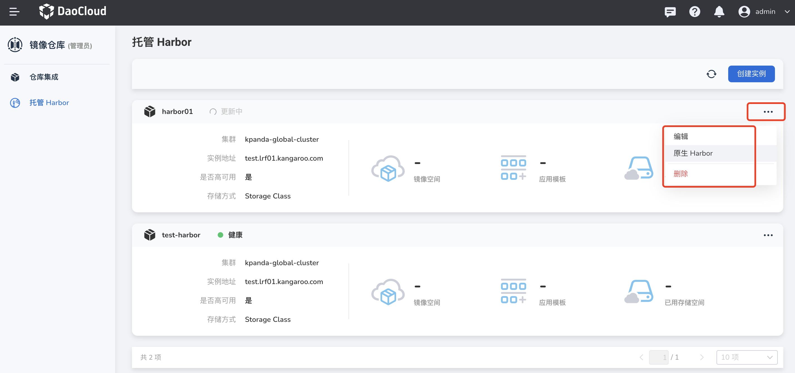

# Managed Harbor

Harbor is an open source container registry service for secure hosting and efficient distribution of OCI-compliant Artifacts such as container images and Helm Charts. It can help you manage Artifacts consistently and securely across cloud-native computing platforms (such as Kubernetes and Docker). The DaoCloud Enterprise platform provides Harbor-based fast deployment capabilities, and realizes one-stop high availability, high performance, and high Efficient deployment, management, use and other full-cycle container registry services.

## Product Features

- Support multi-copy deployment to achieve high availability
- Support importing platform users into native Harbor instances
- Provide a native Harbor instance entry, and the user's operations on the platform UI and operations in the native Harbor will take effect in real time
- Support using the platform to build a database or access an external database
- Support using the platform to build a Redis instance or access an external Redis instance
- Support specifying internal storage or using external S3 compatible object storage

## Functional advantages

- Multiple container registry instances to meet the needs of multiple container registrys in various environments such as development, testing, and production.
- Break the calling barriers between modules, and support rapid image pull when deploying applications in the application workbench and container management module
- Provides a unified management control plane, allowing administrators to manage the full lifecycle of multiple Harbor instances on the same interface.

## Install Harbor Operator

Managed Harbor uses Harbor Operator technology to manage the entire life cycle of Harbor creation, upgrade, and deletion.
Before creating a managed Harbor, you need to install Harbor Operator in the container management, the minimum version requirement is 1.4.0.
The installation steps are as follows:

1. Enter the cluster management of `Container Management`, and select the cluster where Harbor needs to be installed.
2. After entering the cluster, enter `Helm App` -> `Helm Charts`, search for Helm of Harbor Operator.
3. Click `Install`.

## Create managed Harbor

1. Log in to the web console as a user with the Admin role, and click `container registry` from the left navigation bar.

    

1. Click `Managed Harbor` on the left navigation bar, and click the `Create Instance` button in the upper right corner.

    

1. Fill in the instance name, select the deployment location and click `Next` (if there is no deployment location to choose, you need to go to the container management to create a cluster and namespace).

    

1. Fill in the database, Redis instance and image/Charts storage information and click `Next` (currently only supports access to external databases and Redis instances).

    Tips for filling out the database:

    - Address: postgres://{host}:{port}, for example postgres://acid-minimal-cluster.default.svc:5432
    - Username: Fill in the username to connect to the database
    - Password: fill in the password to connect to the database

    Redis filling is divided into stand-alone and sentinel modes:

    - Fill in the address in stand-alone mode: redis://{host}:{port}, you need to replace the two parameters host and port.
    - Fill in the address in sentinel mode: redis+sentinel://{host}:{port}?sentinelMasterId={master_id}, you need to replace the three parameters host, port, and master_id.
    - Password: Fill in as required

    

1. Fill in the domain name, select the ingress instance, enter the administrator password and click `OK` (username/password is used to log in to the native Harbor instance, please keep the password safe).

    Tips for filling in the domain name: http://{host}, `http://` in front of the host must be included.

    

1. Return to the list of managed Harbor instances. The newly created instance is the first one by default. Wait for the status to change from 'Updating' to 'Healthy' before it can be used normally.

    

1. Click `...` on the right side of an instance, and you can choose to edit, delete, or enter the original Harbor.

    
