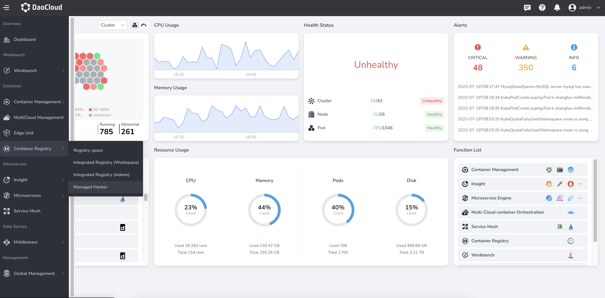

# Registry integration

Registry integration is the entrance to the container registry of the centralized management platform, which supports the integration of external container registrys, such as Harbor Registry and Docker Registry;
It can also automatically integrate the managed Harbor created by the platform. After the repository is integrated, the platform administrator can assign a private registry space to one or more workspaces (namespaces under the workspace) by binding the registry space to the workspace.
Or set the registry space as public for use by all namespaces of the platform.

## Main features

- Supports the integration of mainstream container registrys, such as Harbor Registry and Docker Registry, to help you centrally manage platform-level container registrys.
- Support quick viewing of data such as registry address, number of registry spaces, and storage usage through the overview page.
- Support creating and setting registry space status as public or private. If the status of the image space is public, the images under it can be used by all namespaces of the platform.
  If the status of the image space is private, after binding the image space to one or more workspaces, only the namespaces under the bound workspace can use the private image to ensure the security of the private image.
- Automatic integration of managed Harbor, after the platform creates a managed Harbor instance, it will be automatically integrated into the list of integrated registrys for unified management.

## Functional advantages

- Unified management portal for unified management of integrated container registrys and managed Harbor instances.
- High security, private images can only be pulled when deploying applications by binding the image space to the workspace.
- Convenient and fast, once the image space is set to public, all namespaces within the platform can pull the public images under it when deploying applications.
- Support mainstream container registry types: Harbor Registry, Docker Registry.

## Steps

1. Log in to the web console as a user with the Admin role, and click `container registry` from the left navigation bar.

    

1. Click `registry Integration` on the left navigation bar, and click the `registry Integration` button in the upper right corner.

1. Select the registry type, fill in the integration name, registry address, user name and password to integrate the external container registry into the platform.
