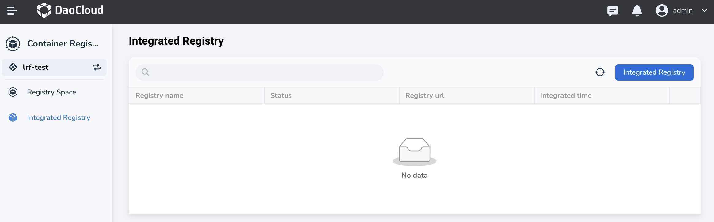

# Bind/Unbind Workspace

There are two types of registry spaces: public and private. The images in a public registry space are public, while the images in a private registry space are private.

- For public images, users can deploy applications through the `Choose Image` button in the container management module,
  selecting and deploying images from all public registry spaces in `Container Registry` -> `Integrated Registry `section without any other configuration.
- For private images, however, the workspace (tenant) needs to be assigned the private registry space
  by an administrator before members under the workspace can use them, ensuring the security of private images.

**Prerequisites:** An external Harbor registry has been created or integrated, and a registry space has been created.

## Binding Steps

Generally, for private registry spaces, binding to a workspace is helpful to allow members to use the images.

1. Log in to DCE 5.0 as a user with the Admin role, click `Container Registry` -> `Integrated Registry (Admin)` from the left navigation bar.

    

1. Click a registry name.

    

1. Click `Registry space` in the left navigation bar, then click the `⋮` on the far right of a specific registry space, and select `Bind/unbind workspace`.

    

    If no workspace is bound, the `Workspace` column will display `No binding`.

1. In the pop-up window, select one or more workspaces, and then click `OK`.

    

    To unbind a workspace, simply click on the `x` in the selected workspaces list.

1. The prompt message "Bound/Unbound workspace successfully" will be displayed,
   and the `Workspace` column will display the bound workspace when you move the cursor over it.

    

    Users under this workspace (tenant) can pull images from this registry space.

## FAQs

1. When deploying an application in a Kubernetes namespace and clicking the "Choose Image" button, you are unable to Choose Images from the registry space.

    - Check whether the Kubernetes namespace is bound to a workspace (it needs to be bound).
    - Check whether the registry space is bound to the workspace where the Kubernetes namespace is located (it needs to be bound).
    - Check whether the registry space status is private or public, and switch tabs as necessary.

    

2. What is the difference between assigning a registry space to a workspace for use and integrating a registry under the workspace?

    Platform administrators can centrally manage and assign a registry space to multiple workspaces
    at once without having to associate each one separately.

    Workspace administrators can integrate external image repositories for their members to use as needed,
    without relying entirely on platform administrators, making it more flexible to use.

Next step: [Deploy Applications](../../amamba/user-guide/wizard/create-app-git.md)