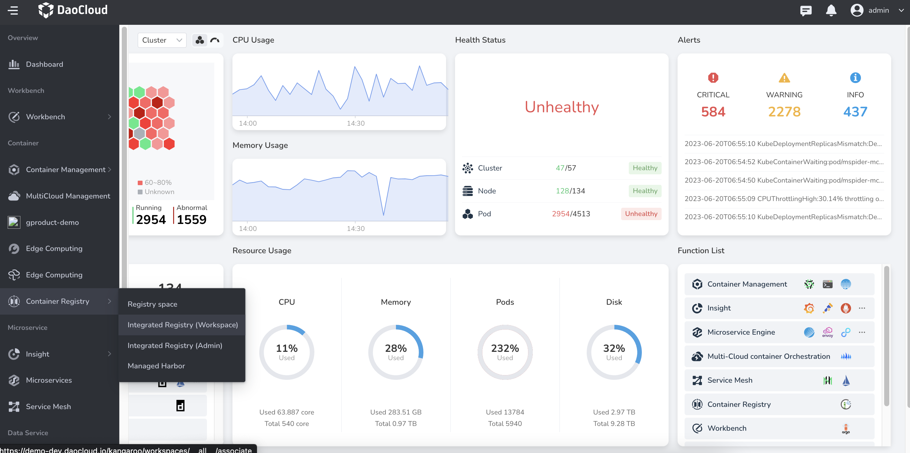
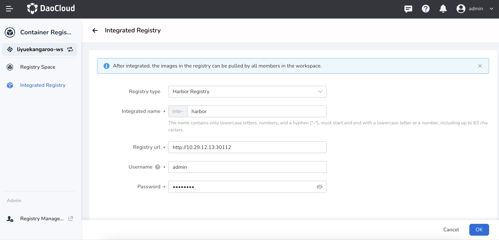

# Integrated Registry (Workspace)

Integrated Registry (Workspace) is a convenient way to access registries for workspaces.
Workspace admin can flexibly integrate registry for their workspace members as needed.
Once integrated, members can use all public and private images under the workspace by
clicking the `Choose Image` button when deploying applications in namespaces under the
workspace, achieving quick application deployment.

Support for integrating three registries:

- Harbor Registry: This is an open-source enterprise-grade Docker registry
  that provides functionalities such as image storage, version control, access control,
  and security scanning. It focuses on offering highly customizable and secure container image
  management solutions for enterprise environments. Harbor Registry supports integration across
  multiple container orchestration platforms and includes rich permission management and
  auditing capabilities.

- Docker Registry: This is the official Docker registry service provided by Docker
  as part of its ecosystem. It is used for storing, distributing, and managing Docker images.
  Docker Registry provides basic functionalities for image storage and version control and
  can be operated through a simple API.

- JFrog Artifactory: This is a versatile software package management and distribution platform
  that supports various types of packages, including Docker images. In addition to serving as
  a Docker registry, Artifactory also supports storage, distribution, and management
  of other package formats like Maven, npm, etc. Artifactory offers robust features like powerful
  access control, caching, and fast replication while being highly scalable and customizable.
  Compared to the above two image repositories, Artifactory is a more comprehensive software package
  management platform suitable for workloads spanning multiple package types.

## Benefits

- Flexible and convenient: Workspace administrators can independently access one or more
  Harbor/Docker type container registrys for use by workspace members.
- Global linkage: After accessing, when deploying applications on Workbench,
  you can press the `Choose Image` button to choose the image in the registry with one click to achieve rapid application deployment.

## Steps

1. Log in to DCE 5.0 as a user with the Workspace Admin role, and click `Container Registry` -> `Integrated Registry (Workspace)` from the left navigation bar.

    

1. Click the `Integrated Registry` button in the upper right corner.

    

1. After filling in the form information, click `OK`.

    

    !!! note

        1. If the Docker Registry has not set a password, you can leave it blank,
           and the Harbor registry must fill in the username/password.
        1. For a hands-on demo, see [Integrated Registry Video Demo](../../videos/kangaroo.md)
