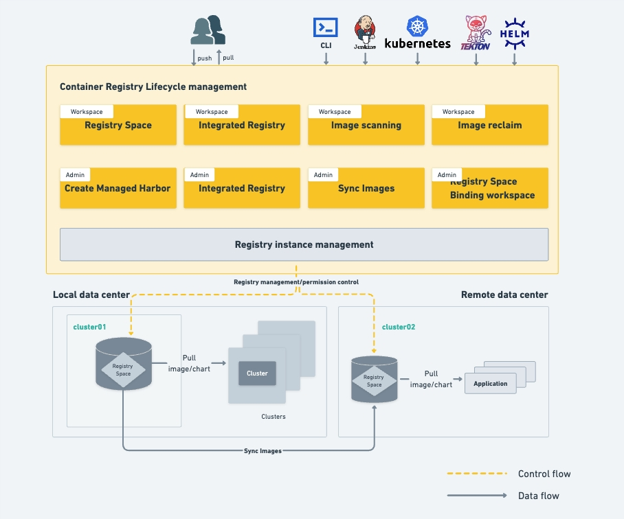

# What is a Container Registry

A container registry is a cloud native image hosting service that supports multi-instance lifecycle management. 
It allows deploying container registry instances to any cloud native basic environment and integrating external 
container registries such as Harbor Registry, Docker Registry and Jfrog Registry.

Through the container registry service, you can assign private registry space to one or more workspaces (tenants) 
to ensure the security of private images. You can also expose the registry space to all Kubernetes namespaces. 
The container registry cooperates with the [Container Management](../../kpanda/intro/index.md) service to help users quickly deploy applications.

## Features

- Full Lifecycle Management

    The container registry provides lifecycle management through managed harbors, including the creation, editing, 
    and deletion of image repositories.

- Integrated External Registries

    It allows administrators in integrating external repositories and allocating registry spaces to one or more 
    workspaces (tenants); also allows independent integration of external container registry by workspaces (tenants).

- Image Scanning

    It supports image scanning to identify security risks in images.

- Convenient Application Deployment

    It interacts with the container management module, allowing quick image selection through the "Select Image" feature 
    to complete application deployment.

- Image Synchronization

    It suupports both manual and scheduled image synchronization. Images can be synchronized to the target repository 
    or from the target repository to the local repository.

- Image Reclaim

    Supports setting image recycling rules to manage images in the repository. Images can be moved to the recycle bin based on certain rules either manually or on a scheduled basis.

**Product Logic Architechture**

[Download DCE 5.0](../../download/index.md){ .md-button .md-button--primary }
[Install DCE 5.0](../../install/index.md){ .md-button .md-button--primary }
[Free Trial](../../dce/license0.md){ .md-button .md-button--primary }
