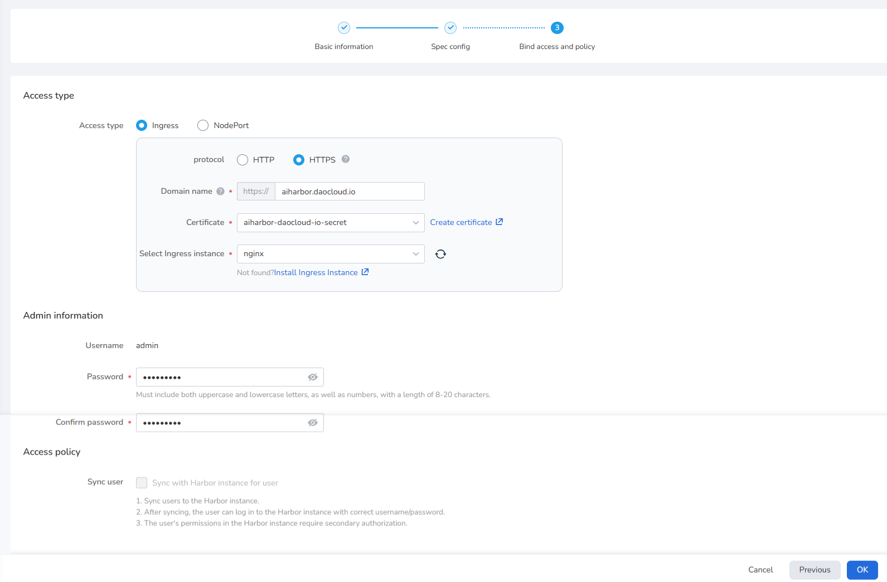
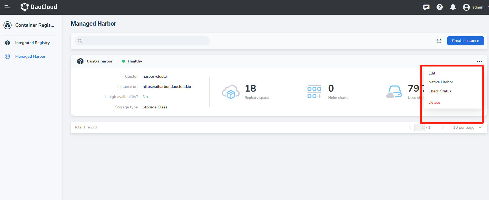

# Create Managed Harbor

Prerequisite: [Cert Manager](https://cert-manager.io/docs/installation/) and [Harbor Operator](./operator.md) have been installed.

!!! note

     For Harbor instances, in addition to using administrator accounts,
     robot accounts are also supported for access.

1. Log in to DCE 5.0 as a user with the Admin role, and click __Container Registry__ -> __Managed Harbor__ from 
   the navigation bar.

     

1. Click the __Create Instance__ button in the upper right corner.

     

1. Fill in the instance name, select the deployment location and click __Next__
   (if there is no deployment location to choose, you need to go to Container Management module to create a cluster and namespace).

     

1. Fill in the database, Redis instance and image/Charts storage information and click __Next__ .

     If __Middleware__ has been installed, the system will automatically detect PostgreSQL and Redis. 
     When there is no available database, you can click the link to create one.
     If __Middleware__ hasn't been installed, you can __Join external instance__ and use external PostgreSQL and Redis.
     
     Tips for filling out the database:

     - Address: `postgres://{host}:{port}`, for example `postgres://acid-minimal-cluster.default.svc:5432`
     - Username: Fill in the username to connect to the database
     - Password: fill in the password to connect to the database

     Redis filling is divided into stand-alone and sentinel modes:

     - Fill in the address in stand-alone mode: `redis://{host}:{port}`, you need to replace the two parameters: `host` and `port`.
     - Fill in the address in sentinel mode: `redis+sentinel://{host}:{port}?sentinelMasterId={master_id}`, you need to replace the three parameters: `host`, `port`, and `master_id`.
     - Password: Fill in as required

     

1. Fill in the domain name, select the ingress instance, enter the administrator password and click __OK__ 
   (username/password is used to log in to the native Harbor instance, please keep the password safe).

     Tips for filling in the domain name: `http://{host}`, `http://` in front of the host must be brought.

          

1. Return to the list of managed Harbor instances. The newly created instance is the first one by default. 
   Wait for the status to change from `Updating` to `Healthy` before it can be used normally.

1. Click __...__ on the right side of an instance, and you can choose to edit, delete, enter the Native Harbor or check status.

    

1. **Managed Harbor** primarily involves managing the entire lifecycle of a Harbor instance. Once created, 
   the system will automatically integrate the instance into the **Integrated Registry** list. You can navigate to the 
   **Integrated Registry** list to view the instance details and perform operations such as `Create Image Space` and `Sync Images`.

Next step: [Create registry space](../integrate/integrate-admin/registry-space.md)
