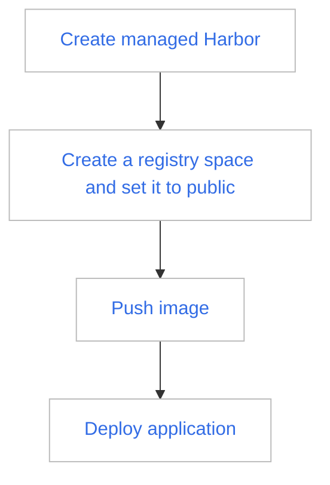
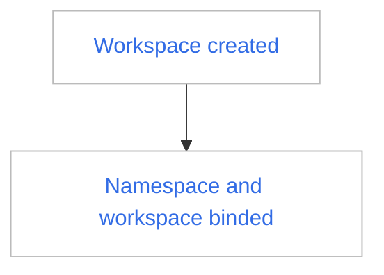
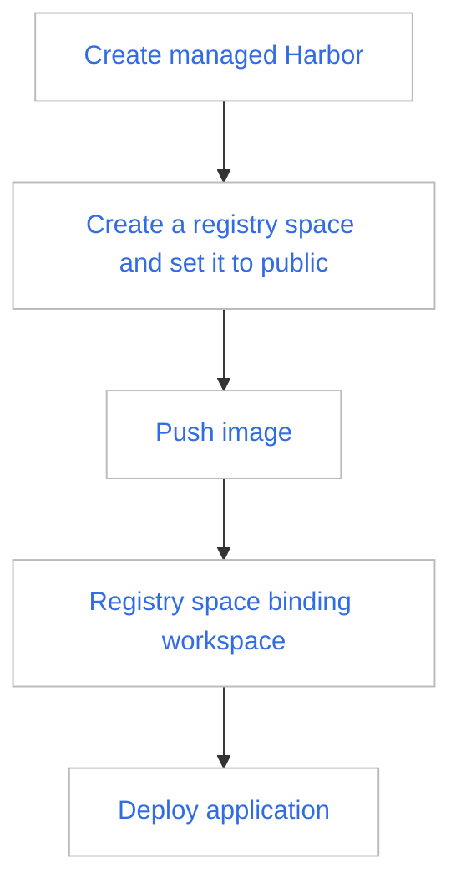

---
hide:
  - toc
MTPE: ModetaNiu
DATE: 2024-08-19
---

# Admin quickly uses the container registry to serve the platform

In DCE 5.0, there are two methods for managing container registries: Managed Harbor (self-built Harbor on DCE) and 
Integrated Registry (integrating external Harbor or Docker Registry).

- [Managed Harbor](../managed/intro.md)（suggested）
- [Integrated Registry](../integrate/integrate-admin/integrate-admin.md)

Harbor is mainly promoted as the Container Registry in DCE 5.0 to provide image services.

## Sharing public images 

Assuming that you have created a Managed Harbor or integrated to an external harbor, follow the steps below to 
share a public image with all namespaces:

Expected Result: When users on the platform deploy applications in the namespace, they can select images in the 
public registry space for deployment through the image selector.

## Sharing private images

Assuming that you have created a Managed Harbor or integrated to an external harbor, follow the steps below 
to share a private image with the namespace under the specified workspace (tenant):

The prerequisites are:

Concrete steps are as follows:

Expected Result: Only when deploying applications in namespaces under this workspace, can you use the image selector 
to select private images under this registry space to deploy applications.

!!! tip

    1. The connected Harbor can achieve the same effect as above.
    1. Docker Registry itself only has public images, so after accessing, the images will be open to all namespaces.
