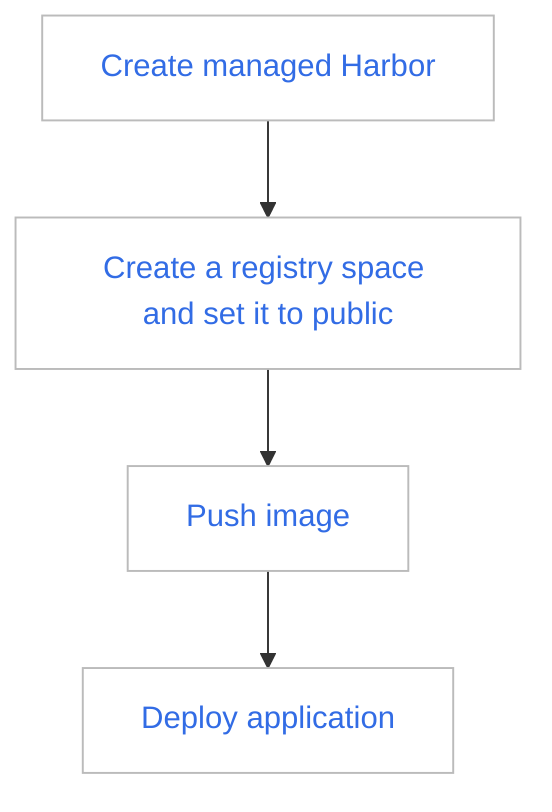
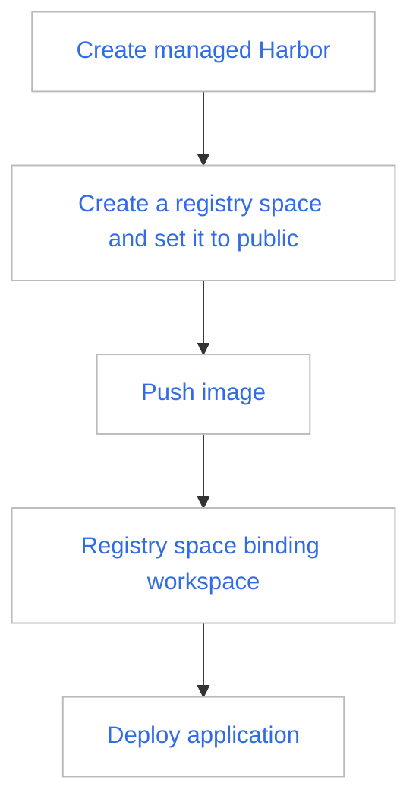
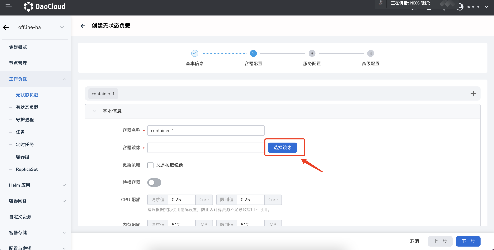
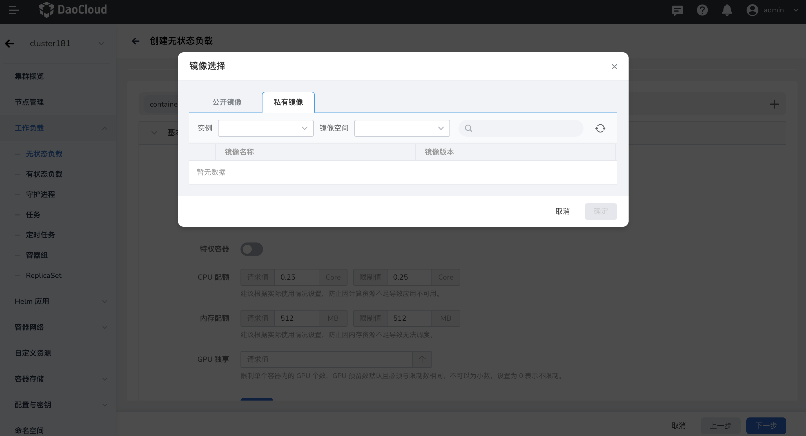

---
hide:
  - toc
---

# Admin quickly uses the registry to serve the platform

In DCE 5.0, there are two registry management methods: Managed Harbor (self-built Harbor on DCE) and Integrated Registry (integrating external Harbor or Docker Registry).

- [Managed Harbor](../managed/intro.md)（suggestion）
- [Integrated Registry](../integrate/integrate-admin.md)

Harbor is mainly promoted as a registry in DCE 5.0 to provide image services.

## Sharing public images

Assuming that you have created a managed Harbor or connected to an external harbor, follow the steps below to share a public image with all namespaces:

1. Create a managed Harbor.
2. Create a registry space and set it to public.
3. Push the image to the registry space.
4. Deploy the application.

Expected Result: When all users on the platform deploy applications in the namespace, they can select images in the public registry space for deployment through the image selector.

## Sharing private images

Assuming that you have created a managed Harbor or connected to an external harbor, follow the steps below to share a private image with the namespace under the specified workspace (tenant):

The prerequisites are:

1. Created workspace
2. Namespace bound workspace

The operation steps are:

1. Create a managed Harbor.
2. Create a registry space and set it to public.
3. Push the image to the registry space.
4. Bind the registry space to the workspace.
5. Deploy the application.

Expected Result: Only when deploying applications in namespaces under this workspace, you can use the image selector to select private images under this registry space to deploy applications.

!!! tip

    - The connected Harbor can achieve the same effect as above.
    - Docker Registry itself only has public images, so after accessing, the images will be open to all namespaces.
