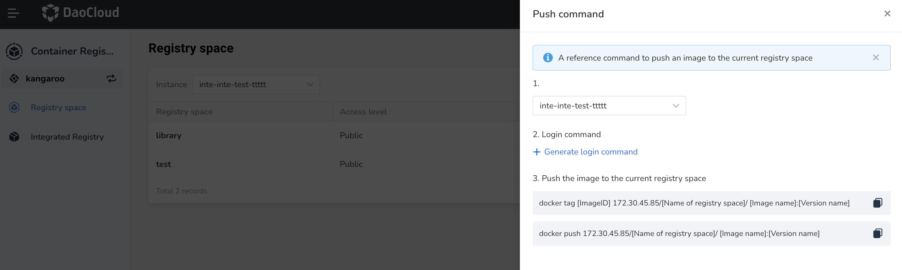
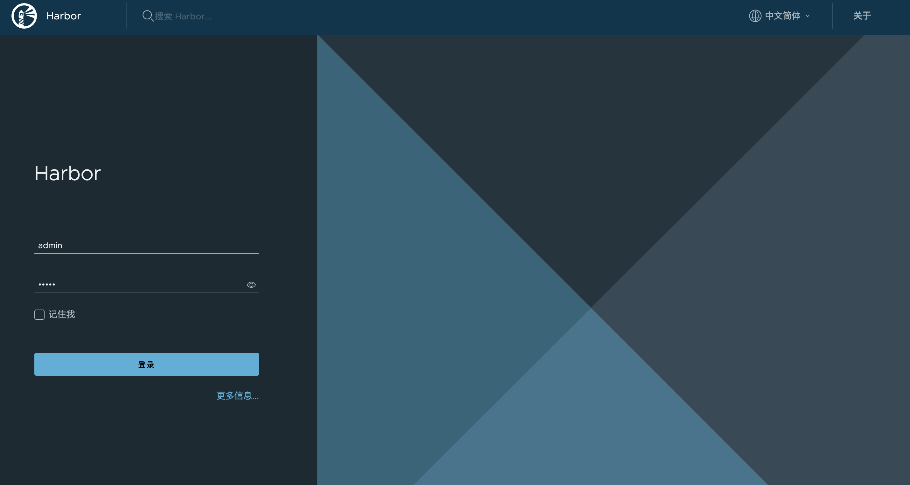
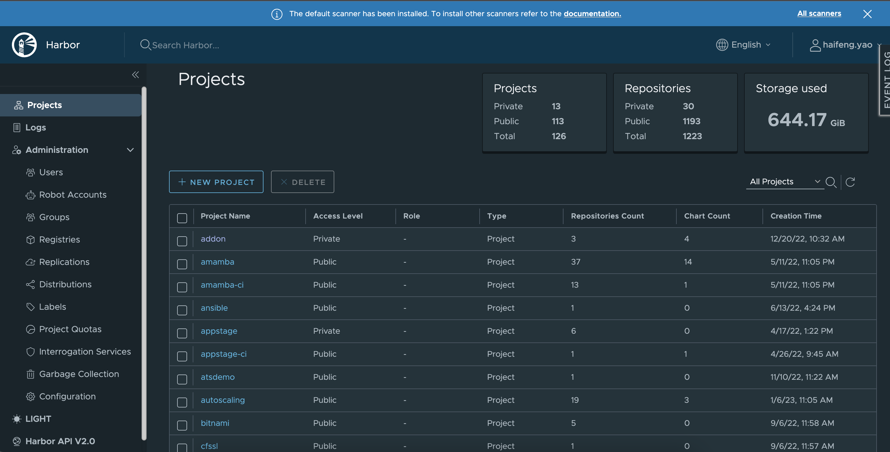

# Pushing an Image to the Container Registry

After creating managed Harbor and registry space, you can follow the instructions below to log in and push the image to the container registry or log in to native Harbor to view the guidance provided by native Harbor under each registry space (project).

## Push Method 1

**Prerequisites:** Managed Harbor and registry space have been created.

You can build a new container image locally or grab a public image from DockerHub for testing. This page takes the latest official Nginx image of DockerHub as an example. Run the following commands in sequence in the command line tool to push the image. Please replace "library" and "nginx" with the name of the registry space and container registry you actually created.

1. Log in to the container registry using the following command:

    ```bash
    docker login --username=<container registry login name> <container registry address>
    ```

    Example: `docker login --username=admin http://test.lrf02.kangaroo.com`

    Enter the container registry password in the returned result (the password set when creating managed Harbor).

2. Tag the image using the following command:

    ```bash
    docker tag <container registry name>:<artifact version> <container registry address>/<registry space name>/<container registry name>:<artifact version>
    ```

    Example: `docker tag nginx:latest http://test.lrf02.kangaroo.com/library/nginx:latest`

3. Push the image to the registry space library using the following command:

    ```bash
    docker push <container registry address>/<registry space name>/<container registry name>:<artifact version>
    ```

    Example: `docker push http://test.lrf02.kangaroo.com/library/nginx:latest`

4. Pull the image using the following command:

    ```bash
    docker pull <container registry address>/<registry space name>/<container registry name>:<artifact version>
    ```

    Example: `docker pull http://test.lrf02.kangaroo.com/library/nginx:latest`

## Push Method 2

**Prerequisites:** Managed Harbor and registry space have been created.

1. On the `Managed Harbor` list page, click `...` on the right side of the target registry,
   then click `Native Harbor` to enter the login page of the native Harbor.

    

2. Enter the username and password set when creating managed Harbor to enter native Harbor.

    

3. Click the name of the target registry space (project) to enter the registry space.

    

4. Click the push command on the right to view the push commands provided by native Harbor.

    

!!! Tip

    Compared with [method 1](#push-method-1), the push command of the native Harbor automatically
    fills in the address of the container registry and the name of the registry space.
