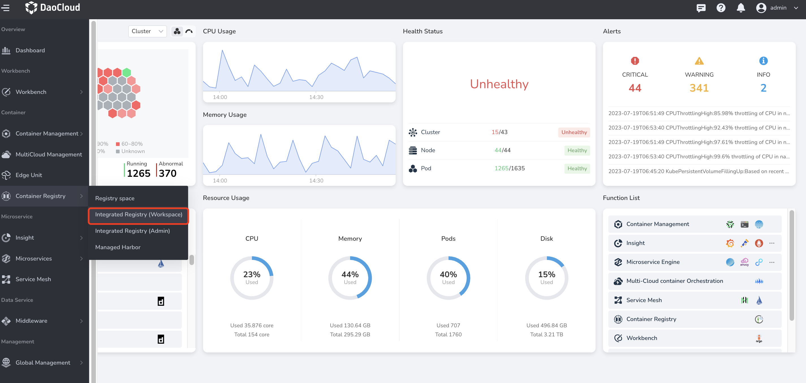
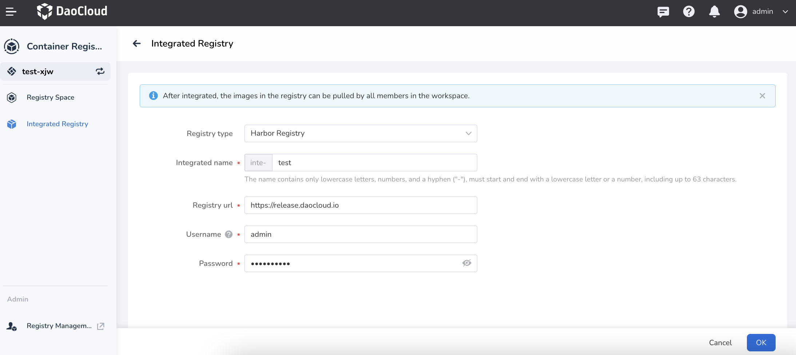
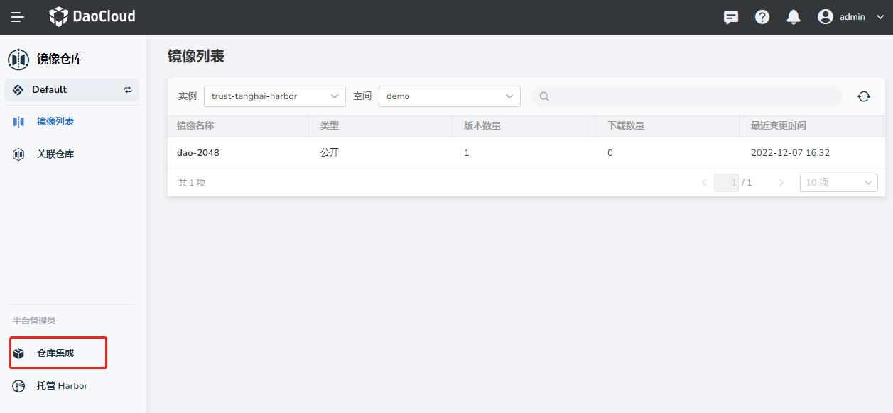
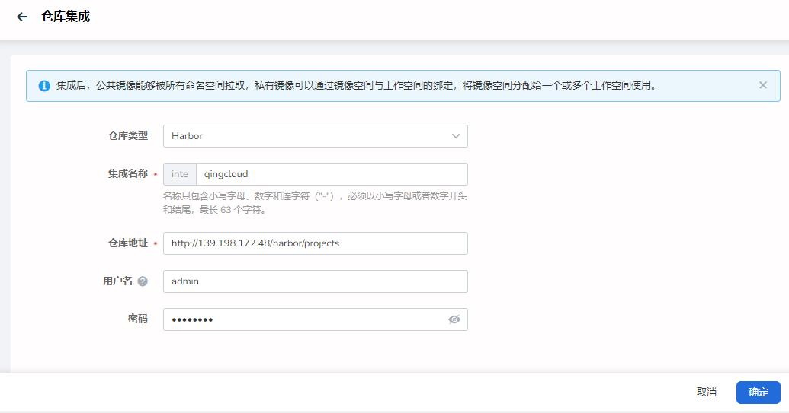
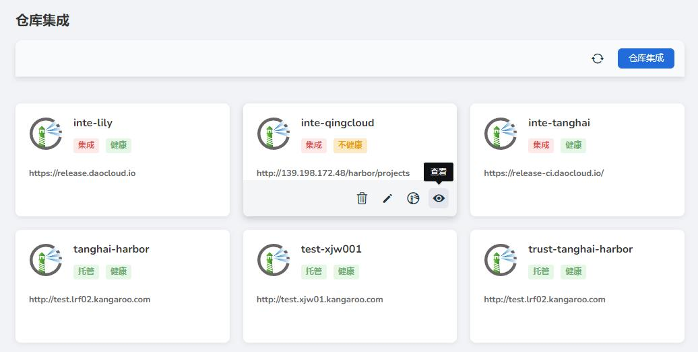

# Manage all container registrys

If you have one or more Harbor or Docker container registrys, you can use DCE 5.0 container registrys for unified management. Depending on the role permissions of the operator, two methods can be used:

- Associated registry
- Integrated registry

## Associated registry

If it is Workspace Admin, you can associate the existing container registry with the DCE platform through the associated registry function for use by members of the workspace. The simple operation steps are as follows:

1. Log in with the Workspace Admin role, click `Associated Registry` from the left navigation bar, and click the `Associated Registry` button in the upper right corner.

    

1. After filling in the form information, click `OK`.

    

    !!! note

        1. If the Docker Registry container registry has not set a password, you can leave it blank, and the Harbor registry must fill in the username/password.
        1. For a hands-on demo, see [Associated Registry Video Demo](../videos/kangaroo.md).

## Integrated registry

If you are an Admin (platform administrator), you can also integrate the existing container registry into the DCE platform through the registry integration function.
Registry integration is the entrance to the container registry of the centralized management platform. The platform administrator can assign a private image space to one or more workspaces (namespaces under the workspace) by binding the image space to the workspace. Or set the image space as public for use by all namespaces of the platform.

1. Log in with the Admin role, and click `Registry Integration` on the left navigation bar.

    

1. Click the `Registry Integration` button in the upper right corner.

    

1. Select the registry type, fill in the integration name, registry address, user name and password, and click `OK`.

    

1. In the integrated registry list, hover the cursor over a certain registry, click the eye icon to view the overview.

    

1. The overview page displays the basic information and statistical information of the current registry, and also provides a quick start at the top, which is convenient for managing image space, workspace, and creating applications.

    