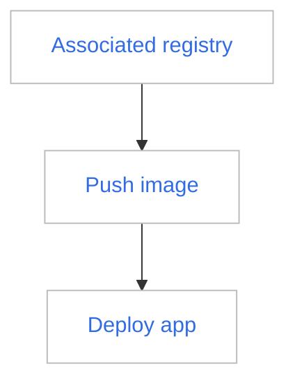
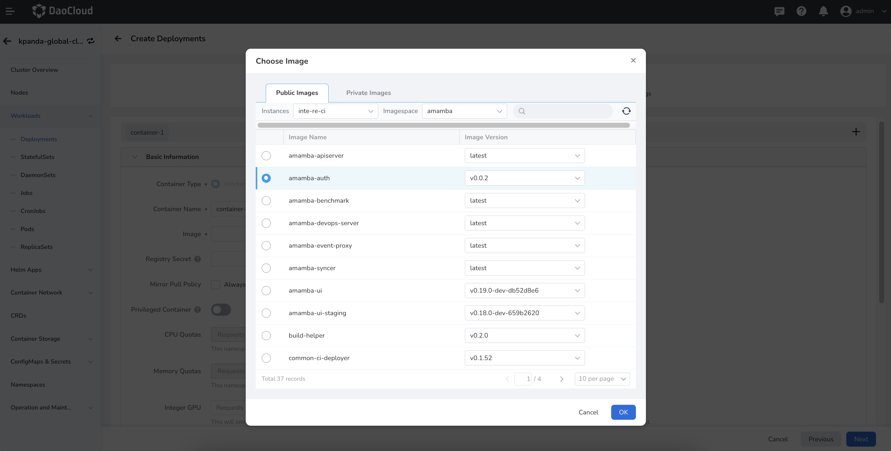

---
hide:
  - toc
---

# Workspace Admin Quickly use the container registry to serve the workspace

In DCE 5.0, Workspace Admin can associate two external container registrys, Harbor and Docker Registry, by associating registrys. After association, members of the workspace can see all images of the associated repository in the image list, and can select the image in the repository for deployment through the image selector when deploying the application in the namespace under the workspace.

Assuming that you have created an external Harbor or Docker Registry, follow the steps below to share the external Harbor or Docker Registry with workspace members.

The prerequisites are:

1. You are a Workspace Admin, and some namespaces are bound under this workspace
2. You have one or more external container registrys (Harbor or Docker Registry)

The operation steps are:

Expected result: When deploying an application in the namespace under this workspace, you can use the image selector to select the image under this registry space to deploy the application.

