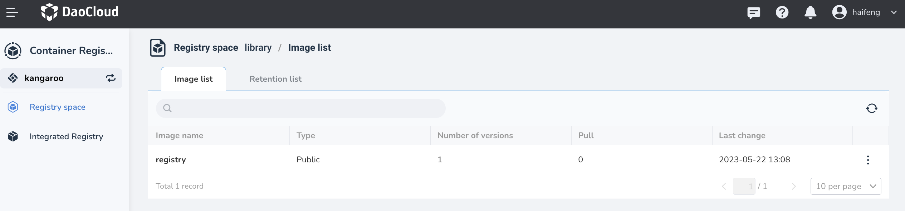
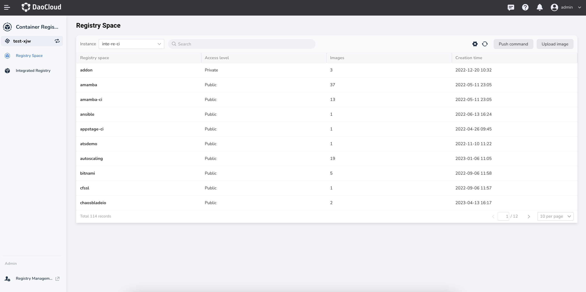
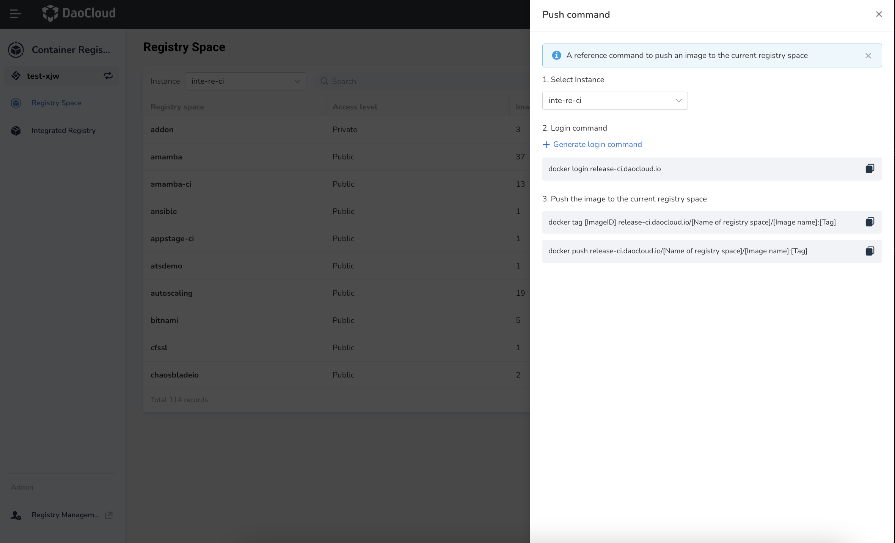
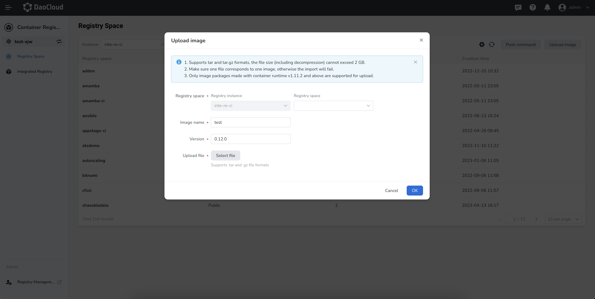

# Registry space

DCE 5.0 container registry provides a feature of isolating images based on registry spaces.
Registry spaces are divided into two types: public and private.

- Public registry: accessible by all users, usually storing public images. There is a default public registry space.
- Private registry: only authorized users can access, usually storing images of the registry space itself.

You can choose different instances to view all registry spaces underneath.

Click a name of registry space to view the current image list and reclaim rules for that space.
You can create reclaim rules for the current registry space. All reclaim rules are calculated
independently and apply to all qualified images, with a maximum of 15 reclaim rules supported.

After entering the registry space through the `Integrated Registry (Workspace)` on the left navigation bar,
click the `Push command` button located on the right side.

You can view the push command that can be used to push the image to the current registry space.

Click the `Upload image` button to upload an image file in tar or tar.gz format.
Please note that the file size should not exceed 2 GB, and each file corresponds to one image.
Currently, only image compression packages made with container runtime v1.11.2 and above are supported to upload.

