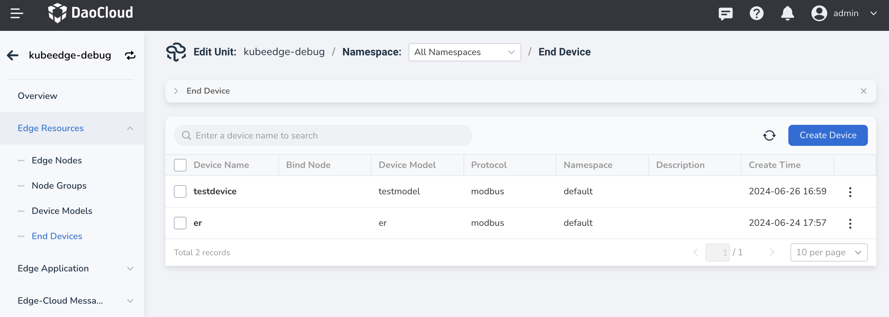
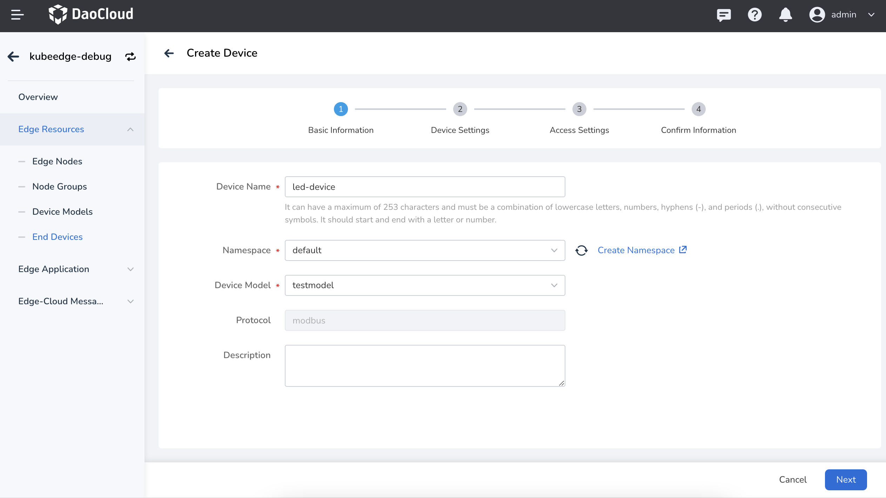
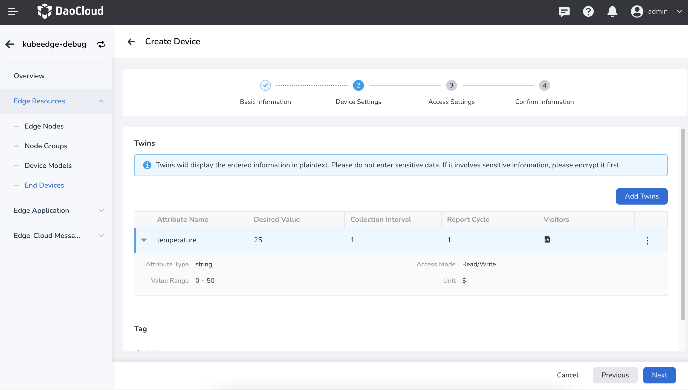
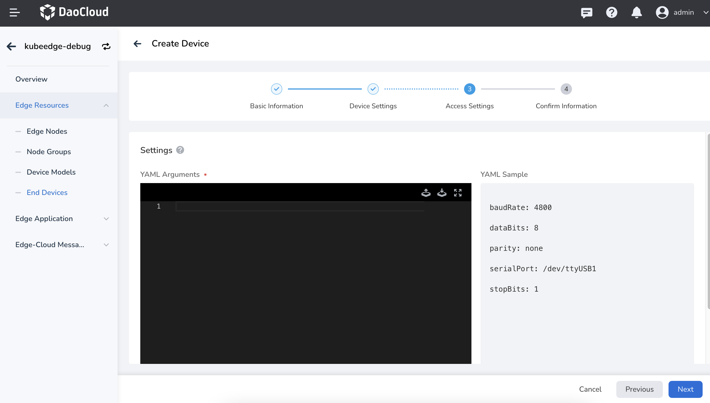
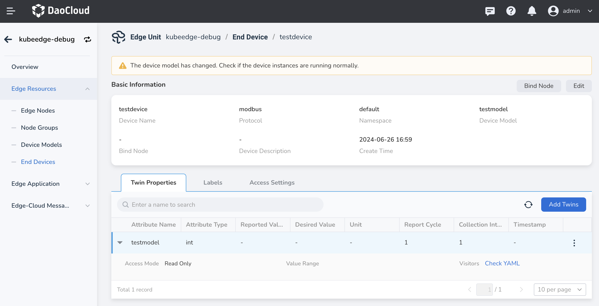

# Smart Device Control

This page introduces the method of accessing the edge computing platform based on a custom protocol from end devices and interacting with the cloud. Using a scenario of controlling a light switch with gestures as an example, the overall implementation process is explained.

## Preparation

- Edge node, for node access requirements, refer to
  [Edge Node Access Requirements](../user-guide/node/join-rqmt.md)
- LED light with a control unit
- LED light driver mapper, for mapper development, refer to
  [How to Develop Device Driver Application Mapper](./develop-device-mapper.md)

## Create End Devices

1. Deploy the LED light driver mapper to the edge node, the deployment process can be found in
   [Creating Workloads](../user-guide/edge-app/create-app.md)

1. Go to the edge unit details page, select the left menu __Edge Resources__ -> __End Devices__ ,
   and click the __Create Device__ button on the top right of the end device list.

    

1. Fill in the basic information.

    

    !!! note

        The access protocol must be consistent with the protocol name defined in the mapper.

1. Fill in the device configuration, add device twin properties and tags.

    - The property value is the expected value of the device.
    - The access method must be consistent with the key-value data defined in the mapper.

    

1. Fill in the device access configuration.

    The access parameters for the platform to connect to the device. In this scenario, the device access path is /dev/ttyACM0, with a baud rate of 9600.

    

1. Information confirmation, verify that the configured information is correct,
   click __OK__ to complete the device creation.

## Verify Effect

1. In the device list, click on the device name to enter the device details page
   and view the reported status values of the device.

    

2. Edit the device twin properties, modify the expected value of the device,
   and see the change in the LED light status.
