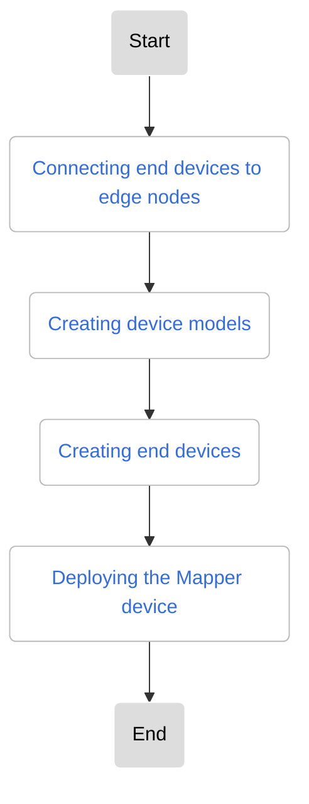

# Instructions to Connect a Modbus Device

This article introduces how to connect an end devices based on the Modbus protocol to DCE 5.0 Cloud Edge Collaboration and interact with the cloud.
A simulated device is used as an example to introduce the overall implementation process.

The process to connect an end device is as follows:



## Preparation work

- Simulated end device with the Modbus protocol: In this article, the end device is simulated as a deployment.

    Simulated device image: **release-ci.daocloud.io/kant/modbusmock:v0.1.0**

- Mapper device: Developed based on the KubeEdge DMI framework, it can collect data for Modbus protocol devices. This device is only suitable for the simulated device mentioned above.

    Mapper image: **release-ci.daocloud.io/kant/devicedemo:v1.1**

- Edge nodes: For node connect requirements, refer to [Edge Node Connect Requirements](../user-guide/node/join-rqmt.md)

## Connecting end devices to edge nodes

Since the Modbus device in this article is a simulated device, the simulated device image needs to be deployed to the edge node first
to run and connect the simulated device. For the deployment process, refer to [Creating Deployments](../user-guide/edge-app/create-app.md).

The [Advanced Settings](../user-guide/edge-app/create-app.md#__tabbed_2_1) includes the following parameters:

- Node Scheduling: Select the node that the device needs to connect to.
- Network Configuration: Choose the host network as the network type.

## Creating device models

For the device model creation process, refer to [Creating Device Models](../user-guide/device/create-device-model.md).

Please ensure the device model parameters are set as follows:

- Access Protocol Name: modbus-tcp
- __Name__ , __Type__ , and __Access Mode__ in __Twin Attributes__ should match the settings shown in the diagram below.

    <!--add image later-->

## Creating end devices

1. Fill in __Basic Information__ and select the device model mentioned above.

2. Fill in __Device Settings__ , and the configuration of the twin attributes associated with the model is as follows:

    Access method for the temperature attribute:

    ```yaml
    offset: 1  # Register offset
    register: HoldingRegister  # Holding register
    ```

    Access method for the humidity attribute:

    ```yaml
    offset: 1  # Register offset
    register: InputRegister  # Input register
    ```

    <!--add image later-->
    <!--add image later-->

3. Fill in __Access Settings__ with the following parameters:

    ```yaml
    address: 0.0.0.0:11502
    ```

    <!--add image later-->

4. After the device is successfully created, it will automatically redirect to the device list. Click **Bind Node** on the right side of the list.

    <!--add image later-->

## Deploying the Mapper device

The Mapper device is primarily used to collect device data, and it operates as a deployment.
Once the Mapper is deployed, the operating data of the device can be retrieved. In this practice scenario,
the temperature and humidity values collected by the Mapper can be seen on the device details page.

In real application scenarios, you can modify the implementation and behavior of the Mapper according to business needs
to complete DMI standard functions such as data push, data pull, data storage in databases, edge-side localization processing, and device linkage.

!!! note

    The order of creating end devices and deploying the Mapper device can be swapped.

Check the image address of mapper device:

```shell
release-ci.daocloud.io/kant/devicedemo:v1.1
```

For the deployment process of Mapper device , refer to [Creating Deployments](../user-guide/edge-app/create-app.md).

Parameters for creating deployments:

- __Container Settings__  -> __Data Storage__ : Choose Host Path, map **HostPath /etc/kubeedge** to **mountPath /etc/kubeedge**, and set the permission to **Read/Write**.
- __Advanced Settings__ -> __Network Configuration__ : Select **Host Network** as the network type.
- __Advanced Settings__ -> __Node Scheduling__ : Choose the same node that is bound to the device.

    <!--add image later-->
    <!--add image later-->

## Verifying Device Operation

After completing the above steps, you can go to the device details page, and see the operating data of the device on the interface. In this scenario, you will see the temperature and humidity values. In this article, the data values of the mock device will not change.

<!--add image later-->
