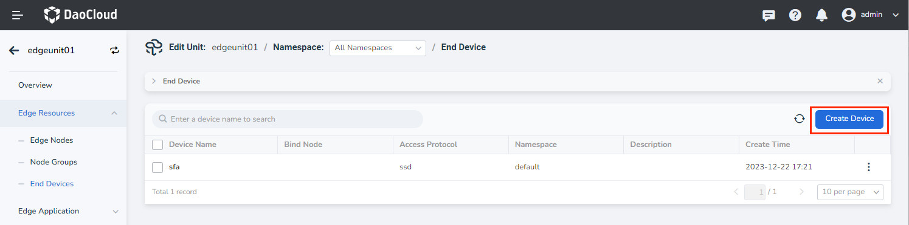
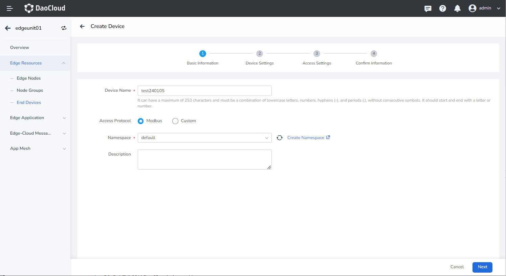
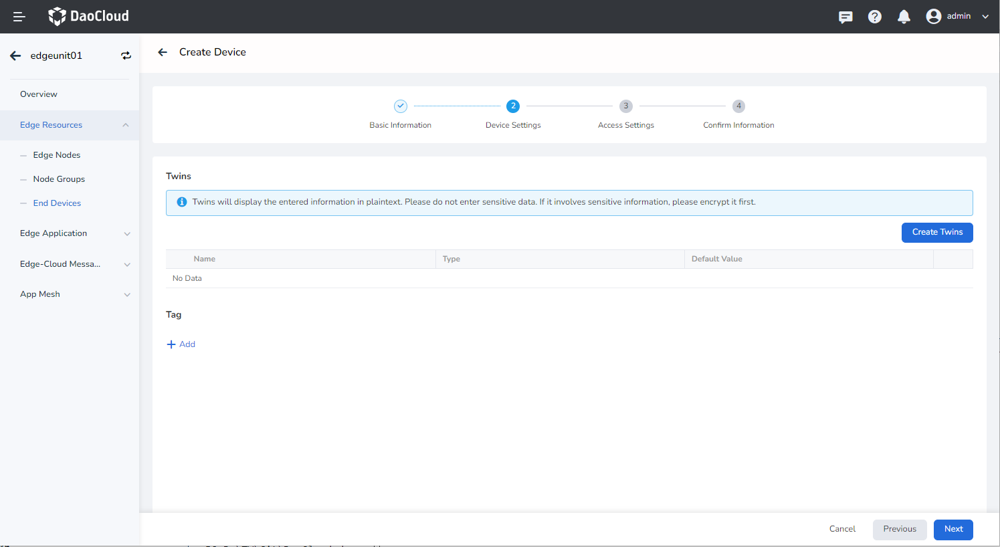
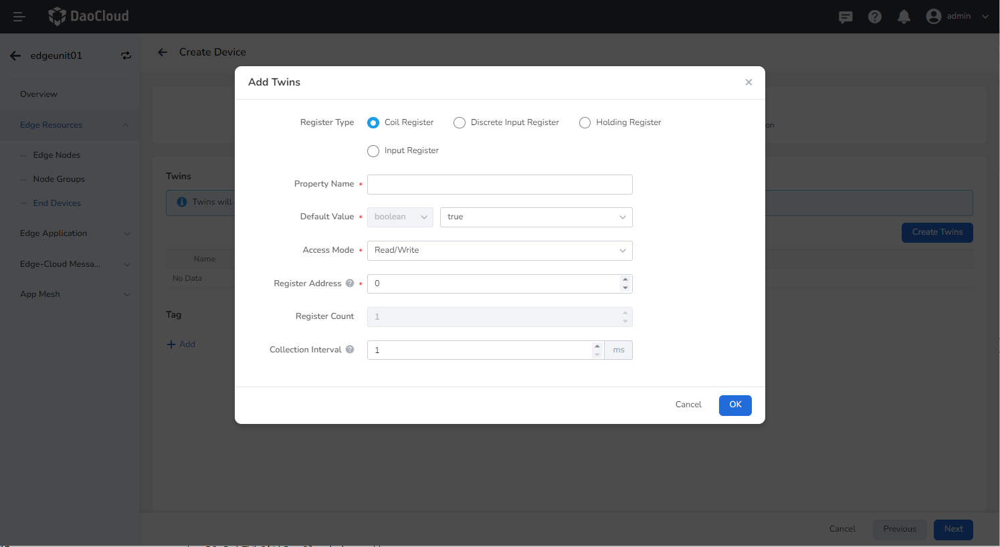
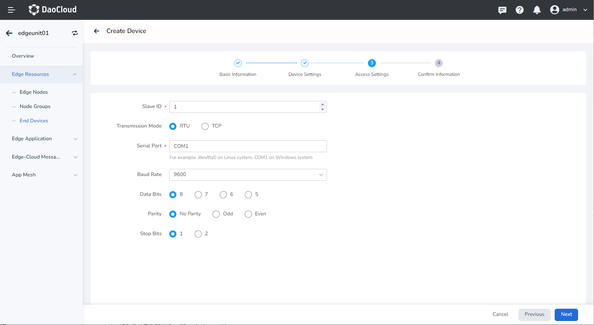
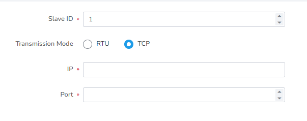
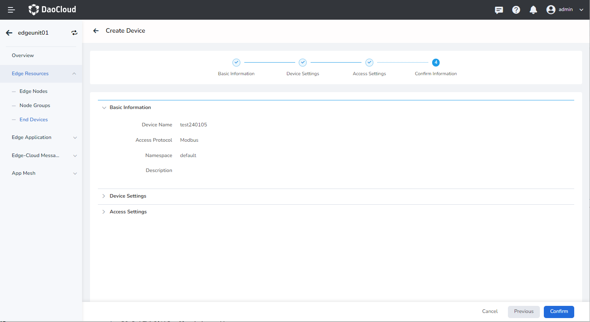
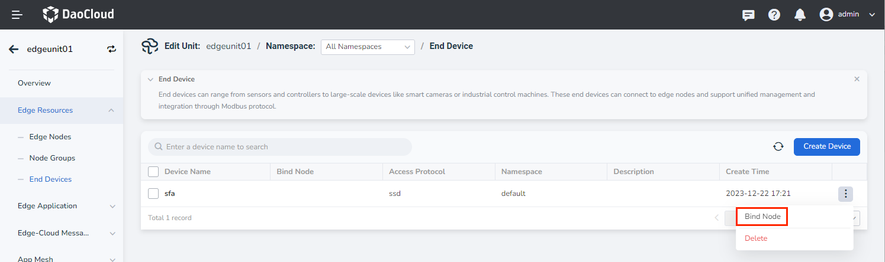

# Create End Device

End device can be connected to edge nodes and support access via the Modbus protocol.
Once an end device is connected, it can be managed centrally in the cloud management plane.

This article describes the steps to create end device and bind them to edge nodes.

## Create an End Device

Follow these steps to create an end device:

1. Navigate to the edge unit details page and select __Edge Resources__ -> __End Devices__ from the left menu.

    

2. Click the __Create Device__ button located at the top right corner of the end device list.

    

3. Enter the basic information.

    - Device Name: Use a combination of lowercase letters, numbers, hyphens (-), and dots (.). Avoid consecutive separators and ensure the name starts and ends with a letter or number. The maximum character limit is 253.
    - Access Protocol: The current platform supports device access via the Modbus protocol.
    - Namespace: Specify the namespace where the device resides. Namespaces help isolate resources from each other.
    - Description: Provide a brief description of the device.

4. Fill in the device settings, and you can add twins and labels.

    - Twin Properties: Optional. Refers to the dynamic data of the end device, including proprietary real-time data such as the on/off state of a light, temperature, and humidity readings from a sensor, etc.
    - Labels: Optional. Classify and manage different device by assigning labels to them.

    

    To add twins, you can select the corresponding register type based on the
    device type and fill in the corresponding parameters. The parameter descriptions are as follows:

    - Register Type: Modbus protocol device register types include Coil Registers, Discrete Input Registers, Holding Registers, and Input Registers.
    - Property Name: Required. The name of the device property.
    - Default Value: Required. The desired value of the property, based on the data type of the register type.
    - Access Mode: Default value. Varies based on the default access method for the register type.
    - Register Address: Required. The starting data bit corresponding to the property.
    - Collection Interval: Optional. Specifies the interval at which the device collects and reports data.
    - Byte Swap: Swap the two-byte contents in each register obtained.
    - Swap Register Order: Reverse the order of all registers obtained from high to low.
    - Property Value Range: Limit the range of the original data obtained.
    - Scaling Factor: Scale the original data obtained.

    

5. Fill in the device access settings.

    The Modbus protocol has two transmission modes: RTU and TCP. The access settings differs between the two modes.

    - Slave ID: The identification field when accessing register values.

    **RTU Transmission Mode:**

    - Serial Port: The serial port to which the end device is connected. Different values can be selected depending on the operating system of the edge node.
    - Baud Rate: The number of symbol elements transmitted per second, which measures the data transfer rate.
    - Data Bits: A parameter that measures the actual data bits in communication.
    - Parity: A simple error-checking mechanism used to determine if there is noise interference during communication or if there is a synchronization issue between transmitting and receiving data.
    - Stop Bits: Represents the last bit of a single data packet.

    

    **TCP Transmission Mode:**

    - IP: The IP address of the end device.
    - Port: The port of the end device.

    

6. Confirm the information and click __OK__ if the configured information is correct to complete the device creation.

    

## Binding End Device to Edge Nodes

An end device can be associated with only one edge node. Once the device is bound to a node, applications deployed on that node can access real-time data from the device using the device twin created in the cloud.

The steps are as follows:

1. Go to the edge unit details page and select the left menu __Edge Resources__ -> __End Devices__ .

2. On the right side of the end device list, click the __⋮__ button and select __Bind Node__ from the popup menu.

3. In the dialog box, select the node to bind and click __OK__ to complete the binding of the edge node.

    

Next step: [Manage End Device](manage-device.md)
