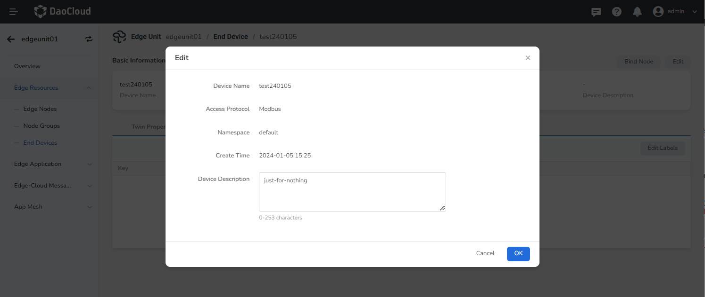
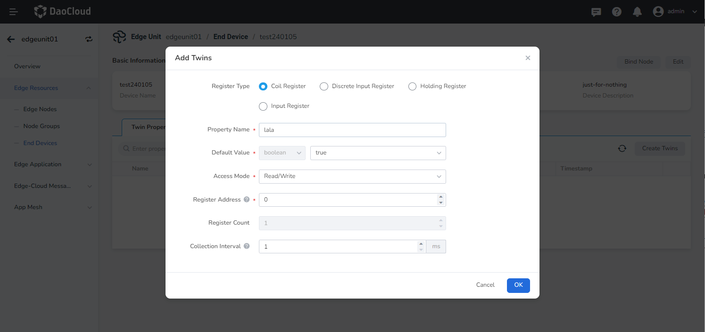
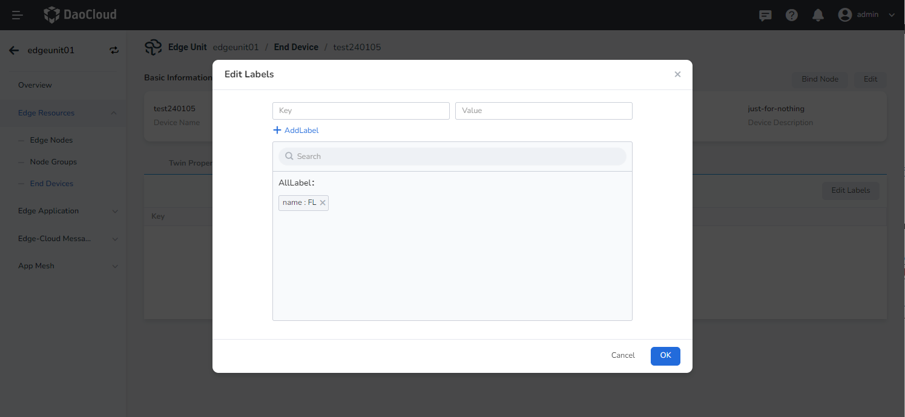
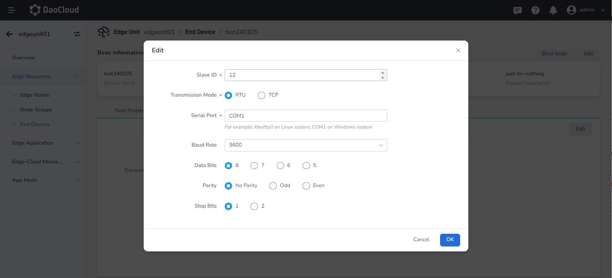
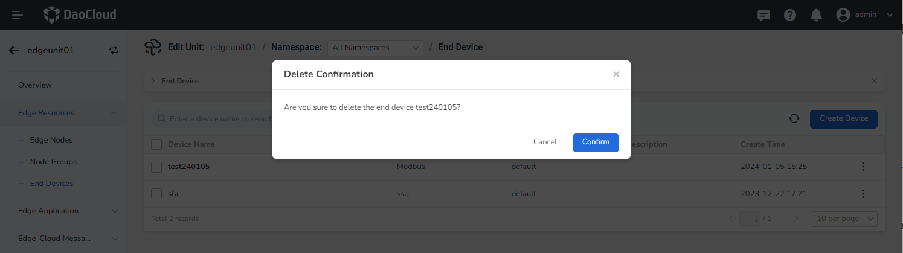

# Manage End Device

## Edit End Device

The platform supports editing and modifying the basic information, twin properties, labels, and access settings of end device.

⚠️ End device can only be edited when they are not bound to edge nodes.

### Edit basic information

The steps to perform this operation are as follows:

1. Go to the edge unit details page and select the left-side menu __Edge Resources__ -> __End Devices__ .
2. Click the device name in the end device list.
3. On the device details page, click the __Edit__ button in the top right corner.
4. In the edit dialog box, modify the device description.
5. Click __OK__ to complete the modification of basic information. The system will automatically return to the device details page.

    

### Edit twin properties

The steps to perform this operation are as follows:

1. On the device details page, select the __Twins Properties__ tab.
2. Click the __Add Twin__ button at the top right of the property list, or click the __⋮__ button
   on the right side of the list and select the __Edit/Delete__ option from the pop-up menu.
3. In the corresponding operation dialog box, click the __OK__ button to complete the operations of adding, editing, or deleting twin properties.

    

### Edit labels

The steps to perform this operation are as follows:

1. On the device details page, select the __Labels__ tab.
2. Click the __Edit Labels__ button at the top right of label lists.
3. In the edit labels dialog box, you can add or delete labels.
4. Click the __OK__ button to complete the modification of device labels.

    

### Edit access settings

The steps to perform this operation are as follows:

1. On the device details page, select the __Access Settings__ tab.
2. Click the __Edit__ button at the top right of the access configuration list.
3. In the edit dialog box, modify the access configuration content.
4. Click the __OK__ button to complete the modification of device access configuration.

    

### Delete end device

On the right side of the end device list, click the __⋮__ button and select __Delete__ from the pop-up menu.

