# Create Deployment

This article explains how to create deployments using two methods: by image and
YAML. Here, deployments refer to stateless applications.

A deployment is an API object that manages replicas of an application.
It represents pods without local state, where the pods are independent, functionally
identical, and can be scaled up or down flexibly. Deployments are stateless, do not
support data persistence, and are suitable for deploying stateless applications
that do not require data storage and can be restarted or rolled back at any time.

## Create by image

Follow the steps below to create a stateless deployment using an image.

1. Go to the details page of the edge unit and select the `Edge Application` -> `Deployments` menu.

2. Click the `Create by Image` button in the upper-right corner of the deployment list.

    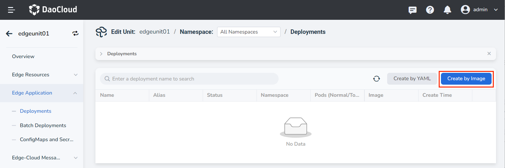

3. Fill in the basic information:

    - Deployment Name: It can contain up to 63 characters and can only include lowercase letters,
      digits, and hyphens ("-"). It must start and end with a lowercase letter or digit,
      for example, deployment-01. The name of the same type of deployment in the same namespace
      must be unique, and the deployment name cannot be changed after the deployment is created.
    - Namespace: Select the namespace where the new deployment will be deployed. By default,
      use the default namespace. If the required namespace is not found, you can create a
      new namespace as prompted on the page.
    - Pods: The number of pod instances in the deployment. By default, create 1 pod
      instance, which cannot be modified.
    - Description: Enter a description for the deployment. The content is customizable.

    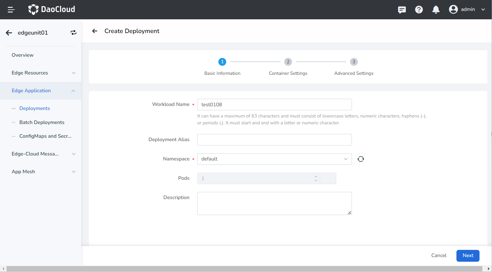

4. Fill in the container settings

    The container settings are divided into six sections: Basic Information, Lifecycle, Health Check,
    Environment Variables, Data Storage, and Security Settings. Click the respective tabs
    below to view the configuration requirements for each section.

    > Container configuration is only applicable to a single container. If you need to add
    > multiple containers in a container group, click the "+" button on the right to add multiple containers.

    === "Basic Information (required)"

        When configuring container parameters, you must correctly fill in the container name
        and image parameters; otherwise, you will not be able to proceed to the next step.
        After filling in the configuration according to the following requirements, click Confirm.

        - Container Name: Can contain up to 63 characters and supports lowercase letters, digits,
          and hyphens ("-"). It must start and end with a lowercase letter or digit, for example, nginx-01.
        - Image: Enter the image address or name. When entering the image name, the
          image will be pulled from the official [DockerHub](https://hub.docker.com/) by default.
          After accessing the image repository module of DCE 5.0, you can click the image selection
          on the right to choose an image.
        - Mirror Pull Policy: When the "Always pull the image" option is selected, the deployment will
          always pull the image from the repository each time it is restarted/upgraded. If not selected,
          the deployment will only pull the image locally, and it will only pull the image from the
          repository if the image does not exist locally. For more details, refer to the
          [Image Pull Policy](https://kubernetes.io/docs/concepts/containers/images/#image-pull-policy).
        - Privileged Container: By default, containers cannot access any device on the host.
          Enabling privileged container allows the container to access all device on the host
          and have all permissions of running processes on the host.
        - CPU/Memory Quota: The requested and limit values for CPU/memory resources. These values
          specify the minimum and maximum amount of resources the container requires. Configure the
          resources for the container according to your needs to avoid resource waste and potential
          system failures caused by exceeding container resource limits. The default values are shown
          in the image.

        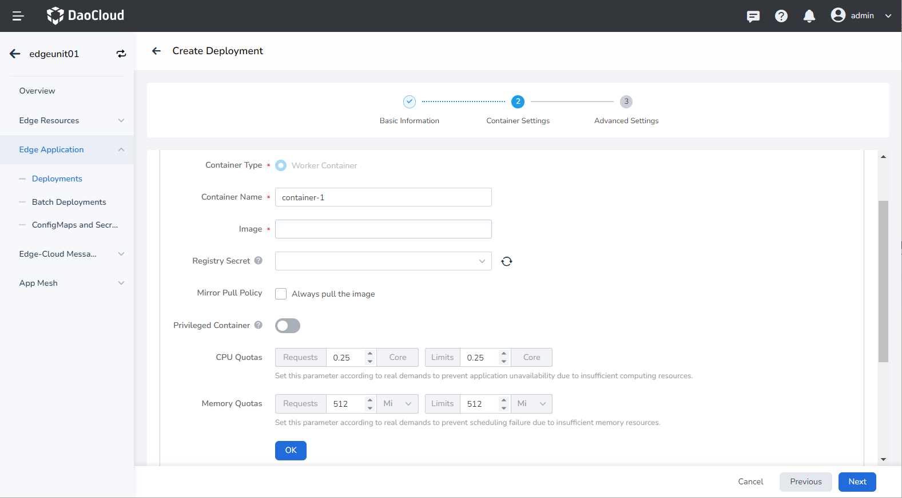

    === "Lifecycle (optional)"

        Set commands to be executed when the container starts, after it starts, or before it stops.
        For more details, refer to [Container Lifecycle](../../../kpanda/user-guide/workloads/pod-config/lifecycle.md).

        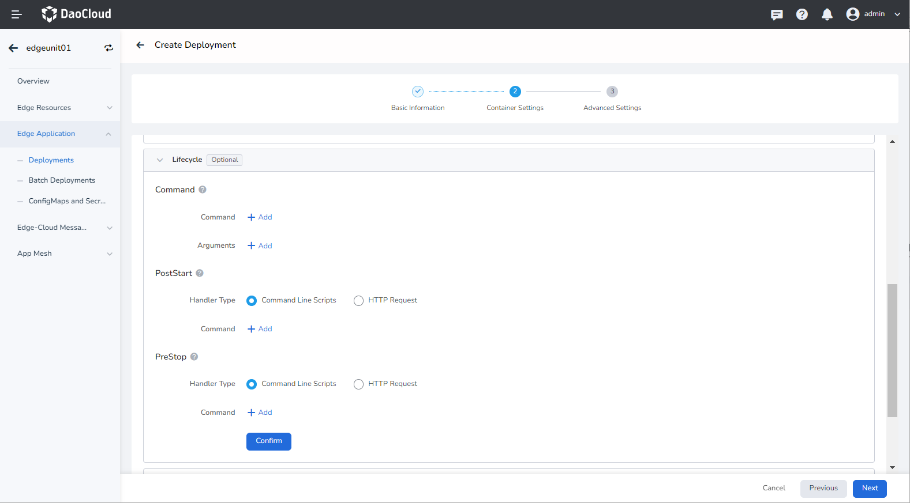

    === "Health Check (optional)"

        Use health checks to determine the health status of the container and application,
        which helps improve the availability of the application. For more details, refer to
        [Container Health Check](../../../kpanda/user-guide/workloads/pod-config/health-check.md).

        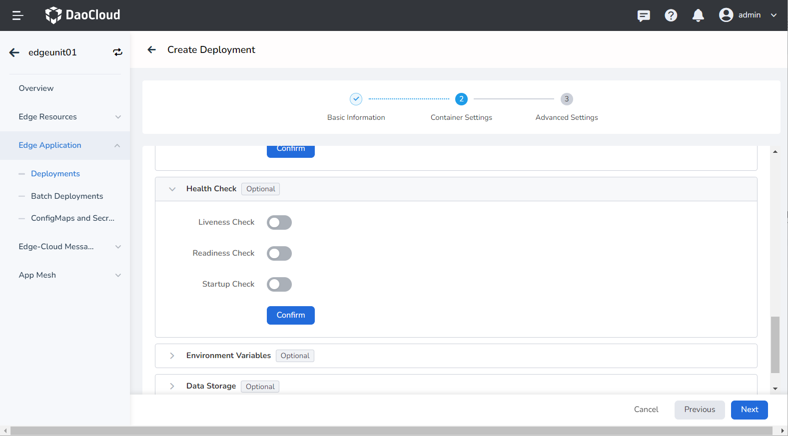

    === "Environment Variables (Optional)"

        Configure container parameters within the Pod, add environment variables to the Pod, or pass configuration settings. For more details, please refer to
        [Container Environment Variable](../../../kpanda/user-guide/workloads/pod-config/env-variables.md).

        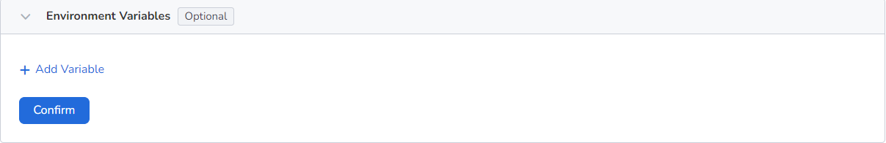

    === "Data Storage (Optional)"

        Configure data volume mounting and data persistence settings for the container. For more details,
         refer to [Container Data Storage](../../../kpanda/user-guide/workloads/pod-config/env-variables.md).

        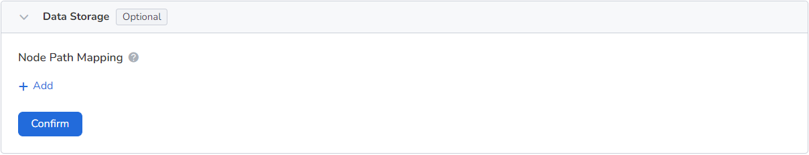

    === "Security Settings (Optional)"

        Ensure container security isolation through Linux's built-in account privilege separation mechanism.
        You can restrict container permissions by using different account UIDs (numeric identity tokens).
        For example, entering 0 indicates using root account privileges.

        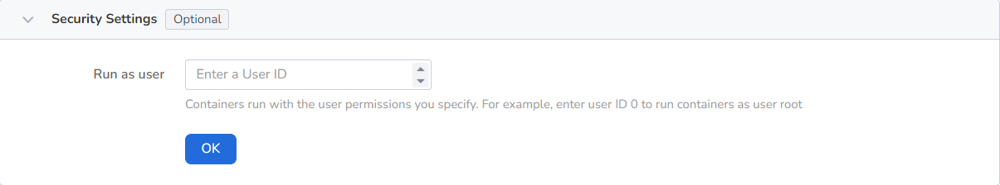

5. Fill in Advanced Configuration

    The advanced configuration includes Node Scheduling, Labels and Annotations, and Access Configuration.
    Click the tabs below to view the configuration requirements for each section.

    === "Node Scheduling"

        Click the `Select Edge Node` button to choose a specific node for deploying the deployment from the popup selection dialog.

        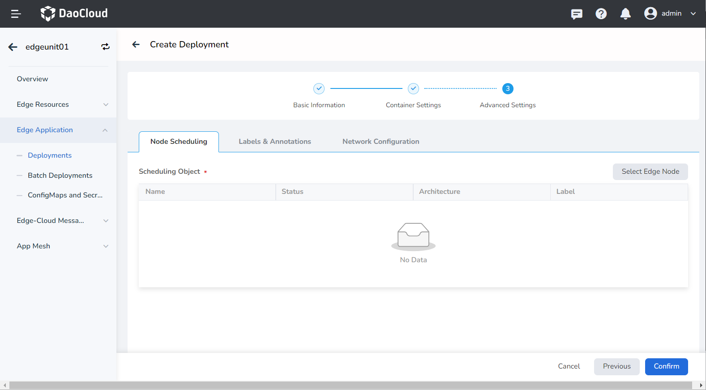

    === "Labels and Annotations"

        Click the `Add` button to add labels and annotations to the deployment and container group.

        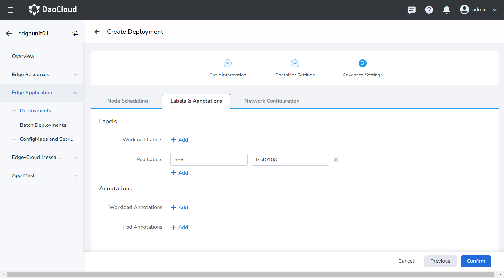

    === "Network Configuration"

        Container access supports three configuration options: Not Accessible, Port Mapping, and Host Network.

        - Inaccessible: The deployment is not accessible from outside.
        - Port Mapping: Container network virtualization isolation, where each container has its own
          virtual network. Communication between the container and the outside world requires port mapping
          with the host. After configuring port mapping, traffic to the host port will be redirected to
          the corresponding container port. For example, if container port 80 is mapped to host port 8080,
          traffic to port 8080 on the host will be directed to port 80 on the container.
        - Host Network: Use the host's (edge node's) network, meaning there is no network isolation
          between the container and the host, and they share the same IP.

        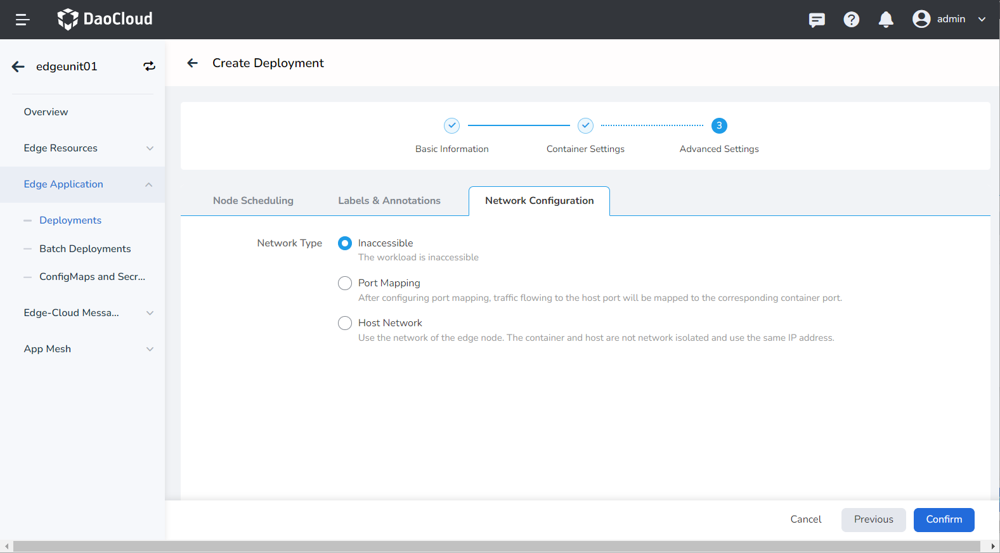

6. Click the `OK` button to complete the creation of the deployment.

## Create with YAML

In addition to creating deployments using the image method, you can also create
stateless deployments more quickly using a YAML file.

Here are the steps:

1. Go to the edge unit details page and select the menu `Edge Application` -> `Deployments`.

2. Click the `Create by YAML` button in the top-right corner of the end device list.

    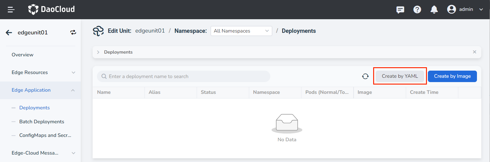

3. Input or paste the prepared YAML file, and click `OK` to complete the creation.

!!! note

    When using YAML to create deployments, it is recommended to add the following constraints:

    - Add labels to identify the edge application.
    - Use node affinity to assign Pods to specific edge nodes.

    ```yaml
    labels:
      kant.io/app: ''

    affinity:
      nodeAffinity:
        requiredDuringSchedulingIgnoredDuringExecution:
          nodeSelectorTerms:
            - matchExpressions:
              - key: kubernetes.io/hostname
                operator: In
                values:
                - edge1h6382jnk
    ```

Impacts:

- If the label configuration is not added, the deployment will not be displayed in the Cloud Edge Collaboration
  module's deployment list. However, you can view the deployment details in the container management module.
- If the node affinity configuration is not added, the deployment may be scheduled randomly and
  cannot be deployed to the specified edge node.

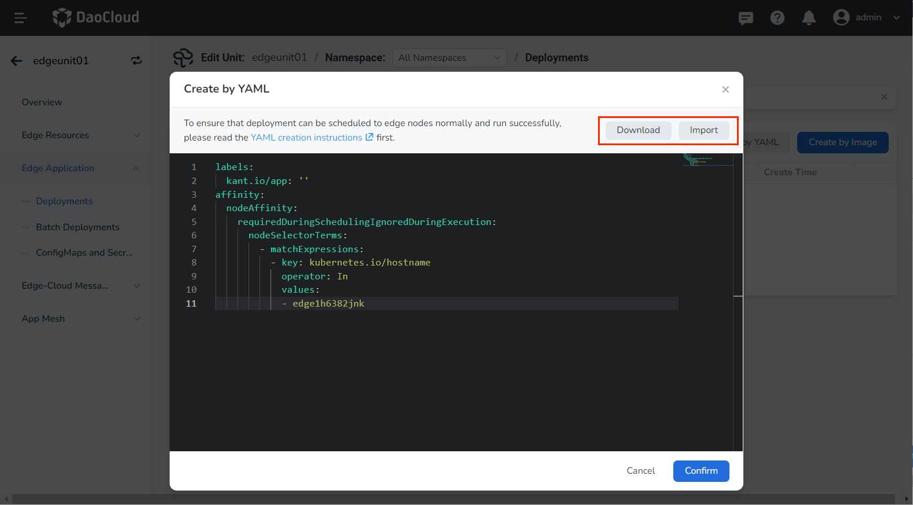
