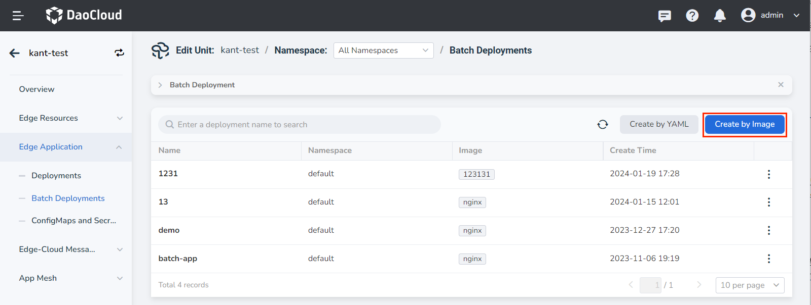
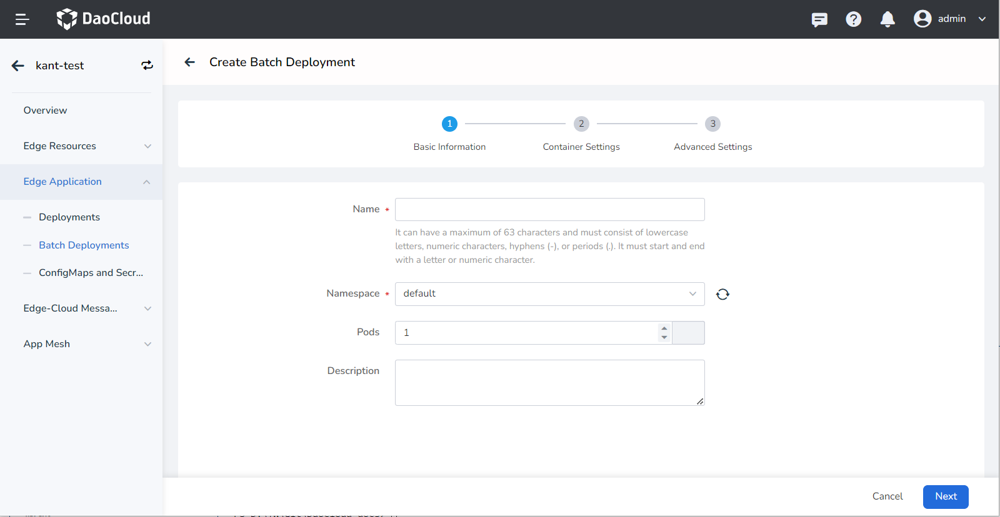
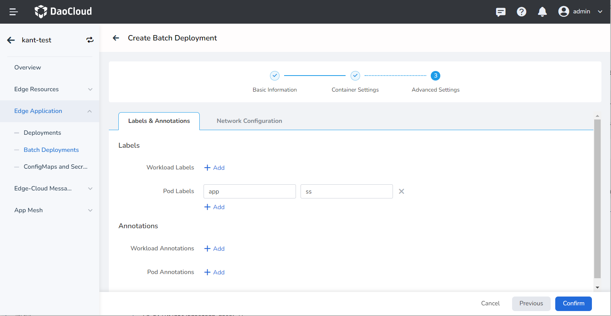
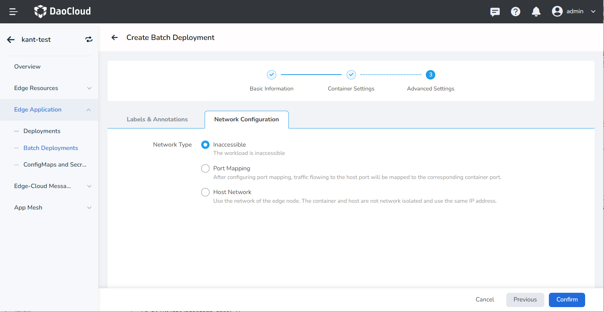
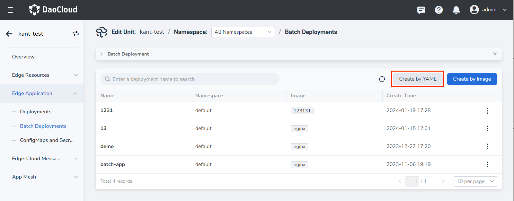

# Create Batch Deployments

Batch deployments can be created using either an image or a YAML file. This article explains how to create batch deployments using images.

## Create by Image

Follow these steps to create a stateless workload using an image.

1. Go to the edge unit details page and select the menu __Edge Application__ -> __Batch Deployments__.

2. Click the __Create by Image__ button in the top-right corner of the batch deployment list.

    

3. Fill in the basic information.

    - Workload Name: Enter a name for the workload (up to 63 characters). The name must consist of
      lowercase letters, numbers, and hyphens ("-"), and it must start and end with a lowercase letter
      or number (e.g., deployment-01). The workload name must be unique within the same namespace,
      and it cannot be changed after the workload is created.
    - Namespace: Select the namespace where you want to deploy the workload. By default, the
      __default__ namespace is used. If the desired namespace is not available, you can create
      a new one as prompted on the page.
    - Pods: Specify the number of Pods. By default, one instance is
      created, but you can modify this value.
    - Description: Enter a description for the workload (optional).

    

4. Fill in the container settings.

    The container configuration consists of six parts: Basic Information, Lifecycle, Health Check,
    Environment Variables, Data Storage, and Security Settings. Click the respective tabs to
    view the requirements for each part.

    > Container configuration applies to individual containers. If you need to add multiple
    > containers within a container group, click the "+" button to add them.

    === "Basic Information (Required)"

        When configuring container parameters, make sure to correctly enter the container name
        and image parameters; otherwise, you won't be able to proceed. Follow these requirements
        and click __OK__ after entering the configuration.

        - Container Name: Enter a name for the container (up to 63 characters). The name can include
          lowercase letters, numbers, and hyphens ("-"). It must start and end with a lowercase letter
          or number (e.g., nginx-01).
        - Image: Enter the image address or name. If you enter a image name, it will default
          to pulling from the official [DockerHub](https://hub.docker.com/). After integrating with
          the Docker Distribution module in DCE 5.0, you can click the image selection button
          to choose an image from the repository.
        - Mirror Pull Policy: By selecting __Always pull the image__ , the workload will pull the image from
          the repository every time it restarts/upgrades. If not selected, it will only pull the
          local image, and only pull from the image repository if the local image does not exist.
          For more details, refer to
          [Image Pull Policy](https://kubernetes.io/docs/concepts/containers/images/#image-pull-policy).
        - Privileged Container: By default, containers cannot access any device on the host.
          Enabling privileged containers allows them to access all device on the host and
          have the same privileges as running processes on the host.
        - CPU/Memory Quota: Specify the requested and limit values for CPU and memory resources.
          These values determine the minimum and maximum resources required by the container.
          Configure the resource allocation based on your needs to avoid resource waste and
          potential system failures. The default values are shown in the image.

        

    === "Lifecycle (Optional)"

        Set the commands to be executed when the container starts, after it starts, and before it stops.
        For more details, refer to [Container Lifecycle](../../../kpanda/user-guide/workloads/pod-config/lifecycle.md).

        

    === "Health Check (Optional)"

        Configure health checks for the container and application to improve availability.
        For more details, refer to [Container Health Check](../../../kpanda/user-guide/workloads/pod-config/health-check.md).

        

    === "Environment Variables (Optional)"

        Configure container parameters, add environment variables, or pass configurations to the pod.
        For more details, refer to [Container Environment Variable](../../../kpanda/user-guide/workloads/pod-config/env-variables.md).

        

    === "Data Storage (Optional)"

        Configure data volume mounting and data persistence settings for the container. For more details,
        refer to [Container Data Storage](../../../kpanda/user-guide/workloads/pod-config/env-variables.md).

        

    === "Security Settings (Optional)"

        Use Linux's built-in account privilege isolation mechanism to secure the container. You can
        limit the container's privileges by specifying a different user ID (UID) with different permissions.
        For example, entering 0 indicates using the root account's privileges.

        

5. Fill in the advanced settings.

    The advanced settings include Labels & Annotations and Network Configuration.
    Click the respective tabs to view the requirements for each part.

    === "Labels & Annotations"

        Click the __Add__ button to add labels and annotations to the workload and container group.

        

    === "Network Configuration"

        Container access can be configured as  Inaccessible, Port Mapping, or Host Network.

        - Inaccessible: The workload is not accessible from outside.
        - Port Mapping: Virtualizes the container network and assigns a separate virtual network
          to each container. Communication between containers and the outside world requires port
          mapping with the host. After configuring port mapping, traffic destined for the host port
          will be redirected to the corresponding container port. For example, if container port 80
          is mapped to host port 8080, traffic to host port 8080 will be directed to container port 80.
        - Host Network: Uses the host (edge node) network, meaning there is no network isolation
          between the container and the host. They share the same IP address.

        

6. Click the __OK__ button to complete the creation of the batch deployment.

## Create by YAML

In addition to creating batch deployments using images, you can also create them more quickly using YAML files. Follow these steps:

1. Go to the edge unit details page and select the left menu __Edge Application__ -> __Batch Deployments__ .

2. Click the __Create by YAML__ button in the top-right corner of the batch deployment list.

    

3. Enter or paste the prepared YAML file and click __OK__ to complete the creation.

!!! note

    When using YAML to create batch deployments, it is recommended to add the following restrictions.

    Labels are used to identify edge applications, and the __workloadScope__ field is used to configure differentiation for edge applications deployed to node groups. The current differentiation supports image overriders and replica settings.

    Here is an example:

    ```yaml
    apiVersion: apps.kubeedge.io/v1alpha1
    kind: EdgeApplication
    metadata:
      name: nginx-app2
      namespace: default
    spec:
      workloadScope:
        targetNodeGroups:
          - name: test
            overriders:
              imageOverriders:
                - component: Repository
                  operator: replace
                  predicate:
                    path: /spec/template/spec/containers/0/image
                  value: nginx1
                - component: Tag
                  operator: replace
                  predicate:
                    path: /spec/template/spec/containers/0/image
                  value: v1
              replicas: 1
      workloadTemplate:
        manifests:
          - apiVersion: apps/v1
            kind: Deployment
            metadata:
              labels:
                kant.io/app: ''
              name: nginx-test2
              namespace: default
            spec:
              replicas: 10
              selector:
                matchLabels:
                  app: nginx-test2
              template:
                metadata:
                  labels:
                    app: nginx-test2
                spec:
                  containers:
                    - image: nginx
                      imagePullPolicy: IfNotPresent
                      name: nginx
    ```
