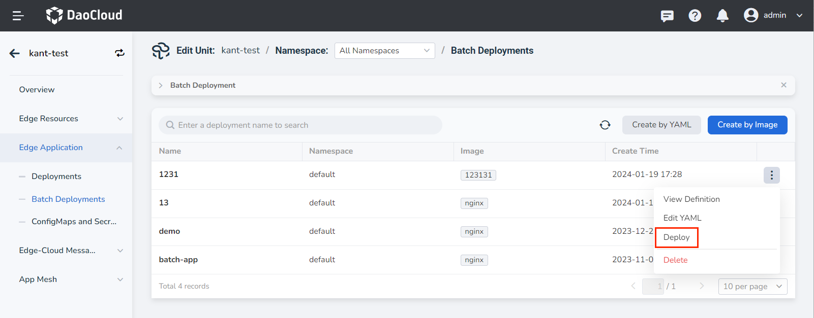
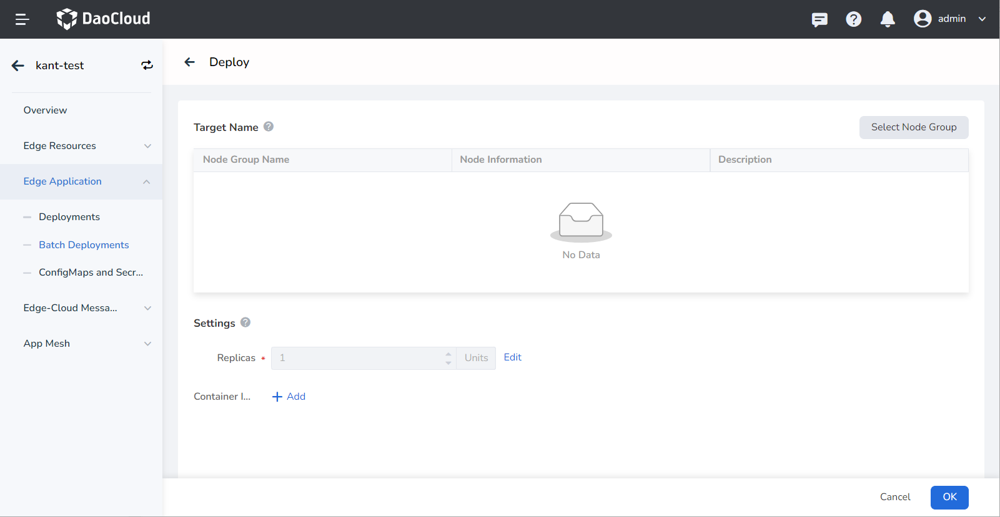
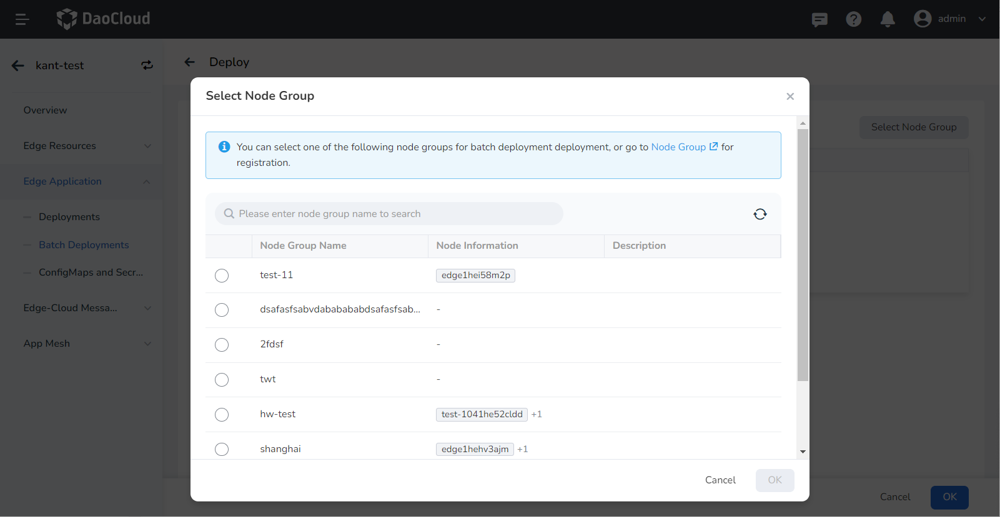
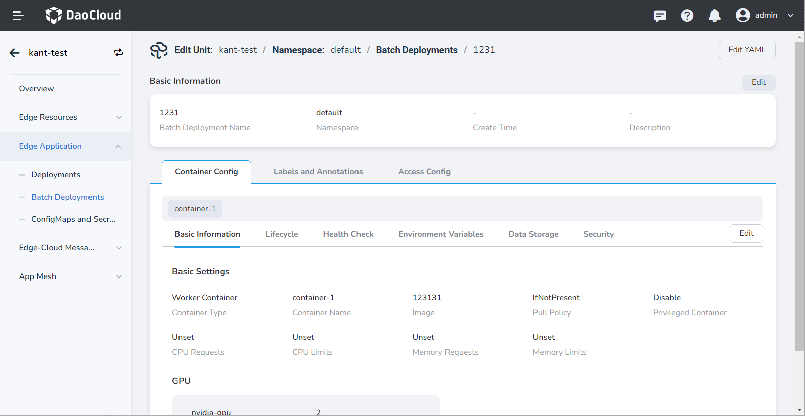

# Deploy Batch Deployments

This article explains the steps to deploy batch deployment definitions to a node group.

## Prerequisites

- Create a batch deployment definition.
- Create a node group.

## Deployment

Follow these steps:

1. Go to the edge unit details page and select the menu __Edge Application__ -> __Batch Deployments__ .

2. On the right side of the batch deployment list, click the __⋮__ button and select __Deploy__ from the popup menu.

    

3. Fill in the relevant parameters.

    - Deployment Object: Select the edge node group where you want to deploy the batch deployments.

        Click __Select Node Group__ and check the edge node groups you want to choose. You can
        quickly search for the desired edge node group by entering its name in the search box in
        the top-left corner of the page.

    - Differential Configuration: Support configuring the instance count and container image for different node groups.

        !!! note
        
            1. The default instance count is based on the batch deployment definition and will be modified if the definition is updated. The modified instance count will not be affected by updates to the batch deployment definition.
            2. It is possible to configure different segments of the container image, repository, and version. The configured segments will not be affected by updates to the batch deployment definition.

    

    

## View Definition

The application resources are packaged and abstracted into an application definition, which is then deployed according to the node group, generating workload instances. You can edit the basic information, container configuration, labels and annotations, and access configuration of the application definition.

Note: After updating the workload definition configuration, all existing configurations of deployed instances, except for the differential configuration, will be replaced synchronously.

Follow these steps:

1. Go to the edge unit details page and select the menu __Edge Application__ -> __Batch Deployments__ .

2. On the right side of the batch deployment list, click the __⋮__ button and select __View Definition__ from the popup menu.

3. On the definition details page, switch between the Container Configuration, Labels and Annotations,
   and Access Configuration tabs. Click the __Edit__ button to enter the corresponding editing interface
   and modify the definition configurations.

