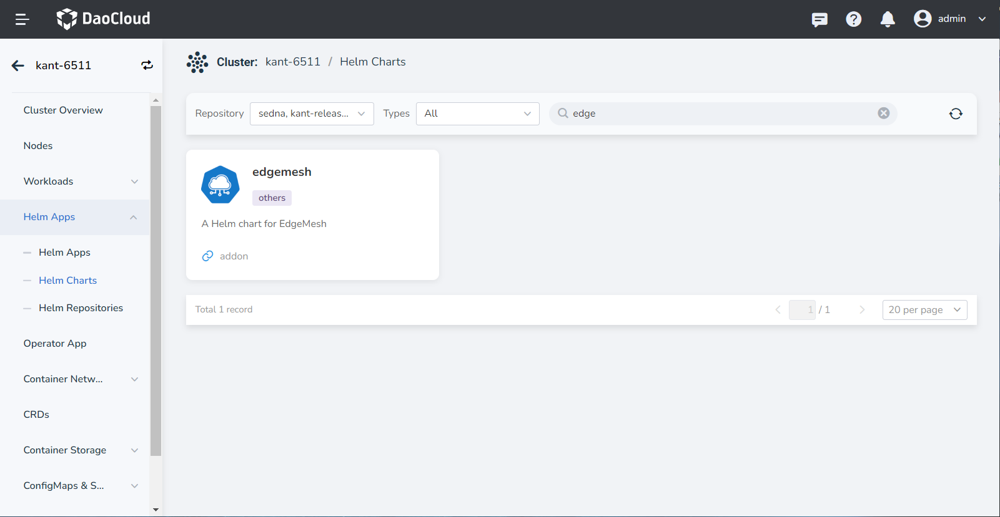
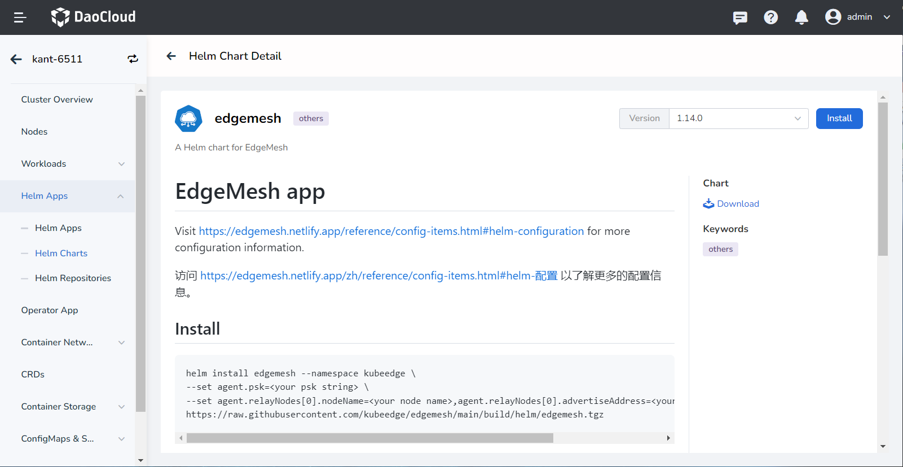
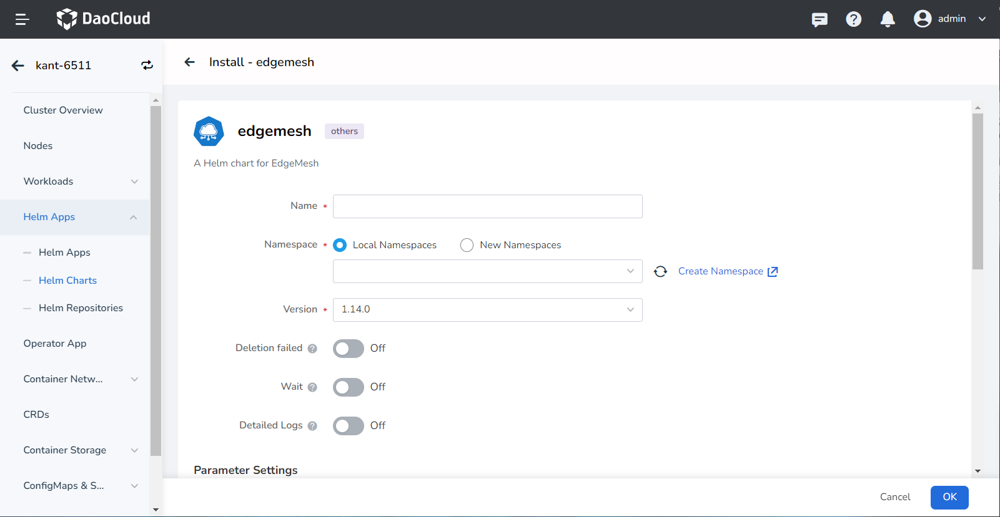

# Deploy EdgeMesh

Before using the application mesh capabilities, you need to deploy EdgeMesh.
This page describes the specific workflow.

## Prerequisites

1. Remove the taint from the K8s master node

    If there are running business applications on the K8s master node that need to access other applications on the cluster nodes, you need to remove the taint from the K8s master node by executing the following command.

    ```shell
    kubectl taint nodes --all node-role.kubernetes.io/master-
    ```

    !!! note
    
        If no applications that need to be proxied on the K8s master node,
        you can skip this step.

2. Add filtering labels to the Kubernetes API service

    Normally, to prevent EdgeMesh from proxying the Kubernetes API service, you need to add filtering labels to it. For more information, please refer to [Service Filtering](https://edgemesh.netlify.app/en/advanced/hybrid-proxy.html#service-filtering).

    ```shell
    kubectl label services kubernetes service.edgemesh.kubeedge.io/service-proxy-name=""
    ```

## Install with Helm

The steps are as follows:

1. Select __Container Management__ -> __Clusters__ in the left navigation bar to enter the cluster list page, and click the cluster name to enter the cluster details page.

2. Select __Helm Apps__ -> __Helm Charts__ in the left menu, and find the __edgemesh__ plugin under the addon repository.

    

3. Click the __edgemesh__ to enter the template details page.

4. Select the EdgeMesh version in the upper right corner of the page,
   and click the __Install__ button to enter the EdgeMesh installation page.

    

5. Fill in the basic configuration for edgemesh.

    - Name: Consists of lowercase letters, numeric characters, or __-__ , and must start with a letter and end with a letter or numeric character.
    - Namespace: The namespace where the EdgeMesh application is located. If the namespace has not been created, you can choose to __Create New Namespace__ .
    - Version: Select the desired EdgeMesh version based on actual business needs.
    - Deletion Failed: When enabled, it will synchronize the installation and wait for it to be installed. It will delete the installation when the installation fails.
    - Wait: When enabled, it will wait for all associated resources of the application to be ready before marking the application installation as successful.
    - Detailed Logs: Enable detailed output of the installation process log.

    

6. YAML parameter configuration.

!!! note

    With the default YAML configuration, you need to supplement the authentication password (PSK)
    and relay node information, otherwise the deployment will fail.

**PSK and Relay Node configuration**

```yaml
  # PSK: is an authentication password that ensures that each edgemesh-agent can only establish a connection if it has the same "PSK password". For more information, please refer to
  # [PSK](https://edgemesh.netlify.app/en/guide/security.html). It is recommended to generate it using openssl, or it can be set to a custom random string.

  psk: Juis9HP1XBouyO5pWGeZa8LtipDURrf17EJvUHcJGuQ=

  # Relay Node: is a node that forwards packets in network communication. It acts as a bridge between the source node and the destination node in communication,
  # helping packets to be transmitted in the network and bypassing certain restrictions or obstacles. In EdgeMesh, it is usually a cloud node, and multiple relay nodes can be added.

  relayNodes:
  - nodeName: masternode
    advertiseAddress:
    - 10.31.223.12
 # - nodeName: <your relay node name2>
 #   advertiseAddress:
 #   - 2.2.2.2
 #   - 3.3.3.3
```

**Here is an example:**

```yaml
global:
  imageRegistry: docker.m.daocloud.io
agent:
  repository: kubeedge/edgemesh-agent
  tag: v1.14.0
  affinity: {}
  nodeSelector: {}
  tolerations: []
  resources:
    limits:
      cpu: 1
      memory: 256Mi
    requests:
      cpu: 0.5
      memory: 128Mi
  psk: JugH9HP1XBouyO5pWGeZa8LtipDURrf17EJvUHcJGuQ=

  relayNodes:
  - nodeName: masternode ## your relay node name
    advertiseAddress:
    - x.x.x.x ## your relay node ip

  modules:
    edgeProxy:
      enable: true
    edgeTunnel:
      enable: true
```

## Verify the deployment

After the deployment is complete, you can run the following command to check if the EdgeMesh is successfully deployed.

1. Select __Container Management__ -> __Clusters__ in the left navigation bar, enter the cluster list page, click on the cluster name to enter the cluster details page.

1. Select __Helm Apps__ in the left menu, enter the Helm application list page.

1. Check the status of the Helm application. The current status is __Deployed__, which means that the EdgeMesh application has been deployed successfully.

    

Next: [Create Services](service.md)
