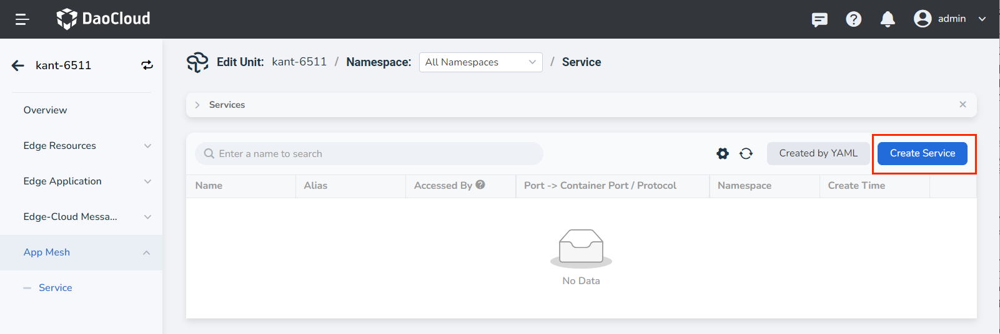
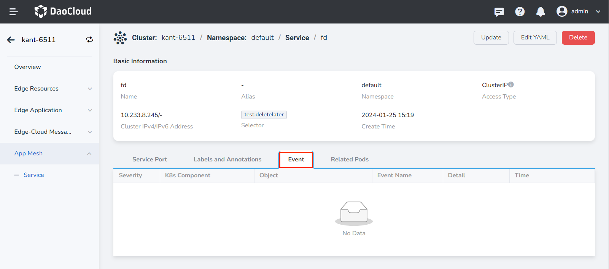
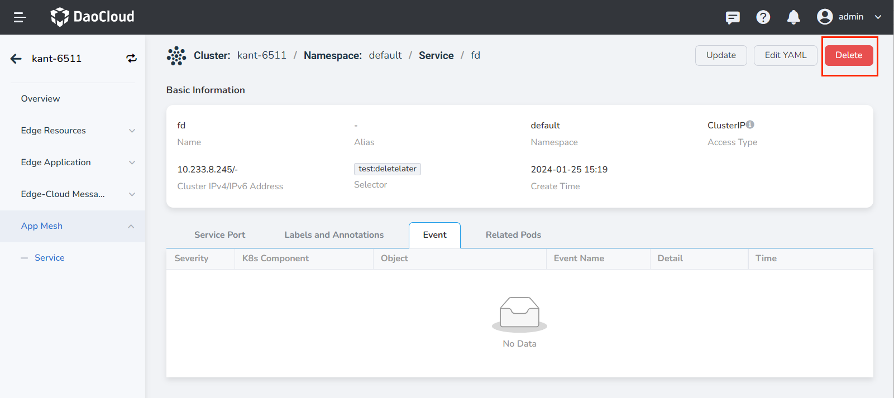

# Services

The App Mesh provides service management capabilities, allowing you to create services that bind application instances and configure access ports, enabling mutual access between applications on nodes.

## Create Service

!!! note

    To ensure that the created service can be accessed, EdgeMesh application must be installed on the node from which the access is initiated.

Follow the steps below to create a service:

1. Select __Cloud Edge Collaboration__ in the left navigation bar to enter the Edge Unit list page. Click the __Edge Unit Name__ to enter the Edge Unit details page.

2. Select __App Mesh__ -> __Service__ in the left menu and click the __Create Service__ button in the top right corner of the service list.

    

3. Fill in the relevant parameters.

    | Parameter        | Description                                                  | Example   |
    | ---------------- | ------------------------------------------------------------ | --------- |
    | Access Type      | **Type**: Not required **Meaning**: Specifies the way Pod services are discovered. Default is cluster internal access (ClusterIP). | ClusterIP |
    | Service Name     | **Type**: Required **Meaning**: Enter the name of the newly created service. **Note**: Please enter a string of 4 to 63 characters, which can include lowercase letters, numbers, and hyphens (-), and must start with a lowercase letter and end with a lowercase letter or a number. | Svc-01    |
    | Namespace        | **Type**: Required **Meaning**: Select the namespace where the new service is located. For more information about namespaces, please refer to the [Namespace Overview](../namespaces/createns.md). **Note**: Please enter a string of 4 to 63 characters, which can include lowercase letters, numbers, and hyphens (-), and must start with a lowercase letter and end with a lowercase letter or a number. | default   |
    | Label Selector   | **Type**: Required **Meaning**: Add labels. Service selects Pods based on labels. Fill in and click "Add". | app:job01 |
    | Port Configuration | **Type**: Required **Meaning**: Add protocol ports to the service. You need to first select the protocol type, currently supporting TCP and UDP. **Port Name**: Enter a custom name for the port. **Service Port (port)**: The access port for the Pod to provide services to the outside world. **Container Port (targetport)**: The actual container port that the workload listens on, used to expose services within the cluster. |           |
    | Session Affinity | **Type**: Optional **Meaning**: When enabled, requests from the same client will be forwarded to the same Pod. | Enabled   |
    | Maximum Session Timeout | **Type**: Optional **Meaning**: When session affinity is enabled, the maximum session is timeout. Default is 30 seconds. | 30 seconds |
    | Labels           | **Type**: Optional **Meaning**: Add labels to the service. |           |
    | Annotations      | **Type**: Optional **Meaning**: Add annotations to the service. |           |

    

4. Click __OK__ to create the service successfully. You will be returned to the service list page, where you can view the access ports corresponding to the service in the service list.

!!! tip

    You can also create a service through __YAML__ .

## Update Service

Services support updating service aliases, label selectors, port configurations, and session affinity settings.

Follow the steps below to update a service:

1. Go to the Edge Unit details page and select __App Mesh__ -> __Service__ in the left navigation bar.

2. Click the service name to enter the service details page. Click the __⋮__ button in the top right corner of the page, and select __Update__ from the pop-up menu to modify the service alias, label selector, port configuration, and session affinity settings.

    

## View Event

You can view service event information.

On the service details page, select the __Event__ tab to view service event information.

## Delete Service

1. Go to the Edge Unit details page and select __App Mesh__ -> __Service__ in the left navigation bar.

2. Click the service name to enter the service details page. Click the __⋮__ button in the top right corner of the page, and select __Delete__ from the pop-up menu to modify the service alias, label selector, port configuration, and session affinity settings.

    
