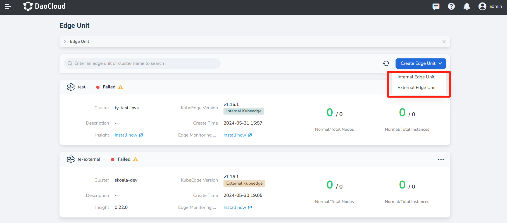
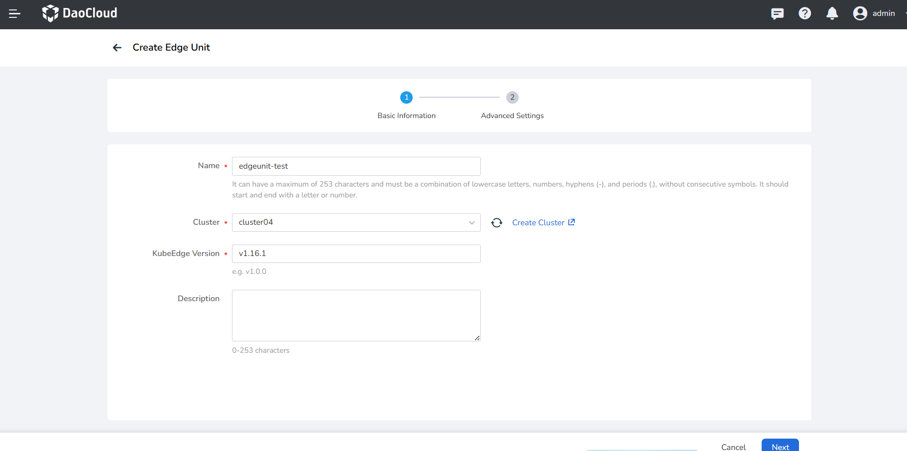
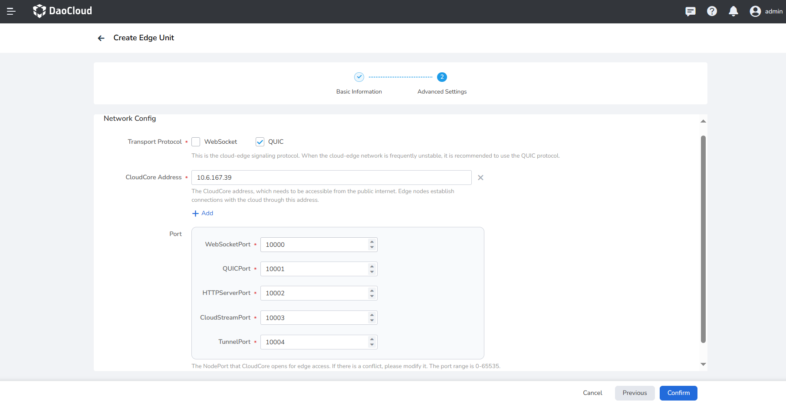

---
hide:
  - toc
---

# Create External Edge Unit

**External Edge Unit** refers to integrating the existing KubeEdge installed in the enterprise system into DCE 5.0 Cloud Edge for unified management.

KubeEdge: An open-source system that extends native containerized application orchestration capabilities to edge nodes.

- CloudCore: The core component of KubeEdge on the cloud side.
- ControllerManager: KubeEdge CRD extension currently used for edge applications and edge node groups.

The following explains the steps to create an external edge unit:

1. Select __Cloud Edge Collaboration__ from the left navigation bar to enter the edge unit list page. Click the __Create Edge Unit__ button at the top right of the page, and select __External Edge Unit__ from the dropdown list;

    

1. Fill in the basic information;

    - Edge Unit Name: A combination of lowercase letters, numbers, hyphens (-), and dots (.), with no consecutive symbols; must start and end with a letter or number; can contain up to 253 characters.
    - Cluster: The cluster running the edge unit control plane.
    - KubeEdge Version: A specific version of the KubeEdge open-source system for extending containerized application orchestration capabilities to edge hosts, built on Kubernetes and providing infrastructure support for network applications.

    <!--- Edge Component Replicas: The number of replicas of cloud-side edge components to ensure high availability of edge components in case of cloud-side node failures.-->

    - Description: Description information of the edge unit.

    !!! note

        If you are working with a single-node cluster, please ensure that the master node supports
        scheduling by removing the NoSchedule taint. This will prevent failures during the
        installation of system components.

    

<!-- 3. Component repository settings. Settings for KubeEdge and Kant cloud-side component repositories;

    - Kant Image Repository: The image repository required by the system for cloud-side components, where Kant refers to the Cloud Edge module.
        - Default: The default image repository address provided by the system, storing the images of cloud-side components required by the Cloud Edge module, such as kant-worker-admission;
        - Custom: If users store the system's cloud-side component images in their own image repository, they can choose a custom repository address.

    - Kant Helm Repository: The helm application repository required by the system for cloud-side components, where Kant refers to the Cloud Edge module. If the desired helm repository is not available in the dropdown options, click the __Create Repository__ button on the right to create a new helm repository.

    - KubeEdge Image Repository (optional): KubeEdge cloud-side component image repository.

    !!! note

        When edge nodes are accessed, the KubeEdge edge-side image repository can use the cloud-side address as a reference, which is recommended. -->

1. Fill in Advanced Settings

    !!! note

        If you use the online installation method, you only need to complete the access configuration. 
        If you use the offline one, you also need to provide the component repository information.

    **Access Settings**

    It refers to the access settings for KubeEdge cloud components. Edge nodes use these settings to establish a connection with the cloud.

    - Communication Protocol: the communication protocol for the cloud-edge signaling channel. When the cloud-edge network is frequently unstable, it is recommended to use the QUIC protocol.
    - Access Address: the access address for the KubeEdge cloud component CloudCore, which needs to be accessible by edge nodes. Edge nodes use this address to establish a connection with the cloud.
    - Ports: CloudCore on the cloud side opens NodePort ports to the edge by default. If there is a conflict, please modify them.
        - WebSocketPort: the port for the WebSocket access protocol, default is 10000.
        - QUICPort: the port for the QUIC access protocol, default is 10001.
        - HTTPServerPort: the HTTP service port, default is 10002.
        - CloudStreamPort: the cloud stream processing interface port, default is 10003.
        - TunnelPort: the data channel port for edge node business data, default is 10004.

    

1. After completing the above information configuration, click the __OK__ button to finish creating the edge unit, and automatically return to the edge unit list.

Next step: [Manage Edge Units](./manage-unit.md)
