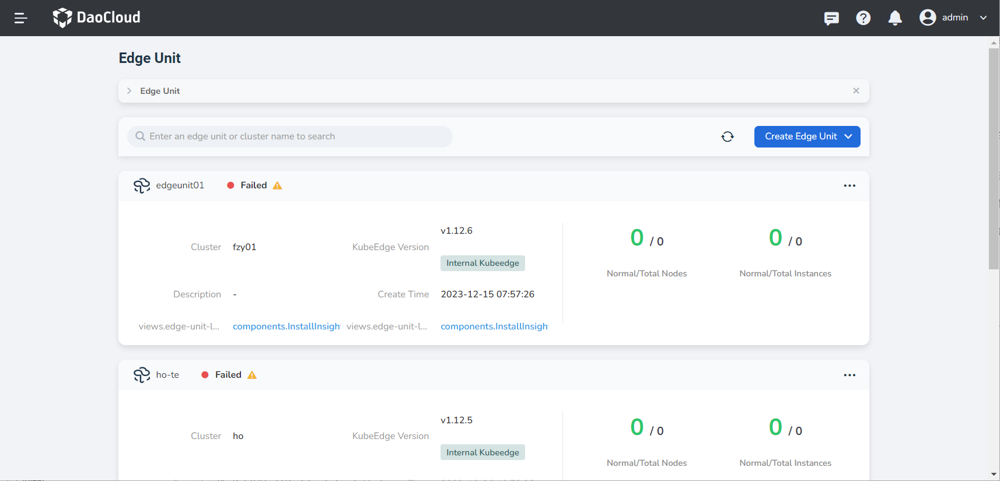
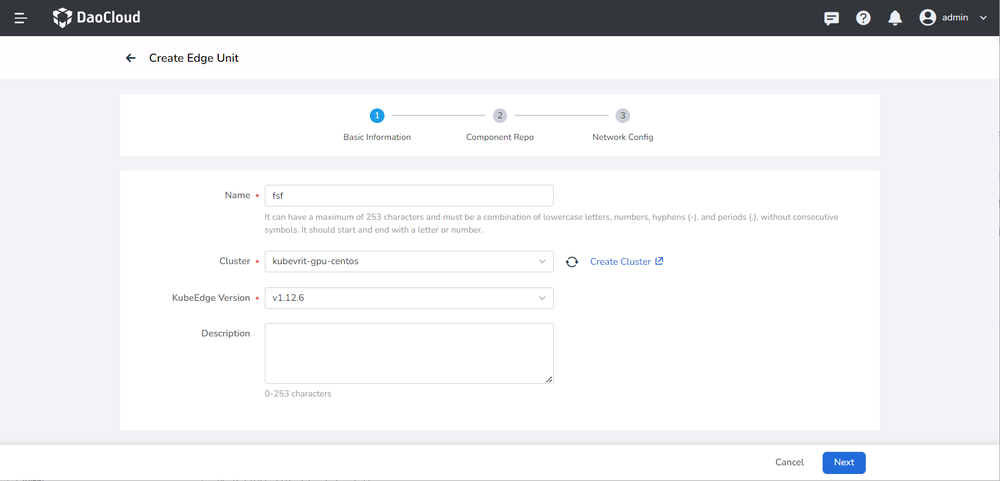
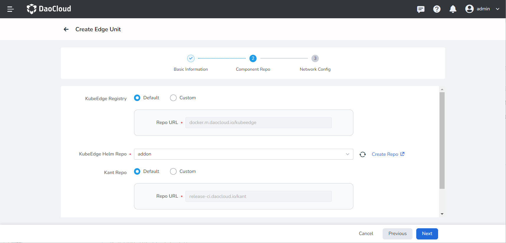
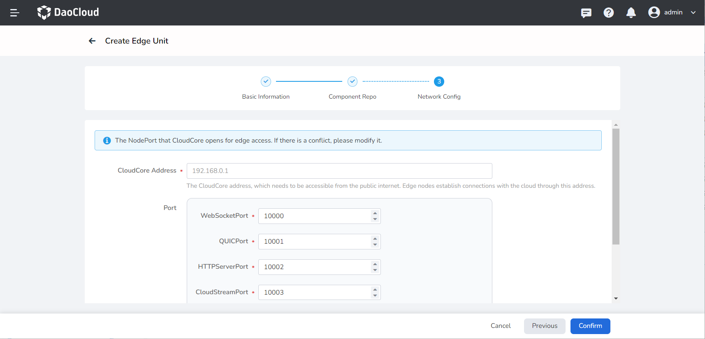

# Create Internal Edge Unit

Edge unit definition: It refers to the collection of computing resources required for container runtime, including the cloud-side Master and edge-side worker Nodes. The concept of an edge unit is similar to a cluster in Kubernetes, but the networking is different. The Master node is deployed in the cloud, and one cloud-side master (with multiple backups) corresponds to one edge cluster.

Business of edge units: Install the KubeEdge Cloud Suite (CloudCore, ControllerManager) on the specified worker cluster and manage it throughout its lifecycle. KubeEdge: It is an open-source system that extends native containerized application orchestration capabilities to edge nodes.

- CloudCore: KubeEdge cloud-side core component.
- ControllerManager: KubeEdge CRD extension, currently applied to edge applications and edge node groups.

DCE 5.0 Cloud Edge supports two types of edge units:

- **Internal Edge Unit** is to install the KubeEdge cloud suite (CloudCore, ControllerManager) for a specified working cluster and manage it throughout its lifecycle.

- **External Edge Unit** refers to integrating the existing KubeEdge installed in the enterprise system into DCE 5.0 Cloud Edge for unified management. See [Creating External Edge Unit](./create-external-unit.md)

## Steps

The following steps explain how to create an edge unit:

1. Select __Cloud Edge Collaboration__ from the left navigation bar to go to the edge unit list page. Click the __Create Edge Unit__ button in the top-right corner of the page.

    

2. Fill in the basic information:

    - Name: A combination of lowercase letters, numbers, hyphens (-), and dots (.), and it should not have consecutive separators. It should start and end with a letter or number. contains a maximum of 253 characters.
    - Cluster: The cluster where the edge unit control plane runs.
    - KubeEdge Version: A specific version released by the KubeEdge open-source system, used to extend containerized application orchestration capabilities to edge hosts. It is built on Kubernetes and provides infrastructure support for network applications.

    <!--- Edge Component Replicas: The number of replicas of cloud-side edge components to ensure high availability when cloud-side nodes fail.-->

    - Description: Description of the edge unit.

    

3. Component Repo: KubeEdge and Kant cloud-side component repository settings.

    - KubeEdge Registry: The KubeEdge cloud-side component image repository, which is the default value for the KubeEdge edge image repository in the batch node module.
        - Default: The default image repository address provided by the system.
        - Custom: You can enter the commonly used image repository address for enterprises.

    - KubeEdge Helm Repo: KubeEdge Helm application repository.
        - Default: The default Helm repository address provided by the system.
        - Custom: You can enter the commonly used Helm repository address for enterprises.

    - Kant Image Repository: The required cloud-side component image repository of the system, where Kant refers to the Cloud Edge Collaboration module; the edge installation package image repository address.
        - Default: The default image repository address provided by the system.
        - Custom: You can enter the commonly used image repository address for enterprises.

    

    !!! note

        If you want to modify the default values of the KubeEdge and Kant image repositories,
        you can go to the **Global cluster kant-system namespace** , and modify the ConfigMap
        corresponding to the parameters kubeedgeImageRepo and kantImageRepo.

        - ConfigMap name: dynamic-properties-config
        - Parameter example as follows:

        ```yaml
        data:
          kantAPIServerProperties: |-
            {
              ...
              # Default values for KubeEdge and Kant image repositories
              "kubeedgeImageRepo": "docker.m.daocloud.io/kubeedge",
              "kantImageRepo": "release-ci.daocloud.io/kant",
            }
        ```

4. Network Config: Network Configuration for KubeEdge cloud-side components, through which edge nodes establish connections with the cloud.

    - CloudCore Address: The address of the KubeEdge CloudCore, which needs to be accessible by edge nodes.

    - Ports:
        - WebSocketPort: The WebSocket port for the access protocol, with a default value of 30000.
        - QUICPort: The QUIC port for the access protocol, with a default value of 30001.
        - HTTPServerPort: The HTTP server port, with a default value of 30002.
        - CloudStreamPort: The port for the cloud-side streaming processing interface, with a default value of 30003.
        - TunnelPort: The port for the edge node business data channel, with a default value of 30004.

    !!! note

        Kubernetes opens ports within the range of 3000-32767 by default. If there is a conflict with NodePort ports, please modify them.

    

5. After completing the configuration, click the __OK__ button to create the edge unit. You will be automatically redirected back to the edge unit list.

Next: [Managing Edge Units](./manage-unit.md)
