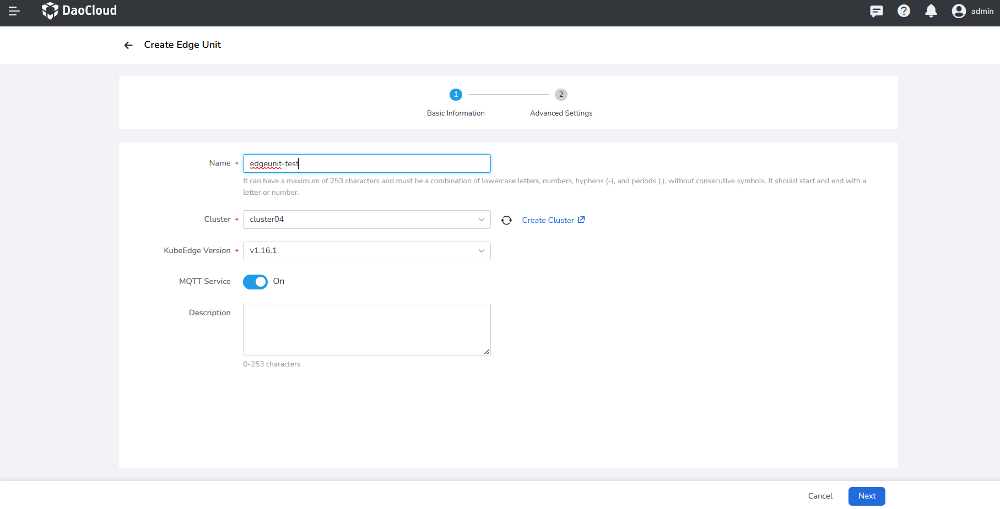
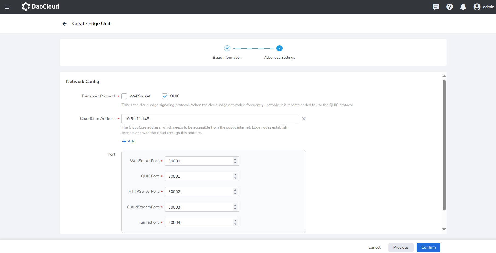

---
hide:
  - toc
MTPE: ModetaNiu
Date: 2024-06-28
---

# Create Internal Edge Unit

Edge unit definition: It refers to the collection of computing resources required for container runtime, 
including the cloud-side Master and edge-side worker Nodes. The concept of an edge unit is similar to a cluster 
in Kubernetes, but the networking is different. The Master node is deployed in the cloud, and one cloud-side master 
(with multiple backups) corresponds to one edge cluster.

Business of edge units: Install the KubeEdge Cloud Suite (CloudCore, ControllerManager) on the specified worker cluster 
and manage it throughout its lifecycle. KubeEdge: It is an open-source system that extends native containerized application 
orchestration capabilities to edge nodes.

- CloudCore: KubeEdge cloud-side core component.
- ControllerManager: KubeEdge CRD extension, currently applied to edge applications and edge node groups.

DCE 5.0 Cloud Edge supports two types of edge units:

- **Internal Edge Unit** is to install the KubeEdge cloud suite (CloudCore, ControllerManager) for 
  a specified working cluster and manage it throughout its lifecycle.

- **External Edge Unit** refers to integrating the existing KubeEdge installed in the enterprise system 
  into DCE 5.0 Cloud Edge for unified management. See [Creating External Edge Unit](./create-external-unit.md)

## Steps

The following steps explain how to create an edge unit:

1. Select __Cloud Edge Collaboration__ from the left navigation bar to go to the edge unit list page. Click the __Create Edge Unit__ button in the top-right corner of the page, and select __Internal Edge Unit__ from the dropdown list;

    

1. Fill in the basic information:

    - Name: A combination of lowercase letters, numbers, hyphens (-), and dots (.), and it should not have consecutive separators. 
      It should start and end with a letter or number. contains a maximum of 253 characters.
    - Cluster: The cluster where the edge unit control plane runs.
    - KubeEdge Version: A specific version released by the KubeEdge open-source system, used to extend 
      containerized application orchestration capabilities to edge hosts. It is built on Kubernetes and 
      provides infrastructure support for network applications.
    - MQTT Service: Whether to enable the default KubeEdge MQTT service (mosquitto) in the edge node, 
      primarily used for message routing and communication with device mappers.

    <!--- Edge Component Replicas: The number of replicas of cloud-side edge components to ensure high availability when cloud-side nodes fail.-->

    - Description: Description of the edge unit.

    

<!-- 3. Component Repository Settings. Configuration for KubeEdge and Kant cloud component repositories:

    - KubeEdge Image Repository: The image repository for KubeEdge cloud components.
        - Default: The system-provided default image repository address, storing images of KubeEdge cloud components such as cloudcore.
        - Custom: If the user stores KubeEdge cloud component images in their own image repository, they can choose a custom repository address.

    - KubeEdge Helm Repository: The Helm application repository for KubeEdge. If the desired Helm repository is not available in the dropdown options, you can click the __Create Repository__ button on the right to create a new Helm repository.

    - Kant Image Repository: The image repository for the required cloud components, where "Kant" refers to the cloud-edge collaboration module.
        - Default: The system-provided default image repository address, storing images of the required cloud components for the cloud-edge collaboration module, such as kant-worker-admission.
        - Custom: If the user stores the required cloud component images in their own image repository, they can choose a custom repository address.

    - Kant Helm Repository: The Helm application repository for the required cloud components, where "Kant" refers to the cloud-edge collaboration module. If the desired Helm repository is not available in the dropdown options, you can click the __Create Repository__ button on the right to create a new Helm repository.

    

    !!! note

        If you want to modify the default values for KubeEdge and Kant image repositories, you can navigate to the **Global cluster kant-system namespace** and modify the corresponding parameters in the ConfigMap configuration file: kubeedgeImageRepo and kantImageRepo.
        
        - ConfigMap configuration file name: dynamic-properties-config
        - Example parameters are as follows:

        ```yaml
        data:
          kantAPIServerProperties: |-
           {
            ...
            # Default values for KubeEdge and Kant image repositories
            "kubeedgeImageRepo": "docker.m.daocloud.io/kubeedge",
            "kantImageRepo": "release-ci.daocloud.io/kant",
           }
        ``` -->

1. Fill in Advanced Settings

    !!! note

        If you use the online installation method, you only need to complete the access configuration. 
        If you use the offline one, you also need to provide the component repository information.

    **Access Settings**

    It refers to the access settings for KubeEdge cloud components. Edge nodes use these settings to establish a connection with the cloud.

    - Communication Protocol: the communication protocol for the cloud-edge signaling channel. When the cloud-edge network 
      is frequently unstable, it is recommended to use the QUIC protocol.
    - Access Address: the access address for the KubeEdge cloud component CloudCore, which needs to be accessible by edge nodes. 
      Edge nodes use this address to establish a connection with the cloud.
    - Ports: CloudCore on the cloud side opens NodePort ports to the edge by default. If there is a conflict, please modify them.
        - WebSocketPort: the port for the WebSocket access protocol, default is 30000.
        - QUICPort: the port for the QUIC access protocol, default is 30001.
        - HTTPServerPort: the HTTP service port, default is 30002.
        - CloudStreamPort: the cloud stream processing interface port, default is 30003.
        - TunnelPort: the data channel port for edge node business data, default is 30004.

    

5. After completing the configuration, click the __OK__ button to create the edge unit. You will be automatically redirected back to the edge unit list.

Next: [Managing Edge Units](./manage-unit.md)
