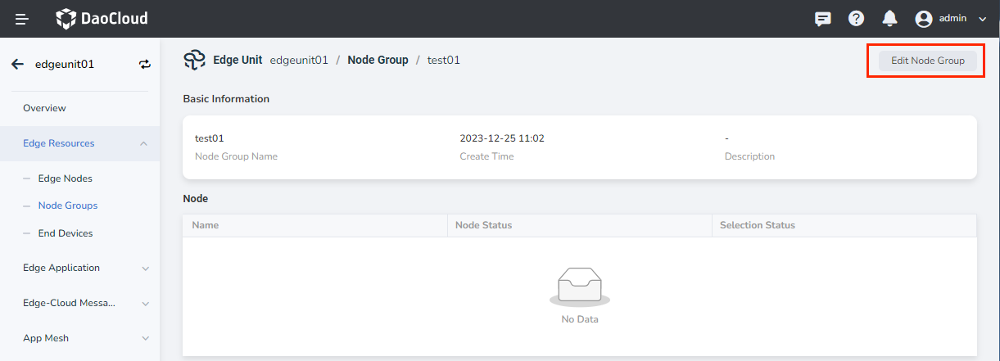
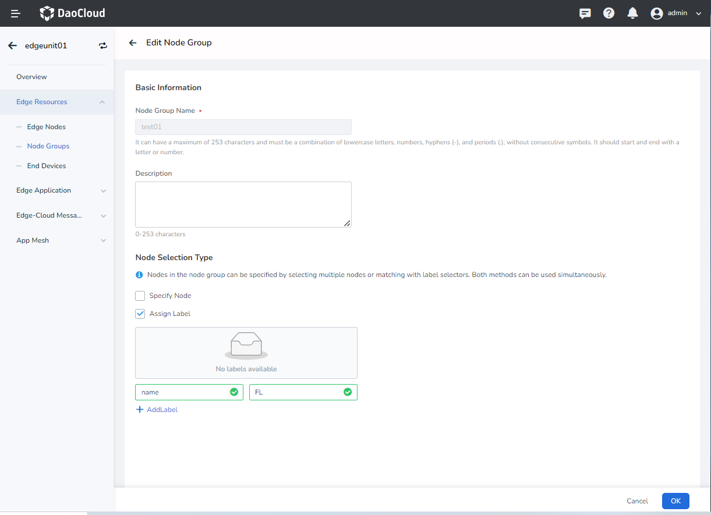
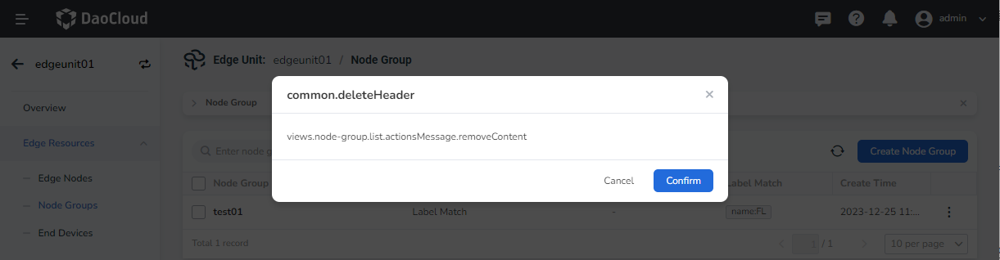

# Manage Edge Node Groups

This article explains the steps to edit and delete edge node groups.

## Edit Edge Node Group

Follow these steps:

1. Go to the edge unit details page and select the left menu `Edge Resources` -> `Node Groups`.

2. Click the Group Name in the edge node group list.

3. On the node group details page, click the `Edit Node Group` button at the top right corner.

    

4. On the edit page, modify the node group configuration information.

    

5. Click `OK` to complete the node group configuration modification. The system will automatically return to the node group details page.

## Delete Edge Node Group

Follow these steps:

1. Go to the edge unit details page and select the left menu `Edge Resources` -> `Node Groups`.

2. On the right side of the node group list, click the `⋮` button and select `Delete` from the popup menu.

3. Click `Confirm` to finish the deletion.

    
