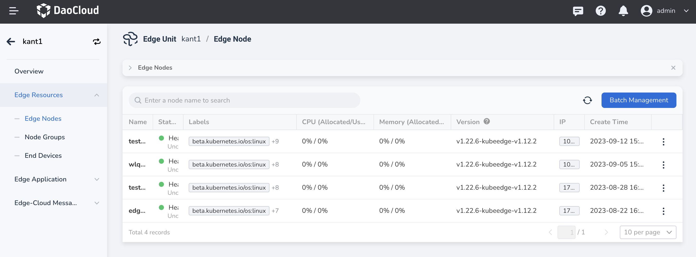
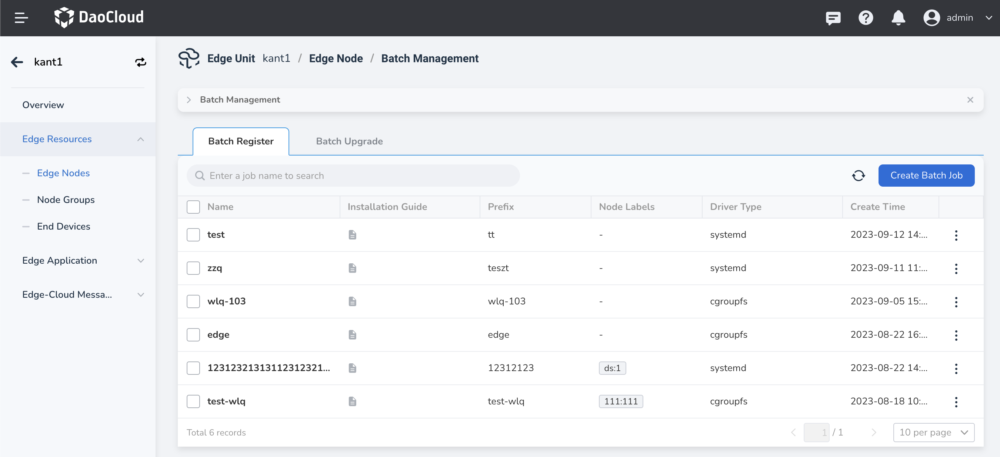
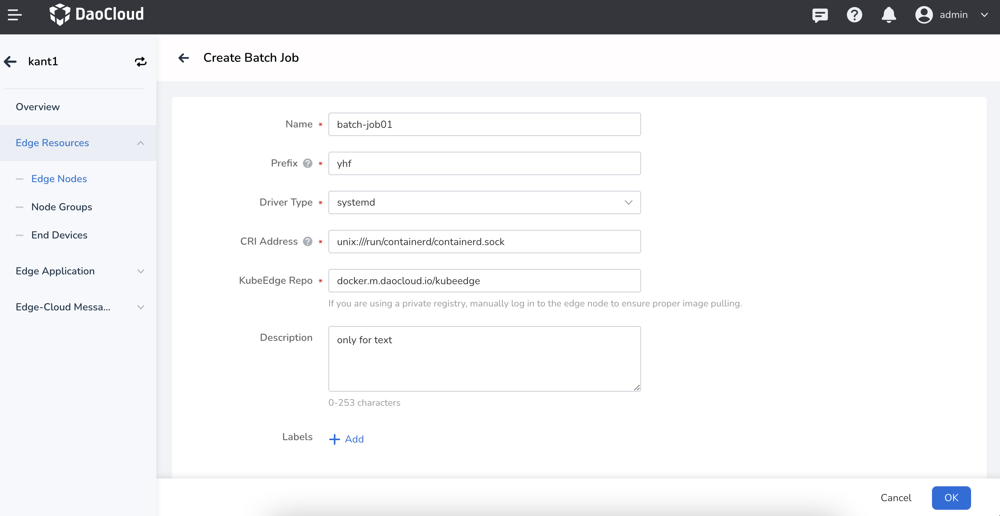

# Batch Register Edge Nodes

Nodes of the same type can have the same edge node configuration by creating a batch task to obtain the edge node configuration file and installer. Batch registering nodes allows for efficient management and reduces operational costs.

The following steps explain how to perform batch registration of edge nodes.

## Create Batch Task

1. On the Edge Node List page, click the `Batch Management` button to enter the `Batch Management` page.

    

1. Select the `Batch Register` tab and click the `Create Batch Job` button in the upper right corner.

    

2. Fill in the registration information.

    - Task Name: The name of the batch task, which cannot be empty and has a length limit of 63 characters.
    - Name Prefix: The nodes accessed through the batch task will have names consisting of the "prefix + random code".
    - CGroup Driver: The control group (CGroup) driver used for managing resources and configurations of pods and containers, such as CPU and memory resource requests and limits.
    - CRI Service Address: The socket file or TCP address for local communication between CRI Client and CRI Server, for example, `unix:///run/containerd/containerd.sock`.
    - KubeEdge Image Repository: The image repository for KubeEdge cloud components, automatically filled with the KubeEdge image repository address set in the edge unit but can be modified by the user.
    - Description: Description of the batch task.
    - Labels: Labels for the batch task.

    

3. After completing the registration information, click the `OK` button to finish creating the batch task for the nodes.

## What's Next

After registration is complete, you will be automatically redirected to the `Installation Guide` page,
where you need to perform the onboarding operation for the edge nodes.
For more details, please refer to the [Onboarding Edge Nodes](./managed-node.md) documentation.
